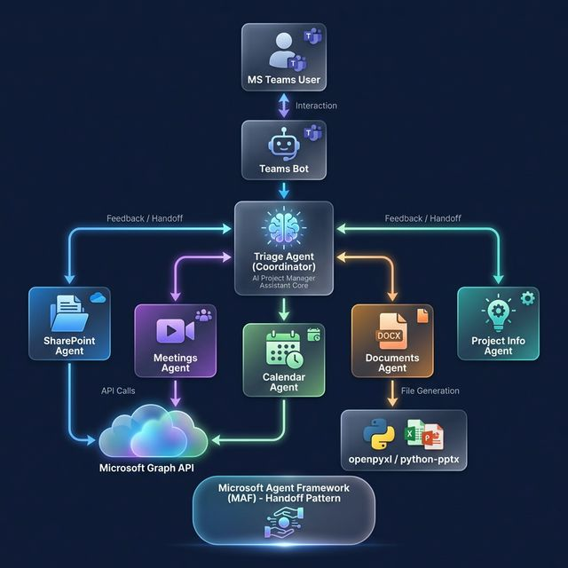

# 🤖 PM Copilot — AI Project Manager Assistant

An enterprise-grade **AI Project Manager Assistant** for teams that don't have a dedicated PM. Built with the **Microsoft Agent Framework (MAF)** using the **Handoff orchestration pattern** and powered by **OpenAI**.

> Accessible via **MS Teams chat**, **CLI terminal**, or **MAF DevUI** for debugging.



---

## ✨ Features

| Capability | Agent | Tools |
|---|---|---|
| **SharePoint Management** | `sharepoint_agent` | Create sites, lists, upload files |
| **Meeting Intelligence** | `meetings_agent` | Transcripts, attendees, AI task extraction |
| **Calendar & Scheduling** | `calendar_agent` | Create meetings, list events |
| **Document Generation** | `documents_agent` | XLSX reports, PPTX presentations |
| **Project Knowledge** | `project_info_agent` | PM best practices, methodology advice |

All agents are coordinated by a **Triage Agent** that understands user intent and routes to the right specialist using MAF's Handoff pattern.

---

## 🚀 Quick Start

### Prerequisites
- Python 3.10+
- OpenAI API key ([platform.openai.com](https://platform.openai.com))

### 1. Set up the virtual environment

```bash
cd Agents2026/maf

# Create venv
python -m venv .venv

# Activate
source .venv/bin/activate      # macOS/Linux
# .venv\Scripts\activate       # Windows

# Install dependencies
pip install -r requirements.txt
```

### 2. Configure environment

```bash
cp .env.example .env
# Edit .env and add your OpenAI API key
```

Required for basic operation:
```env
OPENAI_API_KEY=sk-your-key-here
OPENAI_CHAT_MODEL_ID=gpt-4o
GRAPH_MODE=mock
```

### 3. Run the assistant

```bash
# Interactive terminal mode
python app.py --console

# Start Bot Framework webhook server
python app.py --server

# Launch MAF Developer UI (visual debugging)
python app.py --devui
```

---

## 🏗️ Architecture

PM Copilot uses a **star-topology Handoff pattern**:

1. **User** sends a message (via Teams, CLI, or DevUI)
2. **Triage Agent** analyses intent and routes to the correct specialist
3. **Specialist Agent** performs the task using its tools
4. **Specialist** hands back to Triage for follow-up requests
5. Conversation continues until the user says goodbye

### Project Structure

```
maf/
├── app.py                          # Entry point (console / server / devui)
├── config.py                       # Settings from .env
├── requirements.txt
├── .env.example
├── agents/                         # Agent definitions
│   ├── triage.py                   # Coordinator / router
│   ├── sharepoint_agent.py
│   ├── meetings_agent.py
│   ├── calendar_agent.py
│   ├── documents_agent.py
│   └── project_info_agent.py
├── tools/                          # MAF @tool functions
│   ├── graph_client.py             # MS Graph auth (mock / live)
│   ├── sharepoint_tools.py
│   ├── meetings_tools.py
│   ├── calendar_tools.py
│   └── document_tools.py
├── orchestration/
│   └── handoff_workflow.py         # HandoffBuilder wiring
├── bot/
│   └── teams_bot.py                # Teams activity handler (scaffold)
├── templates/                      # XLSX / PPTX templates
├── output/                         # Generated files (gitignored)
└── docs/
    └── architecture_diagram.png
```

---

## ☁️ Azure AD App Registration (Future — for live MS Graph)

When you're ready to connect to real SharePoint, Teams, and Calendar data:

### 1. Register an app in Azure Portal

1. Go to [Azure Portal](https://portal.azure.com) → **Azure Active Directory** → **App registrations** → **New registration**
2. Name: `PM Copilot`
3. Supported account types: **Single tenant**
4. Click **Register**

### 2. Configure API permissions

Add these **Application permissions** for Microsoft Graph:

| Permission | Purpose |
|---|---|
| `Sites.ReadWrite.All` | SharePoint site & list management |
| `OnlineMeetings.ReadWrite.All` | Teams meeting access |
| `CallRecords.Read.All` | Meeting transcripts |
| `Calendars.ReadWrite` | Calendar event management |
| `Files.ReadWrite.All` | File upload to SharePoint |
| `User.Read` | User profile information |

> ⚠️ Don't forget to **Grant admin consent** after adding permissions.

### 3. Create a client secret

1. Go to **Certificates & secrets** → **New client secret**
2. Copy the secret value

### 4. Update your `.env`

```env
AZURE_TENANT_ID=your-tenant-id
AZURE_CLIENT_ID=your-client-id
AZURE_CLIENT_SECRET=your-client-secret
GRAPH_MODE=live
```

---

## 🤝 MS Teams Bot Deployment (Future)

1. Register a Bot in the [Bot Framework Portal](https://dev.botframework.com)
2. Add your bot's App ID and Password to `.env`
3. Deploy the server and configure the messaging endpoint to `https://your-domain/api/messages`
4. Create a Teams app manifest and sideload or publish to your org

---

## 📝 License

Internal — Enterprise use.
