# PM Copilot — Application Flow Guide

> **Audience:** Developers new to the Microsoft Agent Framework (MAF).
> This document explains how PM Copilot works from top to bottom, with special focus on the **Handoff orchestration pattern** that powers the multi-agent workflow.

---

## Table of Contents

1. [What Is MAF?](#1-what-is-maf)
2. [Key MAF Concepts](#2-key-maf-concepts)
3. [Application Architecture](#3-application-architecture)
4. [The Handoff Pattern — Why We Chose It](#4-the-handoff-pattern--why-we-chose-it)
5. [Deep Dive: handoff_workflow.py](#5-deep-dive-handoff_workflowpy)
6. [How a User Request Flows Through the System](#6-how-a-user-request-flows-through-the-system)
7. [Event Handling — How We Read Agent Responses](#7-event-handling--how-we-read-agent-responses)
8. [Agent Definitions — Anatomy of a Specialist](#8-agent-definitions--anatomy-of-a-specialist)
9. [Tools — How Agents Interact With External Services](#9-tools--how-agents-interact-with-external-services)
10. [Entry Points — Console, Server, DevUI](#10-entry-points--console-server-devui)

---

## 1. What Is MAF?

The **Microsoft Agent Framework** (MAF) is an open-source Python/.NET SDK for building, orchestrating, and deploying AI agents. Think of it as the plumbing layer that lets you:

- Create **agents** (LLM-powered actors with specific roles)
- Give agents **tools** (functions they can call)
- Wire agents together in **orchestration patterns** (how agents collaborate)

```bash
# Install MAF (preview)
pip install agent-framework --pre
```

> [!TIP]
> MAF is the successor to Microsoft's earlier multi-agent libraries (AutoGen, Semantic Kernel Agents). It consolidates the best patterns into a single, enterprise-ready framework.

---

## 2. Key MAF Concepts

Before diving into the code, learn these five building blocks:

| Concept | What It Is | Our Code |
|---|---|---|
| **Agent** | An LLM-powered actor with a name, instructions (system prompt), and optional tools | [triage.py](file:///maf/agents/triage.py), all files in `agents/` |
| **Tool** | A Python function the LLM can call. Decorated with `@tool` | All files in `tools/` |
| **ChatClient** | The LLM connection (OpenAI, Azure OpenAI, etc.) | `OpenAIChatClient` in [config.py](file:///maf/config.py) |
| **Orchestration** | A pattern that controls how multiple agents interact | `HandoffBuilder` in [handoff_workflow.py](file:///maf/orchestration/handoff_workflow.py) |
| **WorkflowEvent** | Events emitted during orchestration (handoffs, outputs, status) | `handle_events()` in [app.py](file:///maf/app.py) |

### MAF's Orchestration Patterns

MAF offers five built-in orchestration patterns. Here's how they compare:

```mermaid
graph LR
    subgraph "Sequential"
        A1[Agent A] --> B1[Agent B] --> C1[Agent C]
    end
    subgraph "Concurrent"
        A2[Agent A]
        B2[Agent B]
        C2[Agent C]
    end
    subgraph "Group Chat"
        A3[Agent A] <--> B3[Agent B]
        B3 <--> C3[Agent C]
        C3 <--> A3
    end
    subgraph "Handoff ✅ (Our Choice)"
        T[Coordinator] --> S1[Specialist 1]
        T --> S2[Specialist 2]
        S1 --> T
        S2 --> T
    end
```



We chose **Handoff** because our use case is a **triage-and-route** pattern: one coordinator understands what the user needs and transfers control to the right specialist.

---

## 3. Application Architecture

```mermaid
graph TD
    User["👤 User Input<br/>(Console / Teams / DevUI)"]
    
    subgraph "app.py — Entry Point"
        CLI["CLI Parser<br/>--console / --server / --devui"]
        Loop["Conversation Loop<br/>run() → handle_events() → run(responses=)"]
    end
    
    subgraph "orchestration/handoff_workflow.py"
        HB["HandoffBuilder<br/>Wires 6 agents into star topology"]
        WF["Built Workflow<br/>.run() / .run(responses=)"]
    end
    
    subgraph "agents/ — 6 Agent Definitions"
        Triage["🎯 triage_agent<br/>(Coordinator)"]
        SP["📂 sharepoint_agent"]
        Meet["📋 meetings_agent"]
        Cal["📅 calendar_agent"]
        Doc["📄 documents_agent"]
        Info["💡 project_info_agent"]
    end
    
    subgraph "tools/ — 12 Tool Functions"
        SPT["SharePoint Tools (4)"]
        MT["Meeting Tools (4)"]
        CT["Calendar Tools (2)"]
        DT["Document Tools (2)"]
    end
    
    subgraph "External"
        OpenAI["OpenAI API<br/>(gpt-4o)"]
        Graph["MS Graph API<br/>(mock or live)"]
    end
    
    User --> CLI --> Loop
    Loop --> WF
    HB --> WF
    WF --> Triage
    Triage --> SP & Meet & Cal & Doc & Info
    SP --> SPT
    Meet --> MT
    Cal --> CT
    Doc --> DT
    SPT & MT & CT --> Graph
    Triage & SP & Meet & Cal & Doc & Info --> OpenAI
```



---

## 4. The Handoff Pattern — Why We Chose It

The **Handoff pattern** is ideal when you have:

- A **coordinator** that can understand intent and route
- Multiple **specialists** with different tools and expertise
- A need for **human-in-the-loop** (the user stays part of the conversation)

### How It Works Conceptually


### Key Behaviors

| Behavior | Description |
|---|---|
| **Auto-registered handoff tools** | MAF automatically creates a `handoff_to_<agent>` tool for each participant. The LLM "decides" to hand off by calling this tool. |
| **Full conversation history** | When Agent A hands off to Agent B, Agent B receives the **entire** conversation so far — it has full context. |
| **Star topology** | Triage → any specialist, specialist → back to triage. No specialist-to-specialist handoffs (keeps routing clean). |
| **User stays in the loop** | After a specialist responds, the workflow asks for user input before continuing. |

---

## 5. Deep Dive: handoff_workflow.py

This is the central wiring module. Let's walk through it line by line.

### Imports

```python
from agent_framework import Agent
from agent_framework.openai import OpenAIChatClient
from agent_framework.orchestrations import HandoffBuilder      # ← The orchestration engine
```

- `Agent` — MAF's agent class  
- `OpenAIChatClient` — Connects to OpenAI's API  
- `HandoffBuilder` — The fluent builder API that wires agents into a Handoff workflow

### Agent Factory Functions

```python
from agents.triage import create_triage_agent
from agents.sharepoint_agent import create_sharepoint_agent
# ... etc.
```

Each agent has its own module with a `create_*_agent(client)` factory function. This keeps agent definitions **modular** — you can test or swap agents independently.

### The build_pm_workflow() Function

```python
def build_pm_workflow(client: OpenAIChatClient | None = None):
```

This is the function that assembles everything. Here's the annotated flow:

#### Step 1 — Create a Shared LLM Client

```python
if client is None:
    client = OpenAIChatClient(api_key=settings.openai_api_key)
```

> [!IMPORTANT]
> All agents share a **single** `OpenAIChatClient`. This means one API key, one model, and consistent behavior. If you later want different models per agent (e.g., GPT-4o for triage, GPT-4o-mini for simple agents), pass different clients to each factory.

#### Step 2 — Instantiate All Agents

```python
triage     = create_triage_agent(client)
sharepoint = create_sharepoint_agent(client)
meetings   = create_meetings_agent(client)
calendar   = create_calendar_agent(client)
documents  = create_documents_agent(client)
project_info = create_project_info_agent(client)

specialists = [sharepoint, meetings, calendar, documents, project_info]
```

Each factory returns an `Agent(name=..., instructions=..., tools=[...])`. The `specialists` list is used for both `participants` and `add_handoff`.

#### Step 3 — Build the Handoff Workflow (the critical part)

```python
workflow = (
    HandoffBuilder(
        name="pm_copilot",                              # ① Workflow name
        participants=[triage, *specialists],             # ② Who's in the workflow
        termination_condition=lambda conv: (             # ③ When to stop
            len(conv) > 0
            and conv[-1].role == "user"
            and any(
                phrase in conv[-1].text.lower()
                for phrase in ["goodbye", "bye", "that's all", ...]
            )
        ),
    )
    .with_start_agent(triage)                           # ④ Entry point
    .add_handoff(triage, specialists)                   # ⑤ Triage → specialists
    .add_handoff(sharepoint, [triage])                  # ⑥ Specialists → triage
    .add_handoff(meetings, [triage])
    .add_handoff(calendar, [triage])
    .add_handoff(documents, [triage])
    .add_handoff(project_info, [triage])
    .build()                                            # ⑦ Finalize and return
)
```

Let's break down each numbered step:

| # | Method | What It Does |
|---|---|---|
| ① | `name=` | Names the workflow (used in logs and DevUI) |
| ② | `participants=` | Registers all agents that can participate. MAF auto-creates internal handoff tools for these. |
| ③ | `termination_condition=` | A lambda that receives the full `conv` (list of `Message` objects). Returns `True` to end the conversation. Ours checks if the user's last message contains farewell phrases. |
| ④ | `.with_start_agent(triage)` | Designates the **first agent** to receive user input. Every message starts with triage. |
| ⑤ | `.add_handoff(triage, specialists)` | Triage can hand off to **any** of the 5 specialists. This creates 5 handoff tools on the triage agent: `handoff_to_sharepoint_agent`, `handoff_to_meetings_agent`, etc. |
| ⑥ | `.add_handoff(specialist, [triage])` | Each specialist can **only** hand back to triage (star topology). This prevents specialists from routing to each other. |
| ⑦ | `.build()` | Compiles everything into a runnable workflow object. |

> [!NOTE]
> **What `.add_handoff()` does under the hood:** It injects a tool named `handoff_to_<target_agent>` into the source agent's tool list. When the LLM decides it needs a different agent, it calls this tool. MAF intercepts the tool call, transfers the full conversation to the target agent, and continues execution there.

### Visual: The Routing Topology

```mermaid
graph LR
    T["🎯 triage_agent"]
    SP["📂 sharepoint_agent"]
    M["📋 meetings_agent"]
    C["📅 calendar_agent"]
    D["📄 documents_agent"]
    PI["💡 project_info_agent"]
    
    T -->|"handoff_to_sharepoint_agent"| SP
    T -->|"handoff_to_meetings_agent"| M
    T -->|"handoff_to_calendar_agent"| C
    T -->|"handoff_to_documents_agent"| D
    T -->|"handoff_to_project_info_agent"| PI
    
    SP -->|"handoff_to_triage_agent"| T
    M -->|"handoff_to_triage_agent"| T
    C -->|"handoff_to_triage_agent"| T
    D -->|"handoff_to_triage_agent"| T
    PI -->|"handoff_to_triage_agent"| T
```



---

## 6. How a User Request Flows Through the System

Here's the **exact** sequence when a user types `"Show me yesterday's meetings"` in console mode:

```mermaid
sequenceDiagram
    participant U as 👤 User (console)
    participant App as app.py
    participant WF as Handoff Workflow
    participant T as 🎯 triage_agent
    participant LLM as OpenAI GPT-4o
    participant M as 📋 meetings_agent
    participant Tool as list_recent_meetings()
    participant Mock as MockGraphClient
    
    U->>App: "Show me yesterday's meetings"
    App->>WF: workflow.run(user_input, stream=True)
    WF->>T: Pass message to start agent
    T->>LLM: System prompt + user message
    LLM-->>T: Tool call: handoff_to_meetings_agent
    Note over WF: 🔀 handoff_sent event emitted
    WF->>M: Transfer conversation to meetings_agent
    M->>LLM: System prompt + full conversation
    LLM-->>M: Tool call: list_recent_meetings("me", 1)
    M->>Tool: Execute list_recent_meetings
    Tool->>Mock: client.list_meetings("me", 1)
    Mock-->>Tool: Returns mock meeting data
    Tool-->>M: JSON meeting list
    M->>LLM: Tool result + conversation
    LLM-->>M: Formatted response to user
    Note over WF: output event + request_info event emitted
    WF-->>App: Stream of WorkflowEvents
    App->>App: handle_events() processes events
    App->>U: Displays formatted meeting list
    Note over App: Enters pending loop,<br/>waits for next user input
```



### In Code

This sequence maps to these lines in [app.py](file:///maf/app.py):

**1. Start the workflow** (line 147-148):
```python
result = workflow.run(user_input, stream=True)
pending = handle_events([event async for event in result])
```

**2. Process events** (line 68-117): `handle_events()` examines each `WorkflowEvent`:
- `handoff_sent` → Logs the handoff transition
- `output` → Displays agent messages to the user
- `request_info` → Agent is waiting for user input; adds to `pending`

**3. Continue the loop** (line 151-171):
```python
while pending:
    user_input = input("You: ")
    responses = {
        req.request_id: HandoffAgentUserRequest.create_response(user_input)
        for req in pending
    }
    events = await workflow.run(responses=responses)
    pending = handle_events(events)
```

> [!IMPORTANT]
> **Two distinct `.run()` calls:**
> - `workflow.run(user_input, stream=True)` — First call: starts the workflow with a user message
> - `workflow.run(responses=responses)` — Subsequent calls: provides user responses to pending requests
>
> This is MAF's **request/response cycle**. The workflow pauses when it needs user input and resumes when you provide it.

---

## 7. Event Handling — How We Read Agent Responses

MAF workflows emit `WorkflowEvent` objects. Here are the event types you'll see:

| Event Type | When It Fires | What `.data` Contains |
|---|---|---|
| `handoff_sent` | Agent A transfers to Agent B | `.source` (sender name), `.target` (receiver name) |
| `output` | An agent produces a response | `AgentResponse` with `.messages` list |
| `request_info` | Workflow needs user input | `HandoffAgentUserRequest` with `.agent_response` |
| `status` | Workflow state changes | `.state` (`IDLE`, `IDLE_WITH_PENDING_REQUESTS`, etc.) |

### Common Patterns

**Reading agent messages:**
```python
if isinstance(event.data, AgentResponse):
    for message in event.data.messages:
        print(f"{message.author_name}: {message.text}")
```

**Responding to user requests:**
```python
# Create a response
HandoffAgentUserRequest.create_response("user's answer")

# Or terminate the conversation
HandoffAgentUserRequest.terminate()
```

---

## 8. Agent Definitions — Anatomy of a Specialist

Every agent in `agents/` follows the same pattern:

```python
from agent_framework import Agent
from agent_framework.openai import OpenAIChatClient

AGENT_INSTRUCTIONS = """
You are the [Role] specialist...
[Detailed instructions about what to do and how to format responses]
"""

def create_xyz_agent(client: OpenAIChatClient | None = None) -> Agent:
    return Agent(
        client=client,                          # LLM connection
        name="xyz_agent",                       # Unique name (used in handoffs)
        instructions=AGENT_INSTRUCTIONS,        # System prompt
        tools=[tool_function_1, tool_function_2], # Available tools
    )
```

### What Makes Each Agent Different

| Agent | Has Tools? | Key Behavior |
|---|---|---|
| **triage_agent** | ❌ (handoff tools only) | Routes based on intent; never does specialist work |
| **sharepoint_agent** | ✅ 4 tools | Creates sites, lists, uploads files |
| **meetings_agent** | ✅ 4 tools | Retrieves transcripts + applies AI reasoning for task extraction |
| **calendar_agent** | ✅ 2 tools | Creates events, lists upcoming schedule |
| **documents_agent** | ✅ 2 tools | Generates XLSX/PPTX from structured data |
| **project_info_agent** | ❌ (knowledge only) | Answers PM questions using its LLM knowledge |

---

## 9. Tools — How Agents Interact With External Services

Tools are Python functions decorated with MAF's `@tool`:

```python
from agent_framework import tool

@tool(approval_mode="never_require")
def list_sharepoint_sites() -> str:
    """List all SharePoint sites available in the organisation."""
    client = get_graph_client()      # Mock or live, based on GRAPH_MODE
    sites = client.list_sites()
    return json.dumps(sites, indent=2)
```

### How Tools Work

1. The **LLM reads** the function name, docstring, and parameter annotations
2. When the LLM decides to call the tool, MAF **executes** the function
3. The **return value** (always a string) is fed back to the LLM as a tool result
4. The LLM uses the result to **compose its response** to the user

### Where Do Tools Run?


> [!NOTE]
> **Mock vs Live:** The `graph_client.py` module checks `GRAPH_MODE` in `.env`. When set to `mock`, all Graph API calls return realistic stub data. Set to `live` to connect to real Microsoft 365 services.

---

## 10. Entry Points — Console, Server, DevUI

The application supports three run modes, all starting from [app.py](file:///maf/app.py):

| Mode | Command | Purpose |
|---|---|---|
| `--console` | `python app.py --console` | Interactive terminal — for local development and testing |
| `--server` | `python app.py --server` | FastAPI webhook on port 3978 — for MS Teams Bot integration |
| `--devui` | `python app.py --devui` | MAF Developer UI — visual workflow debugger in the browser |

All three modes use the **same** `build_pm_workflow()` function from `handoff_workflow.py`. The only difference is *how* user input arrives and *how* agent responses are delivered.

---

> [!TIP]
> **Start here for development:**
> 1. Read [triage.py](file:///maf/agents/triage.py) to understand how routing works
> 2. Read [handoff_workflow.py](file:///maf/orchestration/handoff_workflow.py) to see how agents are wired
> 3. Run `python app.py --console` and test a conversation
> 4. Pick any specialist agent in `agents/` and trace its tools in `tools/`
