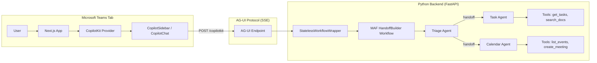

# MAF + CopilotKit Starter Project — Implementation Plan

Build a production-quality reference architecture for an agentic application in Microsoft Teams, integrating MAF, AG-UI, CopilotKit, Next.js, TailwindCSS, and shadcn/ui.

## User Review Required

> [!IMPORTANT]
> **Output directory**: all project files will be created under `/Users/charlie/Documents/GitHub/maf-learning/maf_copilotkit/`

> [!IMPORTANT]
> **Agent scope**: The starter will include a simplified version of the existing PM Copilot (triage + 2 specialists) rather than porting all 5 agents, keeping the template clean while demonstrating the Handoff pattern. Should I include all 5 agents instead?

> [!WARNING]
> **CopilotKit V2**: The plan uses CopilotKit V2 API (`@copilotkit/react-core@^2`, `@copilotkit/react-ui@^2`) with the newer `<CopilotKit>`, `<CopilotChat>`, `useAgent` hooks. The V2 API is the current documented version. Confirm this is acceptable.

---

## Architecture Overview



**Data flow**: User types in CopilotKit chat → CopilotKit sends messages via AG-UI POST → FastAPI receives and creates a fresh MAF HandoffBuilder workflow → Triage agent routes to specialists → Specialists execute tools → AG-UI streams SSE events back → CopilotKit renders streamed text + tool results.

---

## Proposed Changes

### Backend — `agent/`

The Python backend is a standalone FastAPI service. It adapts the existing `maf/` project patterns into a clean starter.

---

#### [NEW] [pyproject.toml](file:///Users/charlie/Documents/GitHub/maf-learning/maf_copilotkit/agent/pyproject.toml)

Project metadata and dependencies. Uses `uv` for venv management. Key deps:
- `agent-framework==1.0.0rc4`
- `agent-framework-ag-ui`
- `fastapi>=0.115.0`
- `uvicorn[standard]>=0.34.0`
- `pydantic-settings>=2.7.0`
- `python-dotenv>=1.0.0`

#### [NEW] [.env.example](file:///Users/charlie/Documents/GitHub/maf-learning/maf_copilotkit/agent/.env.example)

Template env file with `OPENAI_API_KEY=your-key-here` and `PORT=8000`.

#### [NEW] [config.py](file:///Users/charlie/Documents/GitHub/maf-learning/maf_copilotkit/agent/config.py)

Pydantic settings model loading from `.env`. Fields: `openai_api_key`, `port`, `graph_mode` (mock/live).

#### [NEW] [server.py](file:///Users/charlie/Documents/GitHub/maf-learning/maf_copilotkit/agent/server.py)

FastAPI application entrypoint. Mounts CORS middleware (allows `localhost:3000`), mounts the AG-UI endpoint at `/copilotkit`, and a health check at `/`. Run with `uvicorn server:app`.

#### [NEW] [agui_endpoint.py](file:///Users/charlie/Documents/GitHub/maf-learning/maf_copilotkit/agent/agui_endpoint.py)

Adapted from the existing `maf/agui_endpoint.py`. Contains `StatelessWorkflowWrapper` that creates a fresh workflow per request for CopilotKit's stateless message-replay model. Uses `add_agent_framework_fastapi_endpoint` from `agent_framework_ag_ui`.

#### [NEW] [orchestration/handoff_workflow.py](file:///Users/charlie/Documents/GitHub/maf-learning/maf_copilotkit/agent/orchestration/handoff_workflow.py)

Adapted from existing `maf/orchestration/handoff_workflow.py`. Builds a `HandoffBuilder` with triage → specialist handoff topology. Includes 2 specialists (task_agent, calendar_agent) to demonstrate the pattern cleanly.

#### [NEW] [agents/triage_agent.py](file:///Users/charlie/Documents/GitHub/maf-learning/maf_copilotkit/agent/agents/triage_agent.py)

Coordinator agent. Routes user requests to task_agent or calendar_agent. Adapted from existing `maf/agents/triage.py` with simplified routing table.

#### [NEW] [agents/task_agent.py](file:///Users/charlie/Documents/GitHub/maf-learning/maf_copilotkit/agent/agents/task_agent.py)

New specialist for task/project management. Has tools: `get_tasks` (returns mock project tasks), `search_docs` (mock document search). Returns structured results suitable for tool rendering.

#### [NEW] [agents/calendar_agent.py](file:///Users/charlie/Documents/GitHub/maf-learning/maf_copilotkit/agent/agents/calendar_agent.py)

Adapted from `maf/agents/calendar_agent.py`. Has tools: `list_upcoming_events`, `create_meeting`. Returns structured data (tables) that CopilotKit can render.

#### [NEW] [tools/task_tools.py](file:///Users/charlie/Documents/GitHub/maf-learning/maf_copilotkit/agent/tools/task_tools.py)

Mock implementations of `get_tasks()` and `search_docs()`. Return realistic sample data so the demo works without external APIs.

#### [NEW] [tools/calendar_tools.py](file:///Users/charlie/Documents/GitHub/maf-learning/maf_copilotkit/agent/tools/calendar_tools.py)

Mock implementations of `list_upcoming_events()` and `create_meeting()`. Adapted from `maf/tools/calendar_tools.py` with mock mode only.

---

### Frontend — `web/`

Next.js 15 app using CopilotKit V2, TailwindCSS, and shadcn/ui.

---

#### [NEW] Next.js project scaffold

Created via `npx -y create-next-app@latest ./` with TypeScript, TailwindCSS, App Router, and `--use-pnpm`. Then `pnpm dlx shadcn@latest init`.

#### [NEW] [web/package.json](file:///Users/charlie/Documents/GitHub/maf-learning/maf_copilotkit/web/package.json)

Key deps added after scaffold:
- `@copilotkit/react-core@^2`
- `@copilotkit/react-ui@^2`
- `@microsoft/teams-js` (Teams SDK)

#### [NEW] [web/src/app/layout.tsx](file:///Users/charlie/Documents/GitHub/maf-learning/maf_copilotkit/web/src/app/layout.tsx)

Root layout wrapping `<CopilotKit>` provider with AG-UI agent URL pointing to `http://localhost:8000/copilotkit`. Includes Inter font from Google Fonts.

#### [NEW] [web/src/app/page.tsx](file:///Users/charlie/Documents/GitHub/maf-learning/maf_copilotkit/web/src/app/page.tsx)

Main page with a two-column layout:
- Left: workspace area with project dashboard cards
- Right: CopilotKit sidebar chat

Uses `<CopilotSidebar>` from CopilotKit V2. Includes `useAgent` hook for the "default" AG-UI agent.

#### [NEW] [web/src/components/teams-initializer.tsx](file:///Users/charlie/Documents/GitHub/maf-learning/maf_copilotkit/web/src/components/teams-initializer.tsx)

Client component that calls `microsoftTeams.app.initialize()` on mount. Handles the Teams iframe context (theme, locale). Gracefully skips if not in Teams.

#### [NEW] [web/src/components/tool-renderers.tsx](file:///Users/charlie/Documents/GitHub/maf-learning/maf_copilotkit/web/src/components/tool-renderers.tsx)

Custom React components for rendering tool call results:
- `TaskListRenderer` — renders a card grid of tasks returned by `get_tasks`
- `CalendarEventsRenderer` — renders a table of upcoming events
- `MeetingCreatedRenderer` — renders a success card for `create_meeting`

Uses `useRenderTool` hook from CopilotKit V2 to bind tool names to renderers.

#### [NEW] [web/src/components/workspace.tsx](file:///Users/charlie/Documents/GitHub/maf-learning/maf_copilotkit/web/src/components/workspace.tsx)

The main workspace area. Shows project dashboard cards using shadcn/ui `Card`, `Badge`, and `Progress` components. Dark-mode friendly design.

#### [NEW] [web/src/app/globals.css](file:///Users/charlie/Documents/GitHub/maf-learning/maf_copilotkit/web/src/app/globals.css)

TailwindCSS imports + CSS custom properties for CopilotKit theme overrides (dark mode colors, sidebar width). Custom styling for CopilotKit chat bubbles to match the enterprise theme.

---

### Teams Integration

#### [NEW] [web/src/app/teams/manifest.json](file:///Users/charlie/Documents/GitHub/maf-learning/maf_copilotkit/web/src/app/teams/manifest.json)

Teams app manifest template explaining the tab configuration, with placeholder URLs for local dev tunneling (devtunnel/ngrok).

---

### Documentation

#### [NEW] [README.md](file:///Users/charlie/Documents/GitHub/maf-learning/maf_copilotkit/README.md)

Project README with:
- Architecture diagram (mermaid)
- Folder structure explanation
- Quickstart instructions (backend + frontend)
- Teams local dev workflow
- Technology stack overview

#### [NEW] [final_plan.md](file:///Users/charlie/Documents/GitHub/maf-learning/maf_copilotkit/final_plan.md)

Copy of this implementation plan as required by the spec.

#### [NEW] [docs/a2ui-integration.md](file:///Users/charlie/Documents/GitHub/maf-learning/maf_copilotkit/docs/a2ui-integration.md)

Future integration guide for A2UI + AG-UI, explaining:
- What A2UI is (declarative, LLM-friendly generative UI spec)
- How it works with AG-UI (custom events carrying A2UI payloads)
- How to enable it in CopilotKit (middleware config)
- Migration path from current tool rendering

---

## Verification Plan

### Automated Tests

**Backend smoke test** — Run from `maf_copilotkit/agent/`:
```bash
cd /Users/charlie/Documents/GitHub/maf-learning/maf_copilotkit/agent
uv venv && source .venv/bin/activate && uv pip install -e .
# Start server in background
uvicorn server:app --port 8000 &
sleep 3
# Test health endpoint
curl -s http://localhost:8000/ | python3 -c "import sys,json; d=json.load(sys.stdin); assert d['status']=='ok', f'Bad: {d}'; print('✅ Health OK')"
# Test AG-UI info endpoint
curl -s http://localhost:8000/copilotkit/info | python3 -c "import sys,json; d=json.load(sys.stdin); assert 'agents' in d, f'Bad: {d}'; print('✅ AG-UI info OK')"
# Kill background server
kill %1
```

**Frontend build test** — Run from `maf_copilotkit/web/`:
```bash
cd /Users/charlie/Documents/GitHub/maf-learning/maf_copilotkit/web
pnpm install
pnpm build
# If build exits 0, TypeScript compilation and Next.js build are valid
```

### Manual Verification

**Full pipeline test** (requires user to have `OPENAI_API_KEY` set):

1. **Start backend**: `cd agent && source .venv/bin/activate && uvicorn server:app --port 8000`
2. **Start frontend**: `cd web && pnpm dev` (opens at http://localhost:3000)
3. **Open browser** at http://localhost:3000
4. **Send a message** like "Show me my upcoming meetings"
5. **Verify**: The CopilotKit chat sidebar should display a streamed response from the triage agent, which hands off to the calendar agent, which calls the `list_upcoming_events` tool and returns mock data rendered as a styled table
6. **Send another message** like "What are my current tasks?"
7. **Verify**: The task agent responds with mock task data rendered in cards

> [!NOTE]
> If you don't have an OpenAI key, the backend will fail to start. The smoke tests for health and AG-UI info endpoints should still work as they don't invoke the LLM.
