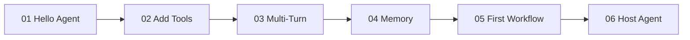

# 01 — Get Started with MAF

> **Source**: [01-get-started/](https://github.com/microsoft/agent-framework/tree/main/python/samples/01-get-started)
> **Difficulty**: Beginner
> **Prerequisites**: Python 3.10+, Azure AI Foundry project, `az login`

## Overview

This is your **onboarding ramp**. Six progressive samples that take you from "Hello World" to hosting an agent in Azure Functions. Each sample introduces exactly one new concept while building on the previous one.



## Prerequisites & Setup

```bash
pip install agent-framework --pre
```

```bash
export AZURE_AI_PROJECT_ENDPOINT="https://your-project-endpoint"
export AZURE_OPENAI_RESPONSES_DEPLOYMENT_NAME="gpt-4o"
```

Authenticate with Azure CLI:
```bash
az login
```

---

## Sample 1: Hello Agent — Your First Agent

### What It Does

Creates the **absolute minimum** agent — just a name, instructions, and a model client — then runs it in two modes: **non-streaming** (get the full response at once) and **streaming** (receive tokens as they generate).

### Full Source Code

```python
import asyncio
import os

from agent_framework.azure import AzureOpenAIResponsesClient
from azure.identity import AzureCliCredential

async def main() -> None:
    # 1️⃣ Create a client pointing to your Azure AI Foundry project
    credential = AzureCliCredential()
    client = AzureOpenAIResponsesClient(
        project_endpoint=os.environ["AZURE_AI_PROJECT_ENDPOINT"],
        deployment_name=os.environ["AZURE_OPENAI_RESPONSES_DEPLOYMENT_NAME"],
        credential=credential,
    )

    # 2️⃣ Turn the client into an agent with a name + instructions
    agent = client.as_agent(
        name="HelloAgent",
        instructions="You are a friendly assistant. Keep your answers brief.",
    )

    # 3️⃣ Non-streaming: get the entire response as a single string
    result = await agent.run("What is the capital of France?")
    print(f"Agent: {result}")

    # 4️⃣ Streaming: receive tokens incrementally as they're generated
    print("Agent (streaming): ", end="", flush=True)
    async for chunk in agent.run("Tell me a one-sentence fun fact.", stream=True):
        if chunk.text:
            print(chunk.text, end="", flush=True)
    print()

if __name__ == "__main__":
    asyncio.run(main())
```

### Step-by-Step Walkthrough

1. **`AzureOpenAIResponsesClient`** — This is MAF's built-in client for Azure OpenAI's Responses API. It wraps the authentication, endpoint, and deployment details into a reusable object.

2. **`client.as_agent()`** — The `.as_agent()` method is the key MAF pattern. It converts any chat client into an `Agent` object. The agent gets:
   - `name` — a unique identifier (used later for hosting, workflows, addressing)
   - `instructions` — the system prompt that shapes the agent's behavior

3. **`agent.run(prompt)`** — The simplest way to invoke an agent. Without `stream=True`, it returns the complete response as a string-like `AgentResponse`.

4. **`agent.run(prompt, stream=True)`** — Returns an async generator of `AgentResponseUpdate` chunks. Each chunk has a `.text` property with the newly-generated text fragment. This is how you build real-time UIs.

### Concepts Introduced

| Concept | Description |
|---------|-------------|
| `AzureOpenAIResponsesClient` | MAF's Azure client wrapping the Responses API |
| `.as_agent()` | Converts any client into a reusable `Agent` object |
| `agent.run()` | Non-streaming invocation — returns complete response |
| `agent.run(stream=True)` | Streaming invocation — returns async iterator of chunks |
| `AzureCliCredential` | Uses your `az login` session for authentication |

### How to Run

```bash
python 01_hello_agent.py
```

---

## Sample 2: Add Tools — Give Your Agent Abilities

### What It Does

Defines a **function tool** using the `@tool` decorator and attaches it to an agent. When the model decides it needs weather data, MAF automatically calls your Python function, feeds the result back to the model, and the model incorporates it into its response.

### Full Source Code

```python
import asyncio
import os
from random import randint
from typing import Annotated

from agent_framework import tool
from agent_framework.azure import AzureOpenAIResponsesClient
from azure.identity import AzureCliCredential
from pydantic import Field

# 1️⃣ Define a tool with @tool decorator
@tool(approval_mode="never_require")
def get_weather(
    location: Annotated[str, Field(description="The location to get the weather for.")],
) -> str:
    """Get the weather for a given location."""
    conditions = ["sunny", "cloudy", "rainy", "stormy"]
    return f"The weather in {location} is {conditions[randint(0, 3)]} with a high of {randint(10, 30)}°C."

async def main() -> None:
    credential = AzureCliCredential()
    client = AzureOpenAIResponsesClient(
        project_endpoint=os.environ["AZURE_AI_PROJECT_ENDPOINT"],
        deployment_name=os.environ["AZURE_OPENAI_RESPONSES_DEPLOYMENT_NAME"],
        credential=credential,
    )

    # 2️⃣ Attach the tool to the agent
    agent = client.as_agent(
        name="WeatherAgent",
        instructions="You are a helpful weather agent. Use the get_weather tool to answer questions.",
        tools=get_weather,
    )

    # 3️⃣ The model will call get_weather automatically when needed
    result = await agent.run("What's the weather like in Seattle?")
    print(f"Agent: {result}")

if __name__ == "__main__":
    asyncio.run(main())
```

### Step-by-Step Walkthrough

1. **`@tool` decorator** — Marks a regular Python function as an agent tool. MAF automatically:
   - Generates the JSON schema from the function signature + type annotations
   - Registers it with the model so it can be called
   - Handles the tool-call → response → model pipeline

2. **`Annotated[str, Field(description=...)]`** — Uses Pydantic's `Field` inside `Annotated` to provide parameter descriptions. The model sees these descriptions and uses them to understand what arguments to pass.

3. **`approval_mode="never_require"`** — Controls whether users must approve tool calls before execution. Options:
   - `"never_require"` — auto-execute (good for demos)
   - `"always_require"` — always ask the user first (recommended for production)

4. **`tools=get_weather`** — Passed to `.as_agent()` to register the tool. You can pass a single tool or a list of tools.

5. **The invisible loop** — When you call `agent.run()`, here's what happens under the hood:
   ```
   User message → Model → "I need to call get_weather(Seattle)" →
   MAF calls get_weather("Seattle") → Returns "sunny, 25°C" →
   Model incorporates result → Final response to user
   ```

### Concepts Introduced

| Concept | Description |
|---------|-------------|
| `@tool` decorator | Turns any Python function into an agent-callable tool |
| `Annotated[type, Field()]` | Provides parameter descriptions for the model |
| `approval_mode` | Controls whether tool execution requires user approval |
| `tools=` parameter | Attaches tools to an agent at creation time |
| Tool-call loop | MAF handles the model ↔ tool ↔ model feedback loop automatically |

### How to Run

```bash
python 02_add_tools.py
```

---

## Sample 3: Multi-Turn Conversations — Remembering Context

### What It Does

Shows how to **maintain conversation history** across multiple `agent.run()` calls using an `AgentSession`. Without a session, each call is independent. With a session, the agent remembers what was said before.

### Full Source Code

```python
import asyncio
import os

from agent_framework.azure import AzureOpenAIResponsesClient
from azure.identity import AzureCliCredential

async def main() -> None:
    credential = AzureCliCredential()
    client = AzureOpenAIResponsesClient(
        project_endpoint=os.environ["AZURE_AI_PROJECT_ENDPOINT"],
        deployment_name=os.environ["AZURE_OPENAI_RESPONSES_DEPLOYMENT_NAME"],
        credential=credential,
    )

    agent = client.as_agent(
        name="ConversationAgent",
        instructions="You are a friendly assistant. Keep your answers brief.",
    )

    # 1️⃣ Create a session — this holds the conversation history
    session = agent.create_session()

    # 2️⃣ First turn — provide info
    result = await agent.run("My name is Alice and I love hiking.", session=session)
    print(f"Agent: {result}\n")

    # 3️⃣ Second turn — the agent remembers because of the shared session
    result = await agent.run("What do you remember about me?", session=session)
    print(f"Agent: {result}")

if __name__ == "__main__":
    asyncio.run(main())
```

### Step-by-Step Walkthrough

1. **`agent.create_session()`** — Creates an `AgentSession` object that stores message history. Think of it as a "conversation thread."

2. **`session=session`** — Pass the same session to each `agent.run()` call. The session accumulates messages:
   - Turn 1: `[user: "My name is Alice...", assistant: "Nice to meet you..."]`
   - Turn 2: `[user: "My name is Alice...", assistant: "Nice to meet you...", user: "What do you remember?", assistant: "Your name is Alice and you love hiking!"]`

3. **Without a session** — Each call is stateless. The agent would have no memory of previous turns.

### Concepts Introduced

| Concept | Description |
|---------|-------------|
| `agent.create_session()` | Creates a conversation thread that persists across calls |
| `session=` parameter | Attaches a session to a run for multi-turn memory |
| Stateless vs Stateful | Without session = stateless; with session = stateful |

### How to Run

```bash
python 03_multi_turn.py
```

---

## Sample 4: Memory — Dynamic Context with Context Providers

### What It Does

Introduces **Context Providers** — the MAF pattern for injecting dynamic, run-time information into an agent. This sample creates a `UserNameProvider` that remembers the user's name and automatically personalizes every future response.

This goes beyond sessions (which just store message history) by letting you **programmatically control what instructions the agent sees** on every invocation.

### Full Source Code

```python
import asyncio
import os
from typing import Any

from agent_framework._sessions import AgentSession, BaseContextProvider, SessionContext
from agent_framework.azure import AzureOpenAIResponsesClient
from azure.identity import AzureCliCredential

# 1️⃣ Define a custom context provider
class UserNameProvider(BaseContextProvider):
    """Remembers the user's name and enriches every request with personalization."""

    def __init__(self) -> None:
        super().__init__(source_id="user-name-provider")
        self.user_name: str | None = None

    async def before_run(
        self,
        *,
        agent: Any,
        session: AgentSession,
        context: SessionContext,
        state: dict[str, Any],
    ) -> None:
        """Called BEFORE each agent invocation — inject extra instructions."""
        if self.user_name:
            context.instructions.append(
                f"The user's name is {self.user_name}. Always address them by name."
            )
        else:
            context.instructions.append(
                "You don't know the user's name yet. Ask for it politely."
            )

    async def after_run(
        self,
        *,
        agent: Any,
        session: AgentSession,
        context: SessionContext,
        state: dict[str, Any],
    ) -> None:
        """Called AFTER each agent invocation — extract info from the conversation."""
        for msg in context.input_messages:
            text = msg.text if hasattr(msg, "text") else ""
            if isinstance(text, str) and "my name is" in text.lower():
                self.user_name = (
                    text.lower().split("my name is")[-1].strip().split()[0].capitalize()
                )

async def main() -> None:
    credential = AzureCliCredential()
    client = AzureOpenAIResponsesClient(
        project_endpoint=os.environ["AZURE_AI_PROJECT_ENDPOINT"],
        deployment_name=os.environ["AZURE_OPENAI_RESPONSES_DEPLOYMENT_NAME"],
        credential=credential,
    )

    memory = UserNameProvider()

    # 2️⃣ Attach the context provider to the agent
    agent = client.as_agent(
        name="MemoryAgent",
        instructions="You are a friendly assistant.",
        context_providers=[memory],
    )

    session = agent.create_session()

    # 3️⃣ First call — provider doesn't know the user yet, will add "ask for name"
    result = await agent.run("Hello! What's the square root of 9?", session=session)
    print(f"Agent: {result}\n")

    # 4️⃣ User provides their name — after_run extracts and stores it
    result = await agent.run("My name is Alice", session=session)
    print(f"Agent: {result}\n")

    # 5️⃣ Now the provider injects "The user's name is Alice" into every call
    result = await agent.run("What is 2 + 2?", session=session)
    print(f"Agent: {result}\n")

    print(f"[Memory] Stored user name: {memory.user_name}")

if __name__ == "__main__":
    asyncio.run(main())
```

### Step-by-Step Walkthrough

1. **`BaseContextProvider`** — The base class for all context providers. You implement two hooks:
   - `before_run()` — Runs before the model is called. Add instructions, modify context.
   - `after_run()` — Runs after the model responds. Extract info, update state.

2. **`context.instructions.append()`** — Dynamically adds instructions to the system prompt for this specific invocation. This is more powerful than static instructions because it can change based on state.

3. **The flow per invocation**:
   ```
   before_run() → [instructions injected] → Model generates response → after_run() → [info extracted]
   ```

4. **`context_providers=[memory]`** — Register the provider when creating the agent. Multiple providers can be composed.

5. **`source_id`** — A unique identifier for this provider. Used internally for tracking.

### Concepts Introduced

| Concept | Description |
|---------|-------------|
| `BaseContextProvider` | Base class for injecting dynamic context into agents |
| `before_run()` | Hook that runs before each model invocation |
| `after_run()` | Hook that runs after each model invocation |
| `context.instructions` | Dynamic instruction list you can modify per-invocation |
| `context_providers=[]` | Registers providers with an agent at creation time |

### How to Run

```bash
python 04_memory.py
```

---

## Sample 5: First Workflow — Chaining Steps Together

### What It Does

Builds a **workflow** — a graph of processing steps (called "executors") connected by edges. This sample chains two steps: (1) convert text to uppercase, (2) reverse the string. **No LLM needed** — this demonstrates pure workflow mechanics.

### Full Source Code

```python
import asyncio

from agent_framework import (
    Executor,
    WorkflowBuilder,
    WorkflowContext,
    executor,
    handler,
)
from typing_extensions import Never

# 1️⃣ Class-based executor — uppercase
class UpperCase(Executor):
    def __init__(self, id: str):
        super().__init__(id=id)

    @handler
    async def to_upper_case(self, text: str, ctx: WorkflowContext[str]) -> None:
        """Convert input to uppercase and forward to the next node."""
        await ctx.send_message(text.upper())

# 2️⃣ Function-based executor — reverse
@executor(id="reverse_text")
async def reverse_text(text: str, ctx: WorkflowContext[Never, str]) -> None:
    """Reverse the string and yield the final workflow output."""
    await ctx.yield_output(text[::-1])

# 3️⃣ Build the workflow graph
def create_workflow():
    upper = UpperCase(id="upper_case")
    return (
        WorkflowBuilder(start_executor=upper)
        .add_edge(upper, reverse_text)
        .build()
    )

async def main() -> None:
    workflow = create_workflow()

    events = await workflow.run("hello world")
    print(f"Output: {events.get_outputs()}")       # ['DLROW OLLEH']
    print(f"Final state: {events.get_final_state()}")  # WorkflowRunState.IDLE

if __name__ == "__main__":
    asyncio.run(main())
```

### Step-by-Step Walkthrough

1. **Two ways to define executors**:
   - **Class-based**: Subclass `Executor`, add a method decorated with `@handler`. Good for complex logic, state.
   - **Function-based**: Decorate an async function with `@executor(id="...")`. Good for simple transformations.

2. **`WorkflowContext` type parameters**:
   - `WorkflowContext[str]` — This node sends `str` messages downstream via `ctx.send_message()`
   - `WorkflowContext[Never, str]` — This node doesn't send downstream (`Never`), but yields workflow output (`str`) via `ctx.yield_output()`

3. **`ctx.send_message()` vs `ctx.yield_output()`**:
   - `send_message()` — Forwards data to the next executor in the graph (internal routing)
   - `yield_output()` — Emits a result that becomes part of the workflow's final output (external result)

4. **`WorkflowBuilder`** — Fluent API for constructing the graph:
   ```python
   WorkflowBuilder(start_executor=A)
       .add_edge(A, B)   # A's output flows to B
       .build()           # Returns a Workflow object
   ```

5. **`workflow.run(input)`** — Sends the initial input to the start executor and runs until idle.

### Concepts Introduced

| Concept | Description |
|---------|-------------|
| `Executor` (class-based) | A processing node defined as a class with `@handler` methods |
| `@executor` (function-based) | A processing node defined as a decorated async function |
| `@handler` | Marks a method as the entry point for an Executor |
| `WorkflowContext` | Provides `send_message()` and `yield_output()` for data routing |
| `WorkflowBuilder` | Fluent API for connecting executors into a workflow graph |
| `workflow.run()` | Executes the workflow with initial input |

### How to Run

```bash
python 05_first_workflow.py
```

---

## Sample 6: Host Your Agent — Azure Functions Deployment

### What It Does

Shows the **hosting pattern** — how to take an agent and deploy it as an HTTP endpoint using Azure Functions. After this, you can call your agent with `POST /api/agents/HostedAgent/run`.

### Full Source Code

```python
from typing import Any

from agent_framework.azure import AgentFunctionApp, AzureOpenAIChatClient
from azure.identity import AzureCliCredential

# 1️⃣ Create the agent (same pattern as before, but using Chat client)
def _create_agent() -> Any:
    return AzureOpenAIChatClient(credential=AzureCliCredential()).as_agent(
        name="HostedAgent",
        instructions="You are a helpful assistant hosted in Azure Functions.",
    )

# 2️⃣ Register it with the hosting framework
app = AgentFunctionApp(
    agents=[_create_agent()],
    enable_health_check=True,
    max_poll_retries=50
)

if __name__ == "__main__":
    print("Start the Functions host with: func start")
    print("Then call: POST /api/agents/HostedAgent/run")
```

### Step-by-Step Walkthrough

1. **`AzureOpenAIChatClient`** — An alternative to `AzureOpenAIResponsesClient`. Uses the Chat Completions API instead of the Responses API. Both produce agents via `.as_agent()`.

2. **`AgentFunctionApp`** — MAF's Azure Functions integration. It:
   - Creates HTTP trigger endpoints for each registered agent
   - Handles request/response serialization
   - Provides a health check endpoint at `/api/health`

3. **`agents=[...]`** — Register one or more agents. Each gets its own endpoint: `/api/agents/{agent_name}/run`.

4. **`enable_health_check=True`** — Adds a `/api/health` endpoint for load balancers and monitoring.

5. **Running it**:
   ```bash
   pip install agent-framework-azurefunctions --pre
   func start  # Azure Functions Core Tools
   ```

### Concepts Introduced

| Concept | Description |
|---------|-------------|
| `AzureOpenAIChatClient` | Alternative client using the Chat Completions API |
| `AgentFunctionApp` | Azure Functions integration for hosting agents |
| Agent hosting | Turning agents into HTTP endpoints |
| Health checks | Built-in monitoring endpoint |

### Prerequisites

```bash
pip install agent-framework-azurefunctions --pre
npm install -g azure-functions-core-tools@4
```

```bash
export AZURE_OPENAI_ENDPOINT="https://your-openai-endpoint"
export AZURE_OPENAI_CHAT_DEPLOYMENT_NAME="gpt-4o"
```

### How to Run

```bash
func start
# Then in another terminal:
curl -X POST http://localhost:7071/api/agents/HostedAgent/run \
  -H "Content-Type: application/json" \
  -d '{"message": "Hello!"}'
```

---

## 🎯 Key Takeaways

1. **The `.as_agent()` pattern is central** — Every MAF client (Azure OpenAI, OpenAI, Anthropic, etc.) uses the same `.as_agent()` method to create agents. Learn this once, use it everywhere.

2. **Tools are just decorated functions** — The `@tool` decorator + Pydantic `Field` annotations are all you need. MAF handles schema generation, invocation, and the tool-call loop automatically.

3. **Sessions = conversation memory** — `create_session()` gives you a thread. Pass it to every `run()` call for multi-turn.

4. **Context Providers = dynamic intelligence** — They're more powerful than sessions because they can programmatically modify instructions and extract information. Think of them as "middleware for prompts."

5. **Workflows are graphs** — Executors are nodes, edges are connections. `send_message()` routes data between nodes, `yield_output()` emits final results.

6. **Hosting is one line** — `AgentFunctionApp(agents=[...])` and you have an HTTP API.

## What's Next

→ [03-01 — Workflow Foundations](03-01-start-here.md) for deeper workflow concepts
→ [02-01 — Tools](02-01-tools.md) for advanced tool patterns
