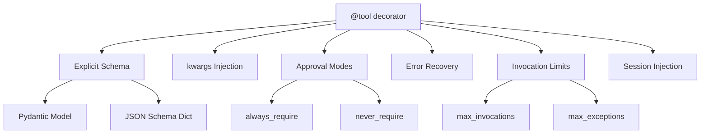

# 02-01 — Tools Deep Dive

> **Source**: [02-agents/tools/](https://github.com/microsoft/agent-framework/tree/main/python/samples/02-agents/tools)
> **Difficulty**: Intermediate
> **Prerequisites**: [01 — Get Started](01-get-started.md) (Sample 2: Add Tools)

## Overview

Tools are how agents **interact with the real world** — calling APIs, reading databases, performing calculations. This guide covers every tool pattern in MAF: from basic `@tool` to explicit schemas, dependency injection, approval flows, error recovery, invocation limits, and class-based tools.



---

## Sample 1: Function Invocation Configuration

### What It Does
Shows how to configure the **global tool-calling behavior** at the client level — things like max iterations, error reporting, and whether to terminate on unknown calls.

### Full Source Code

```python
import asyncio
from typing import Annotated

from agent_framework import tool
from agent_framework.openai import OpenAIResponsesClient

@tool(approval_mode="never_require")
def add(
    x: Annotated[int, "First number"],
    y: Annotated[int, "Second number"],
) -> str:
    return f"{x} + {y} = {x + y}"

async def main():
    client = OpenAIResponsesClient()

    # Configure function invocation behavior at the client level
    client.function_invocation_configuration["include_detailed_errors"] = True
    client.function_invocation_configuration["max_iterations"] = 40

    print(f"Config: \n{client.function_invocation_configuration}")

    agent = client.as_agent(name="ToolAgent", instructions="Use the provided tools.", tools=add)

    response = await agent.run("Add 239847293 and 29834")
    print(f"Response: {response.text}")

if __name__ == "__main__":
    asyncio.run(main())
```

### Key Configuration Options

| Setting | Default | Description |
|---------|---------|-------------|
| `include_detailed_errors` | `false` | Send full stack traces to the model when tools fail |
| `max_iterations` | `10` | Maximum tool-call → model → tool-call loops per request |
| `max_consecutive_errors_per_request` | `3` | Stop after N consecutive tool errors |
| `terminate_on_unknown_calls` | `false` | Whether to fail if the model calls an unregistered tool |

---

## Sample 2: Explicit Schema — Full Control Over Tool Interface

### What It Does
Demonstrates two ways to define the tool schema **explicitly** instead of relying on automatic inference: (1) a Pydantic `BaseModel`, and (2) a raw JSON schema dictionary.

### Full Source Code

```python
import asyncio
from typing import Annotated

from agent_framework import tool
from agent_framework.openai import OpenAIResponsesClient
from pydantic import BaseModel, Field

# Approach 1: Pydantic model as explicit schema
class WeatherInput(BaseModel):
    """Input schema for the weather tool."""
    location: Annotated[str, Field(description="The city name to get weather for")]
    unit: Annotated[str, Field(description="Temperature unit: celsius or fahrenheit")] = "celsius"

@tool(
    name="get_weather",
    description="Get the current weather for a given location.",
    schema=WeatherInput,        # ← Pydantic model controls the schema
    approval_mode="never_require",
)
def get_weather(location: str, unit: str = "celsius") -> str:
    return f"The weather in {location} is 22 degrees {unit}."

# Approach 2: JSON schema dictionary
get_current_time_schema = {
    "type": "object",
    "properties": {
        "timezone": {
            "type": "string",
            "description": "The timezone to get the current time for",
            "default": "UTC",
        },
    },
}

@tool(
    name="get_current_time",
    description="Get the current time in a given timezone.",
    schema=get_current_time_schema,  # ← Raw JSON Schema dict
    approval_mode="never_require",
)
def get_current_time(timezone: str = "UTC") -> str:
    from datetime import datetime
    from zoneinfo import ZoneInfo
    return f"The current time in {timezone} is {datetime.now(ZoneInfo(timezone)).isoformat()}"

async def main():
    agent = OpenAIResponsesClient().as_agent(
        name="AssistantAgent",
        instructions="You are a helpful assistant. Use the available tools to answer questions.",
        tools=[get_weather, get_current_time],
    )
    result = await agent.run("What is the weather in Seattle and what time is it?")
    print(f"Result: {result.text}")

if __name__ == "__main__":
    asyncio.run(main())
```

### When to Use Explicit Schemas
- When you want the model to see a **different interface** than your Python function
- When you need **default values** visible to the model
- When using **complex types** that auto-inference doesn't handle well
- When you want a **single Pydantic model** shared across multiple tools for consistency

---

## Sample 3: kwargs — Inject Runtime Context Into Tools

### What It Does
Shows how to pass **runtime data** (user IDs, tokens, request context) into tools without exposing these to the AI model. The model sees only `location`, but your tool also gets `user_id`.

### Full Source Code

```python
import asyncio
from typing import Annotated, Any

from agent_framework import tool
from agent_framework.openai import OpenAIResponsesClient
from pydantic import Field

@tool(approval_mode="never_require")
def get_weather(
    location: Annotated[str, Field(description="The location to get the weather for.")],
    **kwargs: Any,    # ← Accepts injected kwargs, invisible to the model
) -> str:
    """Get the weather for a given location."""
    user_id = kwargs.get("user_id", "unknown")
    print(f"Getting weather for user: {user_id}")
    return f"The weather in {location} is cloudy with a high of 15°C."

async def main() -> None:
    agent = OpenAIResponsesClient().as_agent(
        name="WeatherAgent",
        instructions="You are a helpful weather assistant.",
        tools=[get_weather],
    )

    # user_id is injected into the tool via kwargs, not visible to the model
    response = await agent.run("What is the weather like in Amsterdam?", user_id="user_123")
    print(f"Agent: {response.text}")

if __name__ == "__main__":
    asyncio.run(main())
```

### How It Works
```
agent.run("question", user_id="user_123")
                       ↓
Model sees: get_weather(location="Amsterdam")
Tool gets:  get_weather(location="Amsterdam", user_id="user_123")
```

The `**kwargs` pattern lets you pass any keyword argument from `agent.run()` through to the tool. The model never sees these.

---

## Sample 4: Dependency Injection — Tools from Dictionary Definitions

### What It Does
Creates a `FunctionTool` from a **serialized dictionary definition** and injects the actual function implementation at runtime. This enables declarative tool definitions.

### Full Source Code

```python
import asyncio

from agent_framework import FunctionTool
from agent_framework.openai import OpenAIResponsesClient

# Serialized tool definition (could come from YAML, a database, etc.)
definition = {
    "type": "function_tool",
    "name": "add_numbers",
    "description": "Add two numbers together.",
    "input_model": {
        "properties": {
            "a": {"description": "The first number", "type": "integer"},
            "b": {"description": "The second number", "type": "integer"},
        },
        "required": ["a", "b"],
        "title": "func_input",
        "type": "object",
    },
}

async def main() -> None:
    # The actual implementation
    def func(a, b) -> int:
        return a + b

    # Create tool from definition + inject the function
    tool = FunctionTool.from_dict(
        definition,
        dependencies={"function_tool": {"name:add_numbers": {"func": func}}}
    )

    agent = OpenAIResponsesClient().as_agent(
        name="FunctionToolAgent",
        instructions="You are a helpful assistant.",
        tools=tool,
    )
    response = await agent.run("What is 5 + 3?")
    print(f"Response: {response.text}")

if __name__ == "__main__":
    asyncio.run(main())
```

### Dependency Injection Structure
```python
dependencies = {
    "function_tool": {             # Matches the tool type
        "name:add_numbers": {      # Instance-specific: target tools named "add_numbers"
            "func": func           # The parameter being injected
        }
    }
}
```

---

## Sample 5: Tool Approval — Human-in-the-Loop for Tool Calls

### What It Does
Shows the full approval workflow: the model requests to call a tool, MAF pauses execution, presents the request to the user, and resumes based on approval/rejection. Demonstrates both non-streaming and streaming modes.

### Key Code (Simplified)

```python
from agent_framework import Agent, AgentResponse, Message, tool
from agent_framework.openai import OpenAIResponsesClient

# One tool auto-executes, the other requires approval
@tool(approval_mode="never_require")
def get_weather(location: str) -> str:
    return f"The weather in {location} is sunny."

@tool(approval_mode="always_require")
def get_weather_detail(location: str) -> str:
    return f"Detailed forecast for {location}: sunny, 88% humidity."

async def handle_approvals(query: str, agent) -> AgentResponse:
    """Loop until all approval requests are resolved."""
    result = await agent.run(query)

    while len(result.user_input_requests) > 0:
        new_inputs = [query]
        for request in result.user_input_requests:
            print(f"Approval needed: {request.function_call.name}({request.function_call.arguments})")

            # Add the assistant's approval request message
            new_inputs.append(Message("assistant", [request]))

            # Get user response
            approved = input("Approve? (y/n): ").lower() == "y"

            # Add approval/rejection response
            new_inputs.append(
                Message("user", [request.to_function_approval_response(approved)])
            )

        result = await agent.run(new_inputs)

    return result
```

### The Approval Flow
```
1. User: "Get detailed weather for Seattle"
2. Model: "I want to call get_weather_detail(Seattle)"
3. MAF: returns user_input_requests (paused)
4. You:  approve or reject
5. You:  send Message("user", [approval_response]) back
6. MAF:  continues or skips the tool call
```

---

## Sample 6: Tool Approval with Sessions

### What It Does
Same approval pattern as above, but using **sessions** to simplify the message tracking. With sessions, you don't need to manually pass previous messages — the session handles it.

### Key Code

```python
from agent_framework import Agent, Message, tool
from agent_framework.azure import AzureOpenAIChatClient

@tool(approval_mode="always_require")
def add_to_calendar(event_name: str, date: str) -> str:
    """Add an event to the calendar (requires approval)."""
    return f"Added '{event_name}' to calendar on {date}"

async def approval_example() -> None:
    agent = Agent(
        client=AzureOpenAIChatClient(),
        name="CalendarAgent",
        instructions="You are a helpful calendar assistant.",
        tools=[add_to_calendar],
    )
    session = agent.create_session()

    # Step 1: Agent wants to call the tool → returns approval request
    result = await agent.run("Add a dentist appointment on March 15th", session=session)

    if result.user_input_requests:
        for request in result.user_input_requests:
            # Step 2: Approve and re-run with session (no manual message construction)
            approval = request.to_function_approval_response(approved=True)
            result = await agent.run(Message("user", [approval]), session=session)

    print(f"Agent: {result}")
```

### Sessions vs No Sessions for Approvals

| Aspect | Without Session | With Session |
|--------|-----------------|--------------|
| Message tracking | Manual: rebuild from `[query, assistant_msg, approval]` | Automatic: session stores everything |
| Multi-step approvals | Complex: must accumulate all messages | Simple: just send approval + session |
| Code complexity | High | Low |

---

## Sample 7: Error Recovery — Graceful Handling of Tool Failures

### What It Does
Demonstrates that when a tool **raises an exception**, MAF catches it, sends the error back to the model, and the model decides how to respond — often explaining the error to the user, then continuing.

### Full Source Code

```python
import asyncio
from typing import Annotated

from agent_framework import tool
from agent_framework.openai import OpenAIResponsesClient

@tool(approval_mode="never_require")
def greet(name: Annotated[str, "Name to greet"]) -> str:
    return f"Hello, {name}!"

@tool(approval_mode="never_require")
def safe_divide(
    a: Annotated[int, "Numerator"],
    b: Annotated[int, "Denominator"],
) -> str:
    """Divide two numbers (can be used with 0 as denominator)."""
    result = a / b  # Will raise ZeroDivisionError!
    return f"{a} / {b} = {result}"

async def main():
    agent = OpenAIResponsesClient().as_agent(
        name="ToolAgent",
        instructions="Use the provided tools.",
        tools=[greet, safe_divide],
    )
    session = agent.create_session()

    # Step 1: Tool throws ZeroDivisionError → model explains gracefully
    print("Step 1: divide(10, 0) - tool raises exception")
    response = await agent.run("Divide 10 by 0", session=session)
    print(f"Response: {response.text}")

    # Step 2: Conversation continues — the exception doesn't kill the session
    print("\nStep 2: greet('Bob') - keeps going")
    response = await agent.run("Greet Bob", session=session)
    print(f"Response: {response.text}")

if __name__ == "__main__":
    asyncio.run(main())
```

### How Error Recovery Works
```
1. Model calls safe_divide(10, 0)
2. Python raises ZeroDivisionError
3. MAF catches it, sends error message back to model
4. Model explains: "Division by zero is undefined..."
5. Conversation continues normally — no crash
```

---

## Sample 8: Max Invocations — Limiting Tool Usage

### What It Does
Shows how to **limit the number of times** a tool can be called using `max_invocations`. After the limit is reached, MAF tells the model the tool is no longer available.

### Key Code

```python
@tool(max_invocations=1)  # Can only be called once!
def unicorn_function(times: Annotated[int, "The number of unicorns"]) -> str:
    """This function returns precious unicorns!"""
    return f"{'🦄' * times}✨"

async def main():
    agent = OpenAIResponsesClient().as_agent(
        name="ToolAgent", instructions="Use the provided tools.", tools=[unicorn_function]
    )
    session = agent.create_session()

    # First call succeeds
    response = await agent.run("Call 5 unicorns!", session=session)
    print(response.text)  # 🦄🦄🦄🦄🦄✨

    # Second call is blocked
    response = await agent.run("Call 10 more unicorns!", session=session)
    print(response.text)  # "The function has reached its limit..."

    # Inspect counters
    print(f"Invocations: {unicorn_function.invocation_count}")
    print(f"Exceptions: {unicorn_function.invocation_exception_count}")
```

### Use Cases
- **Expensive API calls** (pay-per-call services)
- **One-shot actions** (sending an email — only do it once)
- **Safety guardrails** (limit destructive operations)

---

## Sample 9: Max Exceptions — Limiting Tool Failures

### What It Does
Similar to `max_invocations`, but limits the number of **exceptions** a tool can throw. After N failures, the tool is disabled to prevent wasting tokens on a broken tool.

```python
@tool(max_exceptions=2)  # Disable after 2 exceptions
def unreliable_tool(x: int) -> str:
    if x == 0:
        raise ValueError("Cannot process zero!")
    return f"Result: {x}"
```

After 2 exceptions, MAF tells the model: "This tool is no longer available due to repeated failures."

---

## Sample 10: Session Injection — Access Session in Tools

### What It Does
Shows how to access the **session object** inside a tool via `**kwargs`. This lets tools read session IDs, metadata, or any session state.

### Key Code

```python
@tool(approval_mode="never_require")
async def get_weather(
    location: Annotated[str, Field(description="The location")],
    **kwargs: Any,
) -> str:
    """Get the weather for a given location."""
    session = kwargs.get("session")  # Session auto-injected when agent.run() has session=
    if session and isinstance(session, AgentSession):
        print(f"Session ID: {session.service_session_id}")
    return f"The weather in {location} is cloudy."

async def main():
    agent = OpenAIResponsesClient().as_agent(
        name="WeatherAgent",
        instructions="You are a helpful weather assistant.",
        tools=[get_weather],
        options={"store": True},    # Enable server-side session storage
    )
    session = agent.create_session()
    await agent.run("Weather in London?", session=session)
```

---

## Sample 11: Declaration-Only Tools — No Implementation

### What It Does
Creates a tool that has a **declaration (name + description) but no implementation**. When the model calls it, MAF returns the raw function call data instead of executing any code. Useful for testing or when tools are implemented externally.

### Full Source Code

```python
import asyncio
from agent_framework import FunctionTool
from agent_framework.openai import OpenAIResponsesClient

async def main():
    # Tool with no function — just a declaration
    function_declaration = FunctionTool(
        name="get_current_time",
        description="Get the current time in ISO 8601 format.",
    )

    agent = OpenAIResponsesClient().as_agent(
        name="DeclarationOnlyToolAgent",
        instructions="You are a helpful agent that uses tools.",
        tools=function_declaration,
    )

    result = await agent.run("What is the current time?")
    # Instead of a text response, you get the raw function_call data
    print(f"Result: {result.to_json(indent=2)}")
    # Contains: function_call.name = "get_current_time", arguments = "{}"

if __name__ == "__main__":
    asyncio.run(main())
```

### Use Cases
- **Testing** — Verify the model calls the right tool with the right arguments
- **External execution** — Forward the function call to a different service
- **Human-in-the-loop** — Let a human execute the tool and return results

---

## Sample 12: Class-Based Tools — Tools with State

### What It Does
Shows how to use **class methods as tools**, enabling tools that share state. The class instance can be modified between calls, changing tool behavior at runtime.

### Full Source Code

```python
import asyncio
from typing import Annotated
from agent_framework import tool
from agent_framework.openai import OpenAIResponsesClient

class MyFunctionClass:
    def __init__(self, safe: bool = False) -> None:
        self.safe = safe  # Controls behavior at runtime

    def divide(self, a: Annotated[int, "Numerator"], b: Annotated[int, "Denominator"]) -> str:
        """Divide two numbers, safe to use with 0 as denominator."""
        result = "∞" if b == 0 and self.safe else a / b
        return f"{a} / {b} = {result}"

    def add(self, x: Annotated[int, "First number"], y: Annotated[int, "Second number"]) -> str:
        return f"{x} + {y} = {x + y}"

async def main():
    tools = MyFunctionClass(safe=True)

    # Apply @tool to a bound method (note: at runtime, not at class definition)
    add_function = tool(description="Add two numbers.")(tools.add)

    agent = OpenAIResponsesClient().as_agent(
        name="ToolAgent", instructions="Use the provided tools."
    )

    # Step 1: safe=True → returns "∞" for divide by zero
    response = await agent.run("Divide 10 by 0", tools=[add_function, tools.divide])
    print(f"Safe mode: {response.text}")

    # Step 2: Change state → safe=False → raises exception
    tools.safe = False
    response = await agent.run("Divide 10 by 0", tools=[add_function, tools.divide])
    print(f"Unsafe mode: {response.text}")

if __name__ == "__main__":
    asyncio.run(main())
```

### Key Pattern: Runtime Tool Decoration
```python
# At class definition — no decorator
def add(self, x, y) -> str: ...

# At runtime — apply decorator dynamically
add_function = tool(description="Add two numbers.")(tools.add)
```

Note: You can also pass undecorated methods directly as `tools=[tools.divide]` — MAF will auto-wrap them.

---

## 🎯 Key Takeaways

1. **`@tool` handles everything** — schema generation, model registration, invocation, error handling. Just decorate a function.

2. **Two schema strategies** — Auto-infer from the signature (default), or provide explicit Pydantic/JSON schemas for full control.

3. **`**kwargs` is the secret weapon** — Inject user IDs, tokens, sessions, or any runtime data without the model seeing it.

4. **Approval is built-in** — `approval_mode="always_require"` pauses execution and returns `user_input_requests` for human review.

5. **Errors don't crash the conversation** — MAF catches exceptions, feeds them back to the model, and the model recovers gracefully.

6. **Limits protect you** — `max_invocations` and `max_exceptions` prevent runaway tool calls and wasted tokens.

7. **Tools can be passed at `agent.run()` time** — Not just at agent creation. This allows dynamic toolsets based on context.

## What's Next

→ [02-02 — Middleware](02-02-middleware.md) for intercepting and modifying agent behavior
→ [02-06 — Conversations](02-06-conversations.md) for session storage patterns
