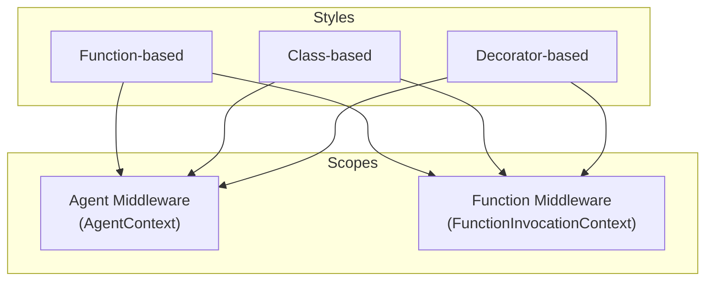

# 02-02 — Middleware Deep Dive

> **Source**: [02-agents/middleware/](https://github.com/microsoft/agent-framework/tree/main/python/samples/02-agents/middleware)
> **Difficulty**: Intermediate
> **Prerequisites**: [01 — Get Started](01-get-started.md), [02-01 — Tools](02-01-tools.md)

## Overview

Middleware lets you **intercept and modify** agent behavior at two levels: **agent-level** (before/after the entire agent run) and **function-level** (before/after each tool call). Think of it as Express.js middleware, but for AI agents.

MAF supports three styles of middleware, and two scopes:



---

## The Three Middleware Styles

### Style 1: Function-Based Middleware

The simplest approach — just write an async function with the right signature.

```python
from agent_framework import AgentContext, FunctionInvocationContext

# Agent middleware — runs before/after the entire agent invocation
async def my_agent_middleware(context: AgentContext, call_next) -> None:
    print("Before agent runs")
    await call_next()          # ← Call the next middleware or the agent itself
    print("After agent runs")

# Function middleware — runs before/after each tool call
async def my_function_middleware(context: FunctionInvocationContext, call_next) -> None:
    print(f"Before {context.function.name} runs")
    await call_next()
    print(f"After {context.function.name} runs")
```

**Registration**: Pass middleware to `.as_agent()`:
```python
agent = client.as_agent(
    name="MyAgent",
    instructions="...",
    tools=get_weather,
    middleware=[my_agent_middleware, my_function_middleware],
)
```

MAF auto-detects the middleware type from the parameter annotation (`AgentContext` vs `FunctionInvocationContext`).

### Style 2: Class-Based Middleware

For stateful or complex middleware — subclass `AgentMiddleware` or `FunctionMiddleware`.

```python
from agent_framework import AgentMiddleware, FunctionMiddleware, AgentContext, FunctionInvocationContext

class SecurityMiddleware(AgentMiddleware):
    async def process(self, context: AgentContext, call_next) -> None:
        last_msg = context.messages[-1] if context.messages else None
        if last_msg and "password" in (last_msg.text or "").lower():
            context.result = AgentResponse(
                messages=[Message("assistant", ["Request blocked: sensitive info detected."])]
            )
            return  # Don't call call_next() → blocks the request

        await call_next()

class LoggingMiddleware(FunctionMiddleware):
    async def process(self, context: FunctionInvocationContext, call_next) -> None:
        start = time.time()
        await call_next()
        print(f"{context.function.name} took {time.time() - start:.3f}s")
```

**Registration**: Pass instances:
```python
middleware=[SecurityMiddleware(), LoggingMiddleware()]
```

### Style 3: Decorator-Based Middleware

Explicitly mark middleware type with `@agent_middleware` or `@function_middleware` — no type annotations needed.

```python
from agent_framework import agent_middleware, function_middleware

@agent_middleware
async def simple_agent_middleware(context, call_next):
    print("[Agent] Before execution")
    await call_next()
    print("[Agent] After execution")

@function_middleware
async def simple_function_middleware(context, call_next):
    print(f"[Function] Before calling: {context.function.name}")
    await call_next()
    print(f"[Function] After calling: {context.function.name}")
```

### Style Comparison

| Style | When to Use | Annotation Required? |
|-------|-------------|---------------------|
| Function-based | Simple, stateless operations | Yes — use `AgentContext` or `FunctionInvocationContext` |
| Class-based | Stateful, complex, OOP patterns | Yes — inherit from `AgentMiddleware` / `FunctionMiddleware` |
| Decorator-based | Quick setup, no type annotations | No — decorator declares the type |

---

## Key Patterns

### Pattern 1: Blocking Requests (Security)

Don't call `call_next()` to prevent the agent or tool from executing:

```python
async def security_middleware(context: AgentContext, call_next) -> None:
    if "password" in (context.messages[-1].text or "").lower():
        print("BLOCKED: Sensitive content detected")
        return  # ← No call_next() = request dies here
    await call_next()
```

### Pattern 2: Exception Handling

Catch tool exceptions and provide graceful fallbacks:

```python
async def exception_middleware(context: FunctionInvocationContext, call_next) -> None:
    try:
        await call_next()
    except TimeoutError:
        # Override the function result with a user-friendly message
        context.result = "Service unavailable, please try again later."
```

Key insight: Setting `context.result` replaces whatever the tool returned (or threw) — the model sees your custom message instead.

### Pattern 3: Shared State Between Middleware

Use a class instance to share state across multiple middleware functions:

```python
class MiddlewareContainer:
    def __init__(self):
        self.call_count = 0

    async def counter_middleware(self, context: FunctionInvocationContext, call_next):
        self.call_count += 1
        print(f"Call #{self.call_count}")
        await call_next()

    async def enhancer_middleware(self, context: FunctionInvocationContext, call_next):
        await call_next()
        if context.result:
            context.result = f"[Call #{self.call_count}] {context.result}"

# Both methods share the same instance state
container = MiddlewareContainer()
middleware = [container.counter_middleware, container.enhancer_middleware]
```

### Pattern 4: Termination Middleware

Force the agent to stop processing:

```python
async def termination_middleware(context: AgentContext, call_next) -> None:
    await call_next()
    # After the agent runs, check if we should stop
    if context.result and "DONE" in context.result.text:
        context.terminate = True  # Stops the tool-call loop
```

### Pattern 5: Result Override

Replace the agent's response entirely:

```python
async def override_middleware(context: AgentContext, call_next) -> None:
    await call_next()
    # Always append a disclaimer
    if context.result:
        original = context.result.text
        context.result = AgentResponse(
            messages=[Message("assistant", [f"{original}\n\n⚠️ This is AI-generated content."])]
        )
```

---

## Agent-Level vs Run-Level Middleware

MAF supports middleware at two granularity levels:

| Level | Scope | Use Case |
|-------|-------|----------|
| **Agent-level** | Runs for every call to this agent | Global policies (security, logging) |
| **Run-level** | Passed per `agent.run()` call | Request-specific behavior |

```python
# Agent-level: always applies
agent = client.as_agent(
    middleware=[security_middleware],  # Every run goes through this
)

# Run-level: only for this specific call
result = await agent.run("query", middleware=[debug_middleware])
```

---

## Middleware Execution Order

Middleware executes in a **pipeline** (like Express.js or ASP.NET middleware):

```
Request →
  [Agent MW 1] →
    [Agent MW 2] →
      [Agent Core] →
        Model generates → wants to call tool →
          [Function MW 1] →
            [Function MW 2] →
              [Tool executes] →
            [Function MW 2] ←
          [Function MW 1] ←
        Model gets result → generates response →
      [Agent Core] ←
    [Agent MW 2] ←
  [Agent MW 1] ←
← Response
```

---

## Additional Samples

The middleware directory also includes these advanced samples:

| File | Concept |
|------|---------|
| `agent_and_run_level_middleware.py` | Agent-level vs run-level middleware comparison |
| `chat_middleware.py` | Middleware for chat-specific operations |
| `session_behavior_middleware.py` | Middleware that modifies session handling |
| `runtime_context_delegation.py` | Delegating agent execution context at runtime |
| `override_result_with_middleware.py` | Replacing agent responses with middleware |

---

## 🎯 Key Takeaways

1. **Two scopes** — `AgentContext` (whole invocation) and `FunctionInvocationContext` (per-tool-call)
2. **Three styles** — Function, class, or decorator. All interchangeable.
3. **`call_next()` is the pipeline** — Call it to continue, skip it to block.
4. **`context.result = ...` overrides output** — Set it to replace tool results or agent responses.
5. **Order matters** — Middleware runs in the order you register it.
6. **Stateful middleware** — Use class instances or `MiddlewareContainer` for shared state.

## What's Next

→ [02-03 — Providers](02-03-providers.md) for connecting to different AI models
→ [02-04 — Context Providers](02-04-context-providers.md) for dynamic prompt injection
