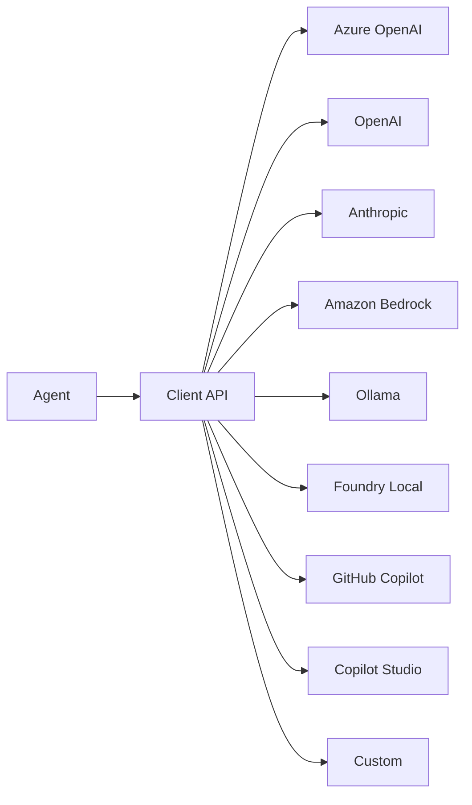

# 02-03 — Providers (Model Backends)

> **Source**: [02-agents/providers/](https://github.com/microsoft/agent-framework/tree/main/python/samples/02-agents/providers)
> **Difficulty**: Beginner–Intermediate
> **Prerequisites**: [01 — Get Started](01-get-started.md)

## Overview

Providers are MAF's **pluggable model backends** — they let you swap between Azure OpenAI, OpenAI, Anthropic, Amazon Bedrock, Ollama, and more without changing your agent logic. MAF supports **11 providers** out of the box.



---

## Provider Catalog

| Provider | Client Class | API Type | Auth |
|----------|-------------|----------|------|
| **Azure OpenAI** | `AzureOpenAIResponsesClient`, `AzureOpenAIChatClient` | Responses, Chat, Assistants | `AzureCliCredential` |
| **Azure AI Foundry V2** | `AzureAIClient` | Foundry projects | `AzureCliCredential` |
| **Azure AI Agent** | `AzureAIAgentClient` | V1 hosted agents | `AzureCliCredential` |
| **OpenAI** | `OpenAIResponsesClient`, `OpenAIChatClient` | Responses, Chat, Assistants | `OPENAI_API_KEY` |
| **Anthropic** | `AnthropicClient`, `ClaudeAgent` | Claude API | `ANTHROPIC_API_KEY` |
| **Amazon Bedrock** | `BedrockChatClient` | Bedrock Runtime | AWS credentials |
| **Ollama** | `OllamaChatClient` | Local inference | None (local) |
| **Foundry Local** | `FoundryLocalClient` | Local inference | None (local) |
| **GitHub Copilot** | `GitHubCopilotAgent` | Copilot API | GitHub token |
| **Copilot Studio** | Direct integration | Copilot Studio | App registration |
| **Custom** | `BaseAgent` / `BaseChatClient` | Any | Any |

---

## Quick Usage

All providers follow the same pattern: create the client, call `.as_agent()`:

### Azure OpenAI (Responses API)
```python
from agent_framework.azure import AzureOpenAIResponsesClient
from azure.identity import AzureCliCredential

client = AzureOpenAIResponsesClient(
    project_endpoint=os.environ["AZURE_AI_PROJECT_ENDPOINT"],
    deployment_name=os.environ["AZURE_OPENAI_RESPONSES_DEPLOYMENT_NAME"],
    credential=AzureCliCredential(),
)
agent = client.as_agent(name="MyAgent", instructions="...")
```

### OpenAI (Direct)
```python
from agent_framework.openai import OpenAIResponsesClient
agent = OpenAIResponsesClient().as_agent(name="MyAgent", instructions="...")
# Uses OPENAI_API_KEY env var automatically
```

### Ollama (Local)
```python
from agent_framework.ollama import OllamaChatClient
agent = OllamaChatClient(model="llama3.2").as_agent(name="LocalAgent", instructions="...")
```

### Anthropic (Claude)
```python
from agent_framework.anthropic import AnthropicClient
agent = AnthropicClient().as_agent(name="ClaudeAgent", instructions="...")
```

### Amazon Bedrock
```python
from agent_framework.amazon import BedrockChatClient
agent = BedrockChatClient(model_id="...").as_agent(name="BedrockAgent", instructions="...")
```

### Custom Provider
```python
from agent_framework import BaseAgent, BaseChatClient
# Subclass these to build your own provider
```

---

## Key Concepts

### Responses API vs Chat API
- **Responses API** (`*ResponsesClient`): Newer, supports tool use, sessions, file search built-in
- **Chat API** (`*ChatClient`): Standard chat completions, widely supported
- **Assistants API**: Server-side thread management

### Provider Interchangeability
Your agent code stays the same — only the client changes:

```python
# Same agent, different backends:
agent_azure = AzureOpenAIResponsesClient(...).as_agent(name="Bot", instructions="...", tools=my_tools)
agent_openai = OpenAIResponsesClient().as_agent(name="Bot", instructions="...", tools=my_tools)
agent_ollama = OllamaChatClient(model="llama3.2").as_agent(name="Bot", instructions="...", tools=my_tools)
```

---

## 🎯 Key Takeaways

1. **11 providers** out of the box — swap backends without changing agent logic
2. **Two main API styles** — Responses (modern) and Chat (universal)
3. **Same `.as_agent()` pattern** everywhere — learn once, use anywhere
4. **Local options** — Ollama and Foundry Local for offline development
5. **Custom extensible** — Subclass `BaseAgent` or `BaseChatClient` for custom backends

## What's Next

→ [02-04 — Context Providers](02-04-context-providers.md) for dynamic agent memory
→ [02-05 — MCP](02-05-mcp.md) for Model Context Protocol integration
