# 02-04 — Context Providers (Agent Memory)

> **Source**: [02-agents/context_providers/](https://github.com/microsoft/agent-framework/tree/main/python/samples/02-agents/context_providers)
> **Difficulty**: Intermediate
> **Prerequisites**: [01 — Get Started](01-get-started.md) (Sample 4: Memory)

## Overview

Context Providers give agents **persistent memory** by injecting dynamic instructions before each run (`before_run`) and extracting information after (`after_run`). They enable agents to remember user preferences, learn from interactions, and personalize responses across sessions.

```mermaid
sequenceDiagram
    participant U as User
    participant A as Agent
    participant CP as Context Provider
    participant M as Model

    U->>A: "Hello, what's √9?"
    A->>CP: before_run()
    CP-->>A: instructions: "Ask for user's name first"
    A->>M: query + instructions
    M-->>A: "May I ask your name first?"
    A->>CP: after_run()
    CP-->>CP: Extract: no name yet
    A-->>U: "May I ask your name first?"
```



---

## Sample: Simple Context Provider

This sample builds a `UserInfoMemory` provider that asks the user for their name and age, extracts it from messages, and personalizes all future interactions.

### Full Source Code

```python
import asyncio
import os
from contextlib import suppress
from typing import Any

from agent_framework import Agent, AgentSession, BaseContextProvider, SessionContext, SupportsChatGetResponse
from agent_framework.azure import AzureOpenAIResponsesClient
from azure.identity import AzureCliCredential
from pydantic import BaseModel

class UserInfo(BaseModel):
    name: str | None = None
    age: int | None = None

class UserInfoMemory(BaseContextProvider):
    DEFAULT_SOURCE_ID = "user_info_memory"

    def __init__(self, source_id: str = DEFAULT_SOURCE_ID, *, client: SupportsChatGetResponse, **kwargs):
        super().__init__(source_id)
        self._chat_client = client

    async def before_run(self, *, agent, session, context: SessionContext, state: dict[str, Any]) -> None:
        """Inject personalized instructions before each agent call."""
        state.setdefault("user_info", UserInfo())

        # Conditional instructions based on what we know
        context.extend_instructions(
            self.source_id,
            "Ask the user for their name first."
            if state["user_info"].name is None
            else f"The user's name is {state['user_info'].name}.",
        )
        context.extend_instructions(
            self.source_id,
            "Ask the user for their age."
            if state["user_info"].age is None
            else f"The user's age is {state['user_info'].age}.",
        )

    async def after_run(self, *, agent, session, context: SessionContext, state: dict[str, Any]) -> None:
        """Extract user info from conversation after each call."""
        messages = context.get_messages(include_input=True, include_response=True)
        user_messages = [m for m in messages if hasattr(m, "role") and m.role == "user"]

        if (state["user_info"].name is None or state["user_info"].age is None) and user_messages:
            with suppress(Exception):
                # Use the model to extract structured data
                result = await self._chat_client.get_response(
                    messages=messages,
                    instructions="Extract the user's name and age if present.",
                    options={"response_format": UserInfo},
                )
                extracted = result.value
                if state["user_info"].name is None and extracted.name:
                    state["user_info"].name = extracted.name
                if state["user_info"].age is None and extracted.age:
                    state["user_info"].age = extracted.age

async def main():
    client = AzureOpenAIResponsesClient(
        project_endpoint=os.environ["AZURE_AI_PROJECT_ENDPOINT"],
        deployment_name=os.environ["AZURE_OPENAI_RESPONSES_DEPLOYMENT_NAME"],
        credential=AzureCliCredential(),
    )
    memory_provider = UserInfoMemory("user_info_memory", client=client)

    async with Agent(
        client=client,
        instructions="You are a friendly assistant. Address the user by name.",
        context_providers=[memory_provider],
    ) as agent:
        session = agent.create_session()
        for msg in ["Hello, what is √9?", "My name is Ruaidhrí", "I am 20 years old"]:
            print(f"User: {msg}")
            print(f"Assistant: {await agent.run(msg, session=session)}")

        # Inspect extracted memory
        print(f"\nMEMORY - Name: {session.state['user_info_memory']['user_info'].name}")
        print(f"MEMORY - Age: {session.state['user_info_memory']['user_info'].age}")
```

### Step-by-Step

1. **`BaseContextProvider`** — Base class. Requires a `source_id` string to namespace state.
2. **`before_run()`** — Called before each agent invocation. Use `context.extend_instructions()` to inject dynamic prompts.
3. **`after_run()`** — Called after each response. Use structured output (`response_format: UserInfo`) to extract data.
4. **`state` dict** — Persisted across calls within a session. Keyed by `source_id`.
5. **`session.state`** — Access extracted memory from the session object.

---

## Built-in Context Providers

MAF also ships integrations with popular storage backends:

| Provider | Source | Storage | Use Case |
|----------|--------|---------|----------|
| `UserInfoMemory` | `simple_context_provider.py` | In-memory | Personalization, user preferences |
| Azure AI Search | `azure_ai_search/` | Azure Search | RAG, knowledge base |
| Mem0 | `mem0/` | Mem0 service | Long-term memory |
| Redis | `redis/` | Redis | Distributed session memory |

---

## Building Your Own

```python
class MyProvider(BaseContextProvider):
    def __init__(self):
        super().__init__("my_provider")

    async def before_run(self, *, context: SessionContext, state: dict, **kwargs):
        # Inject instructions, tools, or messages
        context.extend_instructions(self.source_id, "Custom instruction here")

    async def after_run(self, *, context: SessionContext, state: dict, **kwargs):
        # Extract and store information
        state["last_response"] = context.get_messages(include_response=True)[-1].text
```

---

## 🎯 Key Takeaways

1. **`before_run` / `after_run`** — Lifecycle hooks that run automatically on every `agent.run()`
2. **`context.extend_instructions()`** — Inject dynamic instructions without modifying the agent
3. **`state` dict** — Per-session persistent storage, namespaced by `source_id`
4. **Structured extraction** — Use `response_format` to extract typed data from conversations
5. **Composable** — Stack multiple providers: `context_providers=[memory, search, analytics]`

## What's Next

→ [02-05 — MCP](02-05-mcp.md) for Model Context Protocol integration
→ [02-06 — Conversations](02-06-conversations.md) for session persistence patterns
