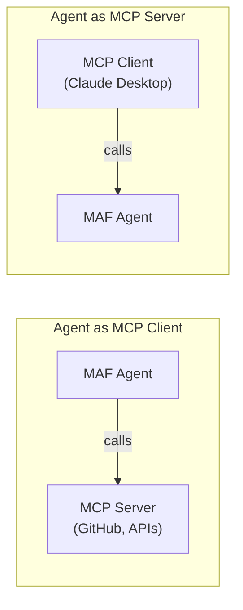

# 02-05 — MCP (Model Context Protocol)

> **Source**: [02-agents/mcp/](https://github.com/microsoft/agent-framework/tree/main/python/samples/02-agents/mcp)
> **Difficulty**: Intermediate–Advanced
> **Prerequisites**: [01 — Get Started](01-get-started.md), [02-01 — Tools](02-01-tools.md)

## Overview

The **Model Context Protocol (MCP)** is an open standard for connecting AI agents to external services. MAF supports MCP in two directions:

1. **Agent as MCP Client** — Your agent calls tools exposed by an MCP server (e.g., GitHub, external APIs)
2. **Agent as MCP Server** — Your agent is exposed as an MCP server for other MCP clients (e.g., Claude Desktop, VS Code)



---

## Sample 1: Agent as MCP Server

Expose your MAF agent as an MCP server that any MCP client can connect to.

### Key Code

```python
from agent_framework import tool
from agent_framework.openai import OpenAIResponsesClient

@tool(approval_mode="never_require")
def get_specials() -> str:
    return "Special Soup: Clam Chowder, Special Salad: Cobb Salad"

@tool(approval_mode="never_require")
def get_item_price(menu_item: str) -> str:
    return "$9.99"

async def run():
    agent = OpenAIResponsesClient().as_agent(
        name="RestaurantAgent",
        description="Answer questions about the menu.",
        tools=[get_specials, get_item_price],
    )

    # One line to become an MCP server
    server = agent.as_mcp_server()

    # Run with stdio transport
    from mcp.server.stdio import stdio_server
    async with stdio_server() as (read_stream, write_stream):
        await server.run(read_stream, write_stream, server.create_initialization_options())
```

### MCP Client Configuration (e.g., Claude Desktop)
```json
{
    "servers": {
        "restaurant": {
            "command": "uv",
            "args": ["run", "agent_as_mcp_server.py"],
            "env": { "OPENAI_API_KEY": "<key>" }
        }
    }
}
```

---

## Sample 2: Agent as MCP Client (GitHub with PAT)

Connect your agent to GitHub's MCP server to interact with repositories, issues, and more.

### Key Code

```python
from agent_framework import Agent
from agent_framework.openai import OpenAIResponsesClient

async def github_mcp_example():
    github_pat = os.getenv("GITHUB_PAT")
    auth_headers = {"Authorization": f"Bearer {github_pat}"}

    client = OpenAIResponsesClient()

    # Get MCP tool from the client
    github_mcp_tool = client.get_mcp_tool(
        name="GitHub",
        url="https://api.githubcopilot.com/mcp/",
        headers=auth_headers,
        approval_mode="never_require",
    )

    async with Agent(
        client=client,
        name="GitHubAgent",
        instructions="You can interact with GitHub repositories, issues, and more.",
        tools=github_mcp_tool,
    ) as agent:
        result = await agent.run("What is my GitHub username?")
        print(result.text)

        result = await agent.run("List my repositories")
        print(result.text)
```

### MCP Authentication Patterns

| Pattern | File | Use Case |
|---------|------|----------|
| **Personal Access Token** | `mcp_github_pat.py` | GitHub repos, issues |
| **API Key Auth** | `mcp_api_key_auth.py` | Generic API services |

---

## 🎯 Key Takeaways

1. **`agent.as_mcp_server()`** — One-liner to expose any agent as an MCP server
2. **`client.get_mcp_tool()`** — Connect to any remote MCP server as a tool
3. **Bidirectional** — Agents can be both MCP servers and clients simultaneously
4. **Auth is header-based** — Pass `headers={}` for API keys, PATs, or bearer tokens

## What's Next

→ [02-06 — Conversations](02-06-conversations.md) for session persistence
→ [02-07 — Declarative Agents](02-07-declarative-agents.md) for YAML-defined agents
