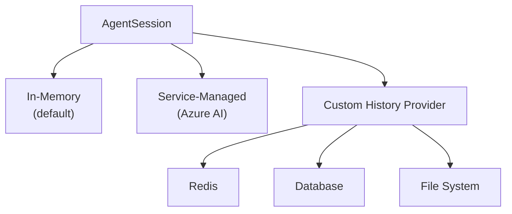

# 02-06 — Conversations (Session Persistence)

> **Source**: [02-agents/conversations/](https://github.com/microsoft/agent-framework/tree/main/python/samples/02-agents/conversations)
> **Difficulty**: Intermediate
> **Prerequisites**: [01 — Get Started](01-get-started.md) (Sample 3: Multi-Turn)

## Overview

Conversations in MAF handle **how chat history is stored and retrieved**. MAF supports three approaches: in-memory sessions, service-managed sessions, and custom history providers with pluggable backends like Redis.



---

## Sample 1: Custom History Provider

Build your own message storage by subclassing `BaseHistoryProvider`.

### Full Source Code

```python
from agent_framework import AgentSession, BaseHistoryProvider, Message
from agent_framework.openai import OpenAIChatClient

class CustomHistoryProvider(BaseHistoryProvider):
    """Custom storage — could be a database, file system, etc."""

    def __init__(self):
        super().__init__("custom-history")
        self._storage: dict[str, list[Message]] = {}

    async def get_messages(self, session_id, *, state=None, **kwargs) -> list[Message]:
        return list(self._storage.get(session_id or "default", []))

    async def save_messages(self, session_id, messages, *, state=None, **kwargs) -> None:
        key = session_id or "default"
        self._storage.setdefault(key, []).extend(messages)

async def main():
    agent = OpenAIChatClient().as_agent(
        name="CustomBot",
        instructions="You remember our conversation.",
        context_providers=[CustomHistoryProvider()],  # ← Plug in custom storage
    )
    session = agent.create_session()

    print(await agent.run("My name is Alice and I love pizza.", session=session))

    # Serialize session for later
    serialized = session.to_dict()

    # Resume later
    resumed = AgentSession.from_dict(serialized)
    print(await agent.run("What do you remember about me?", session=resumed))
```

### Key Concepts

| Method | Purpose |
|--------|---------|
| `get_messages()` | Load history from your storage |
| `save_messages()` | Persist new messages to your storage |
| `session.to_dict()` | Serialize session state (for database storage) |
| `AgentSession.from_dict()` | Deserialize and resume a session |

---

## Sample 2: Suspend and Resume Sessions

Shows how to pause and resume conversations — works with both service-managed and in-memory sessions.

### Key Pattern

```python
# 1. Create session and have a conversation
session = agent.create_session()
await agent.run("Hello! My name is Alice.", session=session)

# 2. Serialize session (store in DB, file, etc.)
serialized = session.to_dict()
# → {"session_id": "...", "state": {...}, "messages": [...]}

# 3. Later: deserialize and resume
resumed = AgentSession.from_dict(serialized)
await agent.run("What's my name?", session=resumed)
# → "Your name is Alice!"
```

### Service-Managed vs In-Memory

| Aspect | Service-Managed (Azure AI) | In-Memory |
|--------|---------------------------|-----------|
| History stored | Server-side | Client-side |
| Serialization | Only session ID needed | Full message history |
| Cross-process | ✅ Automatic | ❌ Must serialize/deserialize |
| Cost | Azure resource usage | Free |

---

## 🎯 Key Takeaways

1. **`BaseHistoryProvider`** — Subclass to plug in any storage backend
2. **`to_dict()` / `from_dict()`** — Serialize sessions for suspend/resume across processes
3. **Register as context provider** — `context_providers=[CustomHistoryProvider()]`
4. **Redis built-in** — `redis_chat_message_store_session.py` shows production-ready Redis storage

## What's Next

→ [02-07 — Declarative Agents](02-07-declarative-agents.md) for YAML/JSON agent definitions
→ [02-08 — Multimodal](02-08-multimodal.md) for image and audio input
