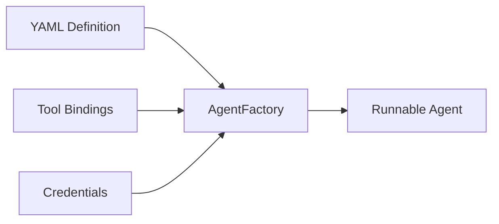

# 02-07 — Declarative Agents (YAML/JSON Definitions)

> **Source**: [02-agents/declarative/](https://github.com/microsoft/agent-framework/tree/main/python/samples/02-agents/declarative)
> **Difficulty**: Intermediate
> **Prerequisites**: [01 — Get Started](01-get-started.md), [02-01 — Tools](02-01-tools.md)

## Overview

Declarative agents let you define agent configuration in **YAML** instead of Python code. This enables non-developer configuration, version control of agent specs, and dynamic agent creation from config files or databases.



---

## Sample 1: Inline YAML Agent

Define an agent entirely from a YAML string — no Python agent setup needed.

### Full Source Code

```python
import asyncio
from agent_framework.declarative import AgentFactory
from azure.identity.aio import AzureCliCredential

async def main():
    yaml_definition = """kind: Prompt
name: DiagnosticAgent
displayName: Diagnostic Assistant
instructions: Specialized diagnostic agent with critical error protocol
description: Performs diagnostics on systems and escalates critical errors.

model:
  id: =Env.AZURE_OPENAI_MODEL
  connection:
    kind: remote
    endpoint: =Env.AZURE_AI_PROJECT_ENDPOINT
"""
    async with (
        AzureCliCredential() as credential,
        AgentFactory(client_kwargs={"credential": credential})
            .create_agent_from_yaml(yaml_definition) as agent,
    ):
        response = await agent.run("What can you do for me?")
        print("Agent response:", response.text)

if __name__ == "__main__":
    asyncio.run(main())
```

### YAML Schema

```yaml
kind: Prompt
name: AgentName
displayName: Human-Readable Name
instructions: System prompt for the agent
description: Description of what the agent does

model:
  id: =Env.MODEL_NAME          # Environment variable reference
  connection:
    kind: remote
    endpoint: =Env.ENDPOINT     # Environment variable reference
```

---

## Sample 2: YAML Agent with Tool Bindings

Load a YAML spec **from a file** and bind Python functions as tools at runtime.

### Key Code

```python
from agent_framework.azure import AzureOpenAIResponsesClient
from agent_framework.declarative import AgentFactory

def get_weather(location: str, unit: str = "celsius") -> str:
    return f"Weather in {location}: {randint(-10, 30)}° {unit}."

async def main():
    with open("GetWeather.yaml") as f:
        yaml_str = f.read()

    factory = AgentFactory(
        client=AzureOpenAIResponsesClient(credential=AzureCliCredential()),
        bindings={"get_weather": get_weather},  # ← Bind Python function to YAML tool name
    )

    agent = factory.create_agent_from_yaml(yaml_str)
    response = await agent.run("Weather in Amsterdam?")
    print(response.text)
```

---

## Additional Samples

| File | What It Shows |
|------|---------------|
| `openai_responses_agent.py` | OpenAI provider with declarative config |
| `azure_openai_responses_agent.py` | Azure OpenAI provider with declarative config |
| `microsoft_learn_agent.py` | Agent with web search tool via YAML |
| `mcp_tool_yaml.py` | MCP tools defined in YAML |

---

## 🎯 Key Takeaways

1. **`AgentFactory`** — Creates agents from YAML strings or files
2. **`=Env.VAR_NAME`** — Reference environment variables in YAML
3. **`bindings`** — Map YAML tool names to Python functions at runtime
4. **Separation of concerns** — Non-developers can edit YAML; developers manage tool implementations

## What's Next

→ [02-08 — Multimodal](02-08-multimodal.md) for image and audio input
→ [02-09 — Observability](02-09-observability.md) for tracing and monitoring
