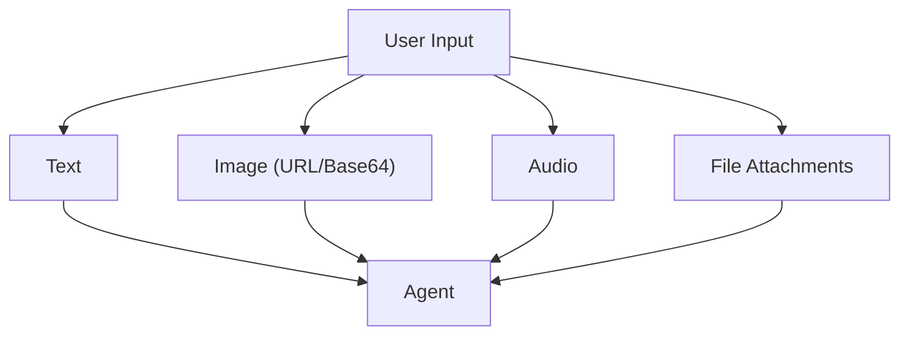

# 02-08 — Multimodal Input

> **Source**: Provider-specific samples in [02-agents/providers/](https://github.com/microsoft/agent-framework/tree/main/python/samples/02-agents/providers) (e.g., `openai/`, `ollama/`)
> **Difficulty**: Intermediate
> **Prerequisites**: [01 — Get Started](01-get-started.md), [02-03 — Providers](02-03-providers.md)

## Overview

MAF supports **multimodal input** — sending images, audio, and files alongside text to agents. This is handled through the provider's native capabilities, wrapped in MAF's message system.



---

## Sending Images

### URL-Based Image Input

```python
from agent_framework import Message, MessageContent

# Create a message with both text and an image URL
message = Message("user", [
    MessageContent.text("What's in this image?"),
    MessageContent.image_url("https://example.com/photo.jpg"),
])

result = await agent.run(message)
```

### Base64-Encoded Image

```python
import base64

with open("photo.png", "rb") as f:
    image_data = base64.b64encode(f.read()).decode()

message = Message("user", [
    MessageContent.text("Describe this image"),
    MessageContent.image_url(f"data:image/png;base64,{image_data}"),
])

result = await agent.run(message)
```

---

## Provider Support

| Provider | Images | Audio | Files | Notes |
|----------|--------|-------|-------|-------|
| OpenAI (GPT-4o) | ✅ | ✅ | ✅ | Full multimodal |
| Azure OpenAI | ✅ | ✅ | ✅ | Same as OpenAI |
| Anthropic (Claude) | ✅ | ❌ | ✅ | Vision only |
| Ollama (LLaVA) | ✅ | ❌ | ❌ | Vision models only |
| Amazon Bedrock | ✅ | ❌ | ❌ | Model dependent |

---

## 🎯 Key Takeaways

1. **`MessageContent.image_url()`** — Pass images via URL or base64 data URIs
2. **Provider-dependent** — Not all models support all modalities
3. **Same agent API** — Multimodal input uses the same `agent.run()` interface
4. **Check provider samples** — See `providers/openai/` and `providers/ollama/` for working examples

## What's Next

→ [02-09 — Observability](02-09-observability.md) for tracing and monitoring
→ [02-10 — Streaming & Extras](02-10-streaming-and-extras.md) for response streaming
