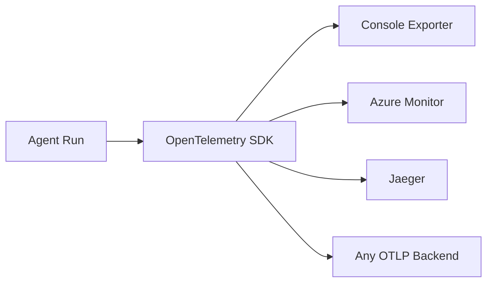

# 02-09 — Observability (Tracing & Monitoring)

> **Source**: [02-agents/observability/](https://github.com/microsoft/agent-framework/tree/main/python/samples/02-agents/observability)
> **Difficulty**: Intermediate–Advanced
> **Prerequisites**: [01 — Get Started](01-get-started.md)

## Overview

MAF has **built-in OpenTelemetry support** for tracing agent interactions, tool calls, and workflows. You can export traces to the console, Azure Monitor, Jaeger, or any OTLP-compatible backend.



---

## Quick Start: Enable Observability

### One Line Setup

```python
from agent_framework.observability import configure_otel_providers

# Enable tracing with environment-variable-based config
configure_otel_providers(enable_sensitive_data=True)
```

### Full Example

```python
import asyncio
from agent_framework import Agent, tool
from agent_framework.observability import configure_otel_providers, get_tracer
from agent_framework.openai import OpenAIChatClient
from opentelemetry.trace import SpanKind
from opentelemetry.trace.span import format_trace_id

@tool(approval_mode="never_require")
async def get_weather(location: str) -> str:
    return f"Weather in {location}: sunny, 22°C."

async def main():
    # Enable OpenTelemetry
    configure_otel_providers(enable_sensitive_data=True)

    # Create a custom span to group all agent operations
    with get_tracer().start_as_current_span("Agent Chat Scenario", kind=SpanKind.CLIENT) as span:
        print(f"Trace ID: {format_trace_id(span.get_span_context().trace_id)}")

        agent = Agent(
            client=OpenAIChatClient(),
            tools=get_weather,
            name="WeatherAgent",
            instructions="You are a weather assistant.",
            id="weather-agent",
        )
        session = agent.create_session()

        for question in ["Weather in Amsterdam?", "And in Paris?"]:
            print(f"\nUser: {question}")
            async for update in agent.run(question, session=session, stream=True):
                if update.text:
                    print(update.text, end="")

if __name__ == "__main__":
    asyncio.run(main())
```

---

## Configuration Options

### Via Environment Variables

```bash
# Export to Azure Monitor
APPLICATIONINSIGHTS_CONNECTION_STRING="InstrumentationKey=..."

# Export to OTLP endpoint (Jaeger, Grafana, etc.)
OTEL_EXPORTER_OTLP_ENDPOINT="http://localhost:4317"
OTEL_EXPORTER_OTLP_PROTOCOL="grpc"
```

### Via Parameters

```python
configure_otel_providers(
    enable_sensitive_data=True,  # Include message content in traces
    # Additional OTel configuration...
)
```

---

## What Gets Traced

| Component | Span Name | Details |
|-----------|-----------|---------|
| Agent Run | `agent.run` | Input, output, model used |
| Tool Call | `tool.{name}` | Arguments, result, duration |
| Model Request | `model.request` | Prompt tokens, completion tokens |
| Workflow Step | `workflow.{executor}` | Input, output per node |

---

## Available Samples

| File | What It Shows |
|------|---------------|
| `agent_observability.py` | Basic agent tracing with console output |
| `workflow_observability.py` | Tracing workflow execution |
| `azure_ai_agent_observability.py` | Azure AI Agent tracing |
| `agent_with_foundry_tracing.py` | Azure AI Foundry tracing |
| `configure_otel_providers_with_env_var.py` | Env-var-based configuration |
| `configure_otel_providers_with_parameters.py` | Parameter-based configuration |
| `advanced_manual_setup_console_output.py` | Manual OTel provider setup |
| `advanced_zero_code.py` | Zero-code instrumentation |

---

## 🎯 Key Takeaways

1. **`configure_otel_providers()`** — One-liner to enable full observability
2. **`get_tracer()`** — Create custom spans to group related operations
3. **Automatic instrumentation** — Agent runs, tool calls, and model requests are traced automatically
4. **Multiple backends** — Console, Azure Monitor, Jaeger, or any OTLP endpoint
5. **Sensitive data control** — `enable_sensitive_data=True` includes message content in traces

## What's Next

→ [02-10 — Streaming & Extras](02-10-streaming-and-extras.md) for response streaming patterns
→ [03-01 — Workflow Start Here](03-01-start-here.md) for workflow fundamentals
