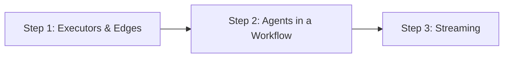

# 03-01 — Workflow Foundations: Start Here

> **Source**: [03-workflows/_start-here/](https://github.com/microsoft/agent-framework/tree/main/python/samples/03-workflows/_start-here)
> **Difficulty**: Beginner
> **Prerequisites**: [01 — Get Started](01-get-started.md) (especially Sample 5: First Workflow)

## Overview

These three samples are the **entry point for the workflow system**. If you completed Sample 5 from Get Started, you've already seen a minimal workflow. Now we go deeper: understanding both styles of executors, wiring agents into workflows, and streaming workflow events.



## Prerequisites & Setup

```bash
pip install agent-framework --pre
```

Step 1 requires **no external services**. Steps 2 and 3 need Azure credentials:

```bash
export AZURE_AI_PROJECT_ENDPOINT="https://your-project-endpoint"
export AZURE_AI_MODEL_DEPLOYMENT_NAME="gpt-4o"
az login
```

---

## Sample 1: Executors & Edges — The Building Blocks

### What It Does

This is the **most important workflow sample**. It demonstrates both ways to define executors, explains the `WorkflowContext` type system, introduces explicit type parameters on `@handler`, and shows the recommended pattern for creating reusable workflows.

### Full Source Code

```python
import asyncio

from agent_framework import (
    Executor,
    Workflow,
    WorkflowBuilder,
    WorkflowContext,
    executor,
    handler,
)
from typing_extensions import Never


# ──────────────────────────────────────────────
# STYLE 1: Class-based executor
# ──────────────────────────────────────────────
class UpperCase(Executor):
    def __init__(self, id: str):
        super().__init__(id=id)

    @handler
    async def to_upper_case(self, text: str, ctx: WorkflowContext[str]) -> None:
        """Convert the input to uppercase and forward it to the next node.

        WorkflowContext[str] means: this node sends str messages downstream.
        """
        result = text.upper()
        await ctx.send_message(result)


# ──────────────────────────────────────────────
# STYLE 2: Function-based executor
# ──────────────────────────────────────────────
@executor(id="reverse_text_executor")
async def reverse_text(text: str, ctx: WorkflowContext[Never, str]) -> None:
    """Reverse the input string and yield the workflow output.

    WorkflowContext[Never, str] means:
    - Never: this node does NOT send messages to downstream nodes
    - str: this node yields workflow output of type str
    """
    result = text[::-1]
    await ctx.yield_output(result)


# ──────────────────────────────────────────────
# STYLE 3: Explicit @handler type parameters
# ──────────────────────────────────────────────
class ExclamationAdder(Executor):
    """Demonstrates explicit input/output on @handler (no introspection)."""

    def __init__(self, id: str):
        super().__init__(id=id)

    @handler(input=str, output=str)
    async def add_exclamation(self, message, ctx) -> None:
        """When you specify explicit types on @handler, the framework uses those
        instead of introspecting the function signature."""
        result = f"{message}!!!"
        await ctx.send_message(result)


# ──────────────────────────────────────────────
# Recommended pattern: factory function
# ──────────────────────────────────────────────
def create_workflow() -> Workflow:
    """Create a fresh workflow with isolated state.

    Each call produces independent executor instances.
    No state leaks between runs.
    """
    upper_case = UpperCase(id="upper_case_executor")
    return (
        WorkflowBuilder(start_executor=upper_case)
        .add_edge(upper_case, reverse_text)
        .build()
    )


async def main():
    # Workflow 1: Introspection-based types (UpperCase → reverse_text)
    print("Workflow 1 (introspection-based types):")
    workflow1 = create_workflow()
    events1 = await workflow1.run("hello world")
    print(events1.get_outputs())                    # ['DLROW OLLEH']
    print("Final state:", events1.get_final_state()) # WorkflowRunState.IDLE

    # Workflow 2: Explicit types (UpperCase → ExclamationAdder → reverse_text)
    upper_case = UpperCase(id="upper_case_executor")
    exclamation_adder = ExclamationAdder(id="exclamation_adder")

    workflow2 = (
        WorkflowBuilder(start_executor=upper_case)
        .add_edge(upper_case, exclamation_adder)
        .add_edge(exclamation_adder, reverse_text)
        .build()
    )

    print("\nWorkflow 2 (explicit @handler types):")
    events2 = await workflow2.run("hello world")
    print(events2.get_outputs())                    # ['!!!DLROW OLLEH']
    print("Final state:", events2.get_final_state())


if __name__ == "__main__":
    asyncio.run(main())
```

### Step-by-Step Walkthrough

#### The Two Executor Styles

| Style | When to Use | Example |
|-------|-------------|---------|
| **Class-based** (`Executor` + `@handler`) | Complex logic, internal state, multiple related operations | `UpperCase`, `ExclamationAdder` |
| **Function-based** (`@executor`) | Simple, stateless transformations | `reverse_text` |

#### Understanding `WorkflowContext` Type Parameters

This is the most confusing part of MAF workflows, so let's break it down:

```python
WorkflowContext                    # = WorkflowContext[Never, Never]
                                   # → Can't send messages, can't yield output

WorkflowContext[str]               # = WorkflowContext[str, Never]
                                   # → Sends str downstream, can't yield output

WorkflowContext[Never, str]        # → Can't send downstream, yields str as output

WorkflowContext[str, str]          # → Both sends and yields str
```

**Simple rule**:
- First type parameter = what `ctx.send_message()` sends to the **next node**
- Second type parameter = what `ctx.yield_output()` returns as **workflow output**

#### The Data Flow

```
Workflow 1:
"hello world" → [UpperCase] → "HELLO WORLD" → [reverse_text] → "DLROW OLLEH" (output)
                 send_message()                  yield_output()

Workflow 2:
"hello world" → [UpperCase] → "HELLO WORLD" → [ExclamationAdder] → "HELLO WORLD!!!" → [reverse_text] → "!!!DLROW OLLEH"
                 send_message()                  send_message()                         yield_output()
```

#### Explicit Type Parameters on `@handler`

```python
# Introspection mode (default): types come from the function signature
@handler
async def to_upper_case(self, text: str, ctx: WorkflowContext[str]) -> None:
    ...

# Explicit mode: types come from @handler parameters
@handler(input=str, output=str)
async def add_exclamation(self, message, ctx) -> None:
    ...
```

When to use explicit types:
- Union types like `str | int` (introspection doesn't always handle these well)
- When you want to decouple the type routing from annotations
- **It's "all or nothing"**: if you specify `input`, you must specify all types explicitly

#### The Factory Pattern

```python
def create_workflow() -> Workflow:
    upper_case = UpperCase(id="upper_case_executor")  # Fresh instance
    return WorkflowBuilder(start_executor=upper_case).add_edge(...).build()
```

**Why this matters**: Executors can hold state. If you reuse the same instance across multiple runs, state leaks between them. The factory pattern guarantees isolation.

### Concepts Introduced

| Concept | Description |
|---------|-------------|
| Class-based `Executor` | Subclass + `@handler` for complex nodes |
| `@executor` function | Decorator for simple, stateless nodes |
| `WorkflowContext[T_Out, T_W_Out]` | Type-safe data routing in workflows |
| `ctx.send_message()` | Forward data to downstream nodes |
| `ctx.yield_output()` | Emit data as workflow output |
| `@handler(input=, output=)` | Explicit type parameters (no introspection) |
| Factory pattern | `create_workflow()` for isolated, reusable workflows |
| `WorkflowBuilder` | Fluent API: `add_edge()`, `set_start_executor()`, `build()` |

### How to Run

```bash
python _start-here/step1_executors_and_edges.py
```

---

## Sample 2: Agents in a Workflow — Non-Streaming

### What It Does

Shows how to use **real LLM agents as workflow nodes**. Creates a Writer agent and a Reviewer agent, wires them sequentially, and runs the workflow. The Writer generates content, which flows to the Reviewer for feedback.

### Full Source Code

```python
import asyncio
import os
from typing import cast

from agent_framework import AgentResponse, WorkflowBuilder
from agent_framework.azure import AzureOpenAIResponsesClient
from azure.identity import AzureCliCredential

async def main():
    # Create the Azure client
    client = AzureOpenAIResponsesClient(
        project_endpoint=os.environ["AZURE_AI_PROJECT_ENDPOINT"],
        deployment_name=os.environ["AZURE_AI_MODEL_DEPLOYMENT_NAME"],
        credential=AzureCliCredential(),
    )

    # Define two agents
    writer_agent = client.as_agent(
        instructions=(
            "You are an excellent content writer. "
            "You create new content and edit contents based on the feedback."
        ),
        name="writer",
    )

    reviewer_agent = client.as_agent(
        instructions=(
            "You are an excellent content reviewer."
            "Provide actionable feedback to the writer about the provided content."
            "Provide the feedback in the most concise manner possible."
        ),
        name="reviewer",
    )

    # Build: Writer → Reviewer
    workflow = (
        WorkflowBuilder(start_executor=writer_agent)
        .add_edge(writer_agent, reviewer_agent)
        .build()
    )

    # Run (non-streaming)
    events = await workflow.run(
        "Create a slogan for a new electric SUV that is affordable and fun to drive."
    )

    # Extract and print outputs
    outputs = cast(list[AgentResponse], events.get_outputs())
    for output in outputs:
        print(f"{output.messages[0].author_name}: {output.text}\n")

    print("Final state:", events.get_final_state())

if __name__ == "__main__":
    asyncio.run(main())
```

### Step-by-Step Walkthrough

1. **Agents ARE executors** — In MAF, every agent implements the `Executor` interface. This means you can plug agents directly into `WorkflowBuilder.add_edge()` just like custom executors.

2. **The data flow**:
   ```
   "Create a slogan..." → [writer_agent] → "Charge Ahead:..." → [reviewer_agent] → "Feedback:..."
   ```
   The Writer receives the user input, generates a slogan, and its response automatically flows to the Reviewer as input.

3. **`AgentResponse`** — When a workflow finishes, agents produce `AgentResponse` objects. Key properties:
   - `.text` — The response text
   - `.messages` — The full list of messages with `.author_name`

4. **No explicit `send_message()` or `yield_output()`** — The agent executor handles this internally. Agent outputs automatically flow through edges.

### Key Insight: The Bridge Between Agents and Workflows

```
┌─────────────────────────────────────────────────────┐
│  Agents         →  .as_agent()  →  Executor nodes   │
│  Custom logic   →  @executor    →  Executor nodes   │
│  Both can be    →  add_edge()   →  Wired together   │
└─────────────────────────────────────────────────────┘
```

This is the fundamental design principle: **agents and custom executors are interchangeable in workflows**.

### How to Run

```bash
python _start-here/step2_agents_in_a_workflow.py
```

---

## Sample 3: Streaming — Real-Time Workflow Events

### What It Does

Same Writer → Reviewer workflow as Sample 2, but now with **streaming**. Instead of waiting for the entire workflow to finish, you receive events in real-time as each agent generates tokens.

### Full Source Code

```python
import asyncio
import os

from agent_framework import AgentResponseUpdate, Message, WorkflowBuilder
from agent_framework.azure import AzureOpenAIResponsesClient
from azure.identity import AzureCliCredential

async def main():
    client = AzureOpenAIResponsesClient(
        project_endpoint=os.environ["AZURE_AI_PROJECT_ENDPOINT"],
        deployment_name=os.environ["AZURE_AI_MODEL_DEPLOYMENT_NAME"],
        credential=AzureCliCredential(),
    )

    writer_agent = client.as_agent(
        instructions="You are an excellent content writer. You create new content and edit contents based on the feedback.",
        name="writer",
    )

    reviewer_agent = client.as_agent(
        instructions=(
            "You are an excellent content reviewer."
            "Provide actionable feedback to the writer about the provided content."
            "Provide the feedback in the most concise manner possible."
        ),
        name="reviewer",
    )

    workflow = (
        WorkflowBuilder(start_executor=writer_agent)
        .add_edge(writer_agent, reviewer_agent)
        .build()
    )

    # Track the last author for formatting
    last_author: str | None = None

    # Stream events as they occur
    async for event in workflow.run(
        Message("user", ["Create a slogan for a new electric SUV that is affordable and fun to drive."]),
        stream=True,
    ):
        if event.type == "output" and isinstance(event.data, AgentResponseUpdate):
            update = event.data
            author = update.author_name
            if author != last_author:
                if last_author is not None:
                    print()  # Newline between authors
                print(f"{author}: {update.text}", end="", flush=True)
                last_author = author
            else:
                print(update.text, end="", flush=True)

if __name__ == "__main__":
    asyncio.run(main())
```

### Step-by-Step Walkthrough

1. **`workflow.run(..., stream=True)`** — Instead of returning an event collection, returns an **async iterator** of events. Each event arrives as soon as it's produced.

2. **`Message("user", [...])`** — For streaming, input is wrapped in a `Message` object instead of a plain string.

3. **Event structure**:
   ```python
   event.type  # "output", "executor_invoked", "executor_completed", etc.
   event.data  # The payload — AgentResponseUpdate for streaming agent output
   ```

4. **`AgentResponseUpdate`** — A streaming chunk from an agent:
   - `.text` — The newly generated text fragment
   - `.author_name` — Which agent generated this chunk

5. **Streaming across multiple agents**:
   ```
   Time →
   [writer tokens stream...]  then  [reviewer tokens stream...]
   ```
   You see writer tokens in real-time, then when the writer finishes, reviewer tokens start streaming.

### Non-Streaming vs Streaming Comparison

| Aspect | Non-Streaming | Streaming |
|--------|---------------|-----------|
| Call | `events = await workflow.run(input)` | `async for event in workflow.run(input, stream=True)` |
| Input | `str` or `Message` | `Message` |
| Output | `events.get_outputs()` | Individual `event` objects |
| Latency | Wait for everything | Real-time tokens |
| Event types | N/A | `"output"`, `"executor_invoked"`, `"executor_completed"` |

### How to Run

```bash
python _start-here/step3_streaming.py
```

---

## 🎯 Key Takeaways

1. **Executors are the fundamental unit** — Whether class-based (`Executor` + `@handler`) or function-based (`@executor`), every workflow node is an executor.

2. **`WorkflowContext` is your routing system** — `send_message()` routes data to the next node; `yield_output()` emits final results. The type parameters make this type-safe.

3. **Agents plug directly into workflows** — Since agents implement `Executor`, they're first-class workflow nodes. No adapters needed.

4. **Streaming reveals the event system** — Workflows emit events for everything: executor starts, agent tokens, executor completions. This is the foundation for observability and real-time UIs.

5. **Use factory functions for isolation** — Wrap `WorkflowBuilder(...)` in a function so each call gets fresh executor instances with no shared state.

## What's Next

→ [03-02 — Control Flow](03-02-control-flow.md) for branching, conditions, and loops
→ [02-01 — Tools](02-01-tools.md) for advanced tool patterns
→ [03-08 — Orchestrations](03-08-orchestrations.md) for Sequential, Concurrent, Handoff, GroupChat, and Magentic patterns
