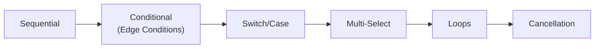
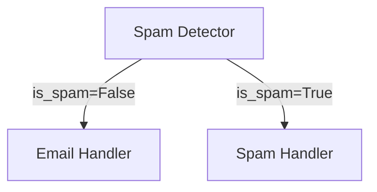

# 03-02 — Control Flow

> **Source**: [03-workflows/control-flow/](https://github.com/microsoft/agent-framework/tree/main/python/samples/03-workflows/control-flow)
> **Difficulty**: Intermediate
> **Prerequisites**: [03-01 — Start Here](03-01-start-here.md)

## Overview

Control flow determines **how data moves** between executors in a workflow. MAF provides sequential chaining, conditional branching, loops, and cancellation primitives.



---

## Sample 1: Sequential Executors

The simplest pattern — chain executors in a linear pipeline.

### Key Code

```python
from agent_framework import Executor, WorkflowBuilder, WorkflowContext, handler

class UpperCaseExecutor(Executor):
    @handler
    async def to_upper_case(self, text: str, ctx: WorkflowContext[str]) -> None:
        result = text.upper()
        await ctx.send_message(result)  # ← Forward to next executor

class ReverseTextExecutor(Executor):
    @handler
    async def reverse_text(self, text: str, ctx: WorkflowContext[Never, str]) -> None:
        result = text[::-1]
        await ctx.yield_output(result)  # ← Final workflow output

# Wire the pipeline
workflow = (
    WorkflowBuilder(start_executor=UpperCaseExecutor(id="upper"))
    .add_edge(upper, reverse)
    .build()
)
```

### Key Concepts

| Concept | Description |
|---------|-------------|
| `ctx.send_message()` | Forward data to the next executor |
| `ctx.yield_output()` | Emit final workflow output |
| `WorkflowContext[T_Out]` | Type of messages this executor sends |
| `WorkflowContext[T_Out, T_W_Out]` | Second type param = workflow output type |

---

## Sample 2: Edge Conditions (Conditional Routing)

Route to different executors based on data inspection — like an `if/else`.

### How It Works

```python
# Define a condition function
def is_spam(message: Any) -> bool:
    if not isinstance(message, AgentExecutorResponse):
        return True
    detection = DetectionResult.model_validate_json(message.agent_response.text)
    return detection.is_spam

def is_not_spam(message: Any) -> bool:
    return not is_spam(message)

# Wire with conditions
workflow = (
    WorkflowBuilder(start_executor=spam_detector)
    .add_edge(spam_detector, email_handler, condition=is_not_spam)   # ← NOT spam → reply
    .add_edge(spam_detector, spam_handler, condition=is_spam)        # ← spam → discard
    .build()
)
```

### Pattern



---

## Sample 3: Switch-Case Edge Groups

Route to **exactly one** of N branches based on an enum-like selector — like a `switch` statement.

```python
from agent_framework import EdgeGroup

# Create mutually exclusive routes
edge_group = EdgeGroup(
    edges=[
        Edge(source=classifier, target=handler_a, condition=lambda m: m.category == "A"),
        Edge(source=classifier, target=handler_b, condition=lambda m: m.category == "B"),
        Edge(source=classifier, target=handler_c, condition=lambda m: m.category == "C"),
    ],
    mode="switch",  # Only first matching edge fires
)
```

---

## Sample 4: Multi-Selection Edge Groups

Route to **all matching** branches simultaneously — enables parallel conditional fan-out.

```python
edge_group = EdgeGroup(
    edges=[...],
    mode="multi_select",  # All matching edges fire in parallel
)
```

---

## Sample 5: Simple Loop

Create feedback loops by adding an edge from an executor **back to itself or an earlier node**.

```python
# Self-loop: worker processes items one at a time
workflow = (
    WorkflowBuilder(start_executor=guesser)
    .add_edge(guesser, judge)
    .add_edge(judge, parser)
    .add_edge(parser, guesser)  # ← Loop back!
    .build()
)
```

The loop exits when an executor calls `ctx.yield_output()` instead of `ctx.send_message()`.

---

## Sample 6: Sequential Streaming

Stream events token-by-token through a sequential pipeline.

```python
async for event in workflow.run("hello world", stream=True):
    if event.type == "output":
        print(event.data)
```

---

## Sample 7: Workflow Cancellation

Cancel a running workflow from the outside.

```python
result = workflow.run("start processing", stream=True)
# ...later...
await workflow.cancel()  # Stops all executors
```

---

## All Samples

| File | Pattern | What It Shows |
|------|---------|---------------|
| `sequential_executors.py` | Sequential | Two-step pipeline with streaming |
| `sequential_streaming.py` | Sequential | Token-level streaming events |
| `edge_condition.py` | Conditional | Spam detection routing with Pydantic |
| `switch_case_edge_group.py` | Switch | Exactly-one-branch routing |
| `multi_selection_edge_group.py` | Multi-select | All-matching-branches parallel routing |
| `simple_loop.py` | Loop | Binary search guessing game with agent judge |
| `workflow_cancellation.py` | Cancellation | External workflow cancellation |

---

## 🎯 Key Takeaways

1. **`add_edge(A, B)`** — Sequential: A's output flows to B
2. **`add_edge(A, B, condition=fn)`** — Conditional: B only runs if `fn(output)` is `True`
3. **`EdgeGroup(mode="switch")`** — Only first matching branch fires
4. **`EdgeGroup(mode="multi_select")`** — All matching branches fire in parallel
5. **Self-loops** — `add_edge(A, A)` creates iteration; exit via `yield_output()`
6. **Termination** — workflow completes when it becomes idle (no pending messages)

## What's Next

→ [03-03 — Parallelism](03-03-parallelism.md) for fan-out/fan-in patterns
→ [03-04 — Composition](03-04-composition.md) for sub-workflows
