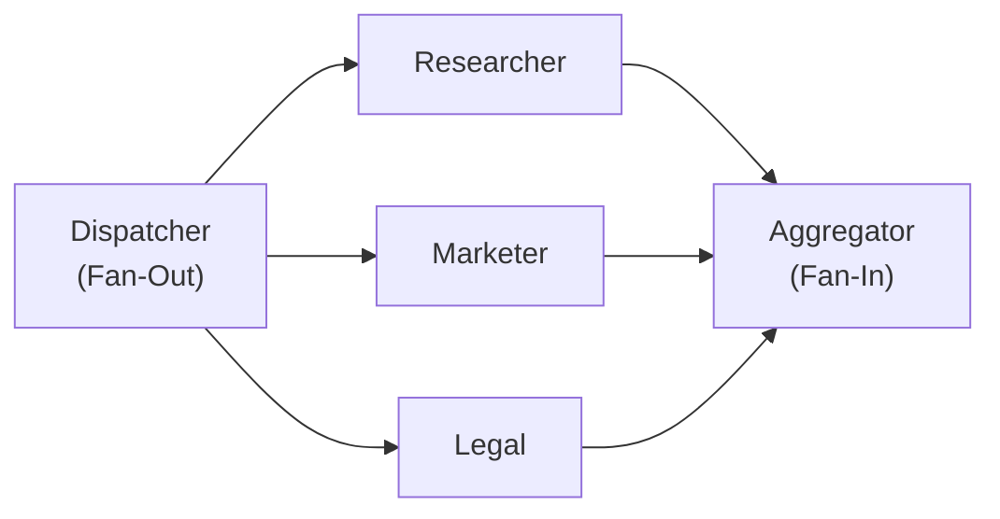

# 03-03 — Parallelism (Fan-Out / Fan-In)

> **Source**: [03-workflows/parallelism/](https://github.com/microsoft/agent-framework/tree/main/python/samples/03-workflows/parallelism)
> **Difficulty**: Intermediate
> **Prerequisites**: [03-01 — Start Here](03-01-start-here.md), [03-02 — Control Flow](03-02-control-flow.md)

## Overview

Parallelism lets you **fan out** work to multiple executors running concurrently, then **fan in** results to a single aggregator. This is ideal for multi-agent research, parallel analysis, or map-reduce pipelines.



---

## Sample 1: Fan-Out / Fan-In with Edges

The core parallel pattern — dispatch one prompt to N agents, collect all responses.

### Key Code

```python
class DispatchToExperts(Executor):
    """Fan out the same prompt to all agent executors."""
    @handler
    async def dispatch(self, prompt: str, ctx: WorkflowContext[AgentExecutorRequest]) -> None:
        initial_message = Message("user", text=prompt)
        # Single send_message broadcasts to all connected downstream executors
        await ctx.send_message(
            AgentExecutorRequest(messages=[initial_message], should_respond=True)
        )

class AggregateInsights(Executor):
    """Fan in: collect all agent responses into one report."""
    @handler
    async def aggregate(self, results: list[AgentExecutorResponse], ctx: WorkflowContext[Never, str]) -> None:
        by_id = {r.executor_id: r.agent_response.text for r in results}
        consolidated = f"Research: {by_id['researcher']}\nMarketing: {by_id['marketer']}\nLegal: {by_id['legal']}"
        await ctx.yield_output(consolidated)
```

### Wiring

```python
workflow = (
    WorkflowBuilder(start_executor=dispatcher)
    .add_edge(dispatcher, researcher)    # Fan out
    .add_edge(dispatcher, marketer)      # Fan out
    .add_edge(dispatcher, legal)         # Fan out
    .add_edge([researcher, marketer, legal], aggregator)  # Fan in
    .build()
)
```

### Key Pattern: `list[T]` Handler Parameter

When an executor's `@handler` accepts a `list[T]` parameter, the workflow engine **waits for all upstream executors** to complete before invoking it. This is the fan-in mechanism.

---

## Sample 2: Aggregating Different Types

Fan-in from executors that produce **different output types**.

```python
@handler
async def aggregate(self, results: list[AgentExecutorResponse], ctx: ...) -> None:
    # Each response has a unique executor_id to identify its source
    for r in results:
        if r.executor_id == "researcher":
            research = r.agent_response.text
        elif r.executor_id == "marketer":
            marketing = r.agent_response.text
```

---

## Sample 3: Map-Reduce with Visualization

A full map-reduce pipeline with live terminal dashboard showing concurrent agent streams.

```python
# Live rendering of parallel streams
def render_live_streams(buffers, order, completed):
    print("\033[2J\033[H", end="")  # Clear terminal
    for agent_id in order:
        state = "completed" if agent_id in completed else "streaming"
        print(f"[{agent_id}] ({state})")
        print(buffers.get(agent_id, ""))
```

---

## All Samples

| File | What It Shows |
|------|---------------|
| `fan_out_fan_in_edges.py` | 3-agent parallel research with aggregator |
| `aggregate_results_of_different_types.py` | Mixed-type aggregation by executor ID |
| `map_reduce_and_visualization.py` | Full map-reduce with live terminal rendering |

---

## 🎯 Key Takeaways

1. **Fan-out** — One dispatcher sends to multiple downstream executors via `send_message()`
2. **Fan-in** — Use `list[T]` parameter type to wait for all upstream results
3. **`add_edge([A, B, C], D)`** — Shorthand for wiring multiple sources to one aggregator
4. **Executor ID** — Use `r.executor_id` to identify which agent produced which result
5. **Live streaming** — Concurrent agents can stream tokens simultaneously

## What's Next

→ [03-04 — Composition](03-04-composition.md) for nested sub-workflows
→ [03-05 — State Management](03-05-state-management.md) for passing context through workflows
