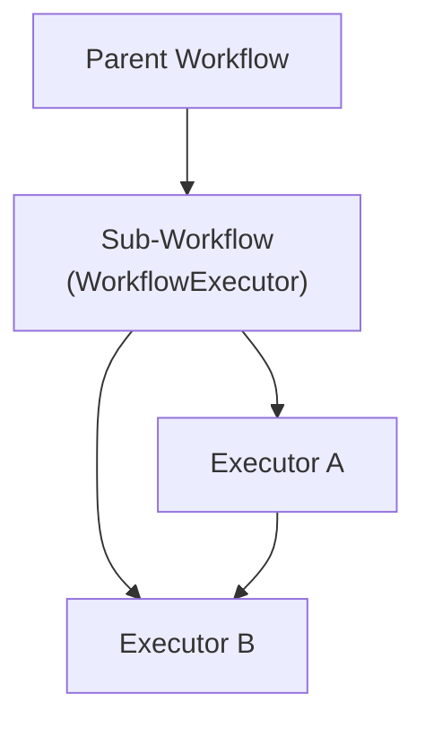

# 03-04 — Composition (Sub-Workflows)

> **Source**: [03-workflows/composition/](https://github.com/microsoft/agent-framework/tree/main/python/samples/03-workflows/composition)
> **Difficulty**: Intermediate–Advanced
> **Prerequisites**: [03-01 — Start Here](03-01-start-here.md), [03-02 — Control Flow](03-02-control-flow.md)

## Overview

Sub-workflows let you **nest one workflow inside another**, enabling modular, reusable workflow components. The parent workflow treats a sub-workflow as just another executor.



---

## Sample 1: Sub-Workflow Basics

A parent workflow invokes a child workflow via `WorkflowExecutor`.

### Key Code

```python
from agent_framework import WorkflowExecutor, WorkflowBuilder

# 1) Build the sub-workflow
text_processor = TextProcessor()
sub_workflow = WorkflowBuilder(start_executor=text_processor).build()

# 2) Wrap it as an executor
sub_workflow_executor = WorkflowExecutor(workflow=sub_workflow, id="sub_processor")

# 3) Use in parent workflow
parent = (
    WorkflowBuilder(start_executor=dispatcher)
    .add_edge(dispatcher, sub_workflow_executor)
    .add_edge(sub_workflow_executor, result_collector)
    .build()
)
```

### How It Works

1. Parent sends a message to `WorkflowExecutor`
2. `WorkflowExecutor` starts the sub-workflow with that message as input
3. Sub-workflow runs independently and produces outputs via `yield_output()`
4. Those outputs flow to the next executor in the parent graph

---

## Sample 2: Request Interception

Intercept and transform messages between parent and sub-workflow.

```python
sub_workflow_executor = WorkflowExecutor(
    workflow=sub_workflow,
    on_request=transform_request,     # Modify input before sub-workflow sees it
    on_response=transform_response,   # Modify output before parent sees it
)
```

---

## Sample 3: Parallel Sub-Workflow Requests

Fan out to the **same sub-workflow** multiple times in parallel.

```python
class ParallelDispatcher(Executor):
    @handler
    async def dispatch(self, items: list[str], ctx: WorkflowContext) -> None:
        for item in items:
            # Each send_message creates a separate sub-workflow run
            await ctx.send_message(TextProcessingRequest(text=item, task_id=str(i)))
```

---

## Sample 4: Sub-Workflow with Kwargs

Pass runtime context from parent to sub-workflow executors.

```python
# Parent passes kwargs through workflow.run()
result = await parent_workflow.run(input_data, user_id="abc", tenant="xyz")
# Sub-workflow executors receive these kwargs automatically
```

---

## All Samples

| File | What It Shows |
|------|---------------|
| `sub_workflow_basics.py` | Basic parent → sub-workflow → result |
| `sub_workflow_request_interception.py` | Transform messages entering/leaving sub-workflow |
| `sub_workflow_parallel_requests.py` | Multiple parallel sub-workflow invocations |
| `sub_workflow_kwargs.py` | Passing runtime context to sub-workflows |

---

## 🎯 Key Takeaways

1. **`WorkflowExecutor`** — Wraps a `Workflow` as an `Executor` for use in parent workflows
2. **Modularity** — Build reusable sub-workflows and compose them like building blocks
3. **Independent runs** — Each sub-workflow invocation is a separate execution context
4. **Interception** — `on_request`/`on_response` hooks let you transform data at boundaries
5. **Parallel invocations** — Multiple `send_message()` calls to the same `WorkflowExecutor` run in parallel

## What's Next

→ [03-05 — State Management](03-05-state-management.md) for data flow and kwargs
→ [03-06 — Human-in-the-Loop](03-06-human-in-the-loop.md) for user interaction
