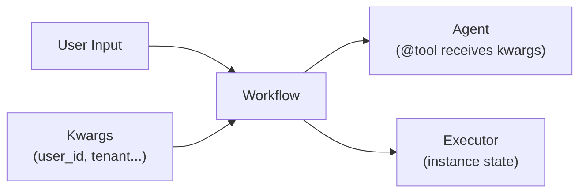
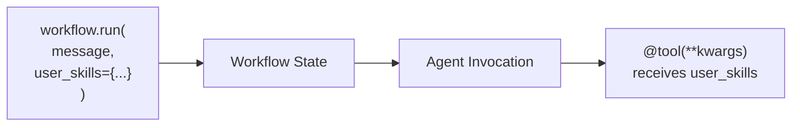

# 03-05 — State Management

> **Source**: [03-workflows/state-management/](https://github.com/microsoft/agent-framework/tree/main/python/samples/03-workflows/state-management)
> **Difficulty**: Intermediate
> **Prerequisites**: [03-01 — Start Here](03-01-start-here.md)

## Overview

State management in workflows determines how **context and data flow** between executors. MAF offers two primary mechanisms: executor instance state and workflow kwargs.



---

## Sample 1: State with Agents

Agents within workflows access shared conversation context (messages flow agent-to-agent) and can maintain internal state through their sessions.

### Key Pattern

```python
# Each agent in a sequential workflow sees prior messages
workflow = SequentialBuilder(participants=[analyst, reviewer]).build()

# analyst processes the input, reviewer sees analyst's output as context
result = await workflow.run("Analyze Q4 revenue trends")
```

### Executor Instance State

```python
class StatefulExecutor(Executor):
    def __init__(self):
        super().__init__(id="counter")
        self._count = 0  # Instance state persists across handler calls in a loop
    
    @handler
    async def process(self, data: str, ctx: WorkflowContext[str]) -> None:
        self._count += 1  # Accumulates across loop iterations
        await ctx.send_message(f"Processed {self._count} items")
```

---

## Sample 2: Workflow Kwargs

Pass **custom context** (user tokens, skill data, tenant info) through workflows to `@tool` functions.

### Key Code

```python
from agent_framework import tool
from agent_framework.orchestrations import SequentialBuilder

@tool(approval_mode="never_require")
async def get_user_skills(topic: str, **kwargs) -> str:
    """Look up skills from context passed through kwargs."""
    user_skills = kwargs.get("user_skills", {})
    return f"Skills for {topic}: {user_skills.get(topic, 'none found')}"

# Build workflow with agent that uses the tool
agent = client.as_agent(name="advisor", tools=get_user_skills)
workflow = SequentialBuilder(participants=[agent]).build()

# Pass kwargs at runtime — they flow to @tool functions
result = await workflow.run(
    "What Python skills do I have?",
    user_skills={"Python": "advanced", "SQL": "intermediate"},  # ← Kwargs
)
```

### How Kwargs Flow



---

## All Samples

| File | What It Shows |
|------|---------------|
| `state_with_agents.py` | Shared conversation context between agents in workflows |
| `workflow_kwargs.py` | Passing runtime context to `@tool` via kwargs |

---

## 🎯 Key Takeaways

1. **Conversation context** — Sequential agents automatically see prior messages
2. **Instance state** — Executor `self._fields` persist across loop iterations within a run
3. **Kwargs** — Pass custom data at `workflow.run()` time; tools receive it via `**kwargs`
4. **Works with all patterns** — Kwargs work with Sequential, Concurrent, GroupChat, Handoff, and Magentic
5. **Not visible to AI** — Kwargs are injected at runtime, hidden from the model's tool schema

## What's Next

→ [03-06 — Human-in-the-Loop](03-06-human-in-the-loop.md) for user interaction in workflows
→ [03-07 — Checkpoint & Resume](03-07-checkpoint.md) for persistence
