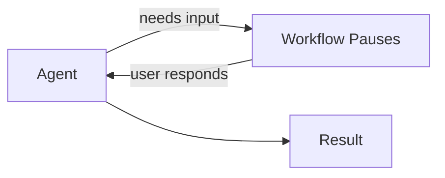

# 03-06 — Human-in-the-Loop (HITL)

> **Source**: [03-workflows/human-in-the-loop/](https://github.com/microsoft/agent-framework/tree/main/python/samples/03-workflows/human-in-the-loop)
> **Difficulty**: Intermediate–Advanced
> **Prerequisites**: [03-01 — Start Here](03-01-start-here.md), [02-01 — Tools](02-01-tools.md)

## Overview

Human-in-the-loop workflows **pause for user input** at specific points. MAF supports this through user input requests, tool approval, declaration-only tools, and request info callbacks.



---

## Sample 1: HITL with User Input

The workflow yields user input requests; your code collects input and resumes.

### Key Pattern

```python
async for event in workflow.run("Start guessing game", stream=True):
    if event.type == "user_input_request":
        # Workflow is paused, waiting for user
        user_response = input("Your turn: ")
        await event.respond(user_response)
    elif event.type == "output":
        print("Result:", event.data)
```

---

## Sample 2: Tool Approval in Workflows

Require human approval before tools execute within a workflow.

```python
@tool(approval_mode="always_require")
async def send_email(to: str, body: str) -> str:
    return f"Email sent to {to}"

# During workflow execution, approval requests surface as events
async for event in workflow.run("Send update email", stream=True):
    if event.type == "user_input_request":
        for req in event.data.user_input_requests:
            print(f"Approve tool call: {req.function_name}({req.arguments})?")
            approved = input("y/n: ") == "y"
            req.approve() if approved else req.reject()
```

---

## Sample 3: Declaration-Only Tools

Define tools with **no implementation** — the workflow itself provides the response.

```python
from agent_framework import FunctionTool

# Tool exists for the AI to "call" but has no actual implementation
get_user_preference = FunctionTool.from_dict({
    "name": "get_user_preference",
    "description": "Ask the user for their preference",
    "parameters": {"type": "object", "properties": {"question": {"type": "string"}}},
})

# When the AI calls this tool, the workflow intercepts and asks the human
```

---

## Sample 4: Request Info (`.with_request_info()`)

Review and optionally modify agent responses before they continue in the workflow.

```python
# Sequential orchestration with human review
workflow = (
    SequentialBuilder(participants=[writer, reviewer])
    .with_request_info()  # ← Pause after each agent for human review
    .build()
)
```

### Available for All Orchestration Patterns

| Pattern | Sample |
|---------|--------|
| Sequential | `sequential_request_info.py` |
| Concurrent | `concurrent_request_info.py` |
| Group Chat | `group_chat_request_info.py` |

---

## All Samples

| File | What It Shows |
|------|---------------|
| `guessing_game_with_human_input.py` | Interactive number guessing with user turns |
| `agents_with_HITL.py` | Agent workflow with user input requests |
| `agents_with_approval_requests.py` | Tool approval in workflow context |
| `agents_with_declaration_only_tools.py` | Tools with no implementation (human-provided) |
| `sequential_request_info.py` | Review sequential agent outputs |
| `concurrent_request_info.py` | Review concurrent agent outputs |
| `group_chat_request_info.py` | Steer group chat with periodic input |

---

## 🎯 Key Takeaways

1. **User input requests** — Workflows pause and yield events when they need human input
2. **Tool approval** — `approval_mode="always_require"` works within workflows
3. **Declaration-only tools** — Tools with no code; the workflow provides responses
4. **`.with_request_info()`** — One-liner to add human review checkpoints to any orchestration
5. **All patterns supported** — HITL works with Sequential, Concurrent, GroupChat, Handoff

## What's Next

→ [03-07 — Checkpoint & Resume](03-07-checkpoint.md) for workflow persistence
→ [03-08 — Orchestrations](03-08-orchestrations.md) for high-level patterns
