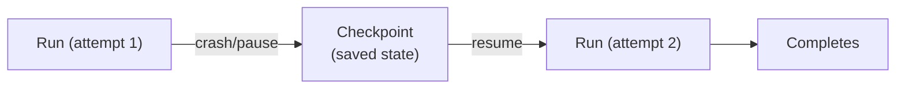

# 03-07 — Checkpoint & Resume

> **Source**: [03-workflows/checkpoint/](https://github.com/microsoft/agent-framework/tree/main/python/samples/03-workflows/checkpoint)
> **Difficulty**: Advanced
> **Prerequisites**: [03-01 — Start Here](03-01-start-here.md), [03-06 — Human-in-the-Loop](03-06-human-in-the-loop.md)

## Overview

Checkpointing lets you **save and resume** workflow state across process restarts, crashes, or user sessions. This is essential for long-running workflows, durable execution, and production deployments.



---

## Sample 1: Checkpoint with Resume

Enable checkpointing and automatically recover from failures.

### Key Code

```python
from agent_framework import InMemoryCheckpointStorage, WorkflowBuilder, WorkflowCheckpoint

# Build workflow with checkpoint storage
checkpoint_storage = InMemoryCheckpointStorage()
workflow_builder = (
    WorkflowBuilder(start_executor=start, checkpoint_storage=checkpoint_storage)
    .add_edge(start, worker)
    .add_edge(worker, worker)  # Self-loop
)

# Run with automatic recovery
latest_checkpoint: WorkflowCheckpoint | None = None
while True:
    workflow = workflow_builder.build()

    event_stream = (
        workflow.run(message=10, stream=True)                                     # Fresh start
        if latest_checkpoint is None
        else workflow.run(checkpoint_id=latest_checkpoint.checkpoint_id, stream=True)  # Resume
    )

    async for event in event_stream:
        if event.type == "checkpoint":
            latest_checkpoint = event.data  # Save checkpoint
        elif event.type == "output":
            print("Done:", event.data)
            return
```

### Executor State Hooks

```python
class WorkerExecutor(Executor):
    def __init__(self):
        self._results = {}  # Internal state

    @override
    async def on_checkpoint_save(self) -> dict[str, Any]:
        """Save executor state into checkpoint."""
        return {"results": self._results}

    @override
    async def on_checkpoint_restore(self, state: dict[str, Any]) -> None:
        """Restore executor state from checkpoint."""
        self._results = state.get("results", {})
```

---

## Sample 2: Checkpoint with HITL

Combine checkpointing with human-in-the-loop — resume after user provides input.

```python
# Workflow pauses for user input → checkpoint is saved
# Process can restart → resume from checkpoint with user's response
```

---

## Sample 3: Sub-Workflow Checkpoint

Checkpoints automatically include sub-workflow state.

---

## Sample 4: Workflow-as-Agent Checkpoint

Checkpoint a workflow that's wrapped as an agent via `.as_agent()`.

---

## All Samples

| File | What It Shows |
|------|---------------|
| `checkpoint_with_resume.py` | Basic checkpoint + auto-recovery with self-loop |
| `checkpoint_with_human_in_the_loop.py` | HITL + checkpoint for durable user interaction |
| `sub_workflow_checkpoint.py` | Checkpointing nested sub-workflows |
| `workflow_as_agent_checkpoint.py` | Checkpointing workflow-as-agent patterns |

---

## 🎯 Key Takeaways

1. **`InMemoryCheckpointStorage`** — For testing; swap with durable storage in production
2. **`checkpoint_storage=`** — Pass to `WorkflowBuilder` to enable checkpointing
3. **`on_checkpoint_save/restore`** — Override in executors to persist custom state
4. **`workflow.run(checkpoint_id=...)`** — Resume from a saved checkpoint
5. **Automatic** — Checkpoints capture executor state, message queues, and sub-workflow state
6. **HITL compatible** — Checkpoints work seamlessly with user input requests

## What's Next

→ [03-08 — Orchestrations](03-08-orchestrations.md) for high-level multi-agent patterns
→ [03-09 — Declarative Workflows](03-09-declarative-workflows.md) for YAML workflow definitions
