# 03-08 — Orchestrations (High-Level Multi-Agent Patterns)

> **Source**: [03-workflows/orchestrations/](https://github.com/microsoft/agent-framework/tree/main/python/samples/03-workflows/orchestrations)
> **Difficulty**: Intermediate–Advanced
> **Prerequisites**: [03-01 — Start Here](03-01-start-here.md)

## Overview

Orchestrations are **pre-built multi-agent workflow patterns** that handle common coordination scenarios. Instead of manually wiring `WorkflowBuilder` graphs, you use high-level builders.

```mermaid
graph TD
    subgraph Orchestration Patterns
        SEQ["Sequential\nA → B → C"]
        CON["Concurrent\nFan-out → Fan-in"]
        HC["Handoff\nAgent → Agent"]
        GC["Group Chat\nModerated Discussion"]
        MAG["Magentic\nPlan → Execute"]
    end
```



---

## Pattern 1: Sequential (`SequentialBuilder`)

Chain agents in order. Each agent sees the full conversation including prior agents' outputs.

```python
from agent_framework.orchestrations import SequentialBuilder

workflow = SequentialBuilder(participants=[writer, reviewer]).build()

async for event in workflow.run("Write a tagline for eBikes", stream=True):
    if event.type == "output":
        for msg in event.data:
            print(f"[{msg.author_name}] {msg.text}")
```

### Variants

| Sample | Feature |
|--------|---------|
| `sequential_agents.py` | Basic agent chain |
| `sequential_custom_executors.py` | Mix agents with custom executors |

---

## Pattern 2: Concurrent (`ConcurrentBuilder`)

Fan out the same prompt to N agents in parallel, then aggregate results.

```python
from agent_framework.orchestrations import ConcurrentBuilder

workflow = ConcurrentBuilder(participants=[researcher, marketer, legal]).build()

events = await workflow.run("Launching a budget eBike")
for output in events.get_outputs():
    for msg in output:
        print(f"[{msg.author_name}] {msg.text}")
```

### Custom Aggregation

```python
# Override the default aggregator with an LLM-based summarizer
workflow = (
    ConcurrentBuilder(participants=[researcher, marketer, legal])
    .with_aggregator(summarizer_callback)
    .build()
)
```

### Variants

| Sample | Feature |
|--------|---------|
| `concurrent_agents.py` | Default aggregator (concat messages) |
| `concurrent_custom_aggregator.py` | LLM-based summarization |
| `concurrent_custom_agent_executors.py` | Custom executors with concurrent fan-out |

---

## Pattern 3: Handoff (`HandoffBuilder`)

Agents transfer control to each other based on conversation context. A triage agent routes to specialists.

```python
from agent_framework.orchestrations import HandoffBuilder

workflow = (
    HandoffBuilder(participants=[triage, billing_agent, tech_agent])
    .build()
)

# Handoff tools are auto-registered — triage can call "transfer_to_billing" etc.
```

### Key Concepts

- **Auto-registered handoff tools** — Each participant gets tools like `transfer_to_<name>`
- **Autonomous mode** — `.with_autonomous_mode()` lets specialists iterate independently
- **Code interpreter** — Handoff supports retrieving file IDs from code interpreter output

### Variants

| Sample | Feature |
|--------|---------|
| `handoff_simple.py` | Basic triage → specialist routing |
| `handoff_autonomous.py` | Autonomous specialist iteration |
| `handoff_with_code_interpreter_file.py` | File handling in handoff |
| `handoff_with_tool_approval_checkpoint_resume.py` | Handoff + approval + checkpoint |

---

## Pattern 4: Group Chat (`GroupChatBuilder`)

Multiple agents discuss a topic, moderated by an orchestrator that selects the next speaker.

```python
from agent_framework.orchestrations import GroupChatBuilder

workflow = (
    GroupChatBuilder(participants=[optimist, pessimist, moderator])
    .with_orchestrator(agent=manager_agent)  # Agent selects next speaker
    .build()
)
```

### Speaker Selection

| Method | How It Works |
|--------|-------------|
| `.with_orchestrator(agent=)` | An AI agent decides who speaks next |
| `.with_orchestrator(selector=fn)` | A Python function picks the next speaker |

### Variants

| Sample | Feature |
|--------|---------|
| `group_chat_agent_manager.py` | AI-managed speaker selection |
| `group_chat_philosophical_debate.py` | Multi-round moderated debate |
| `group_chat_simple_selector.py` | Function-based speaker selection |

---

## Pattern 5: Magentic (`MagenticBuilder`)

The Magentic-One pattern: an orchestrator creates a plan, then delegates tasks to specialist agents.

```python
from agent_framework.orchestrations import MagenticBuilder

workflow = MagenticBuilder(
    orchestrator=planner_agent,
    participants=[coder, researcher, reviewer],
).build()
```

### Variants

| Sample | Feature |
|--------|---------|
| `magentic.py` | Basic plan → execute pattern |
| `magentic_checkpoint.py` | Magentic with checkpoint persistence |
| `magentic_human_plan_review.py` | Human reviews plan before execution |

---

## Workflow as Agent

Any orchestration can be wrapped as an agent for further composition:

```python
agent = workflow.as_agent(name="research_team", instructions="...")
# Now usable as a participant in another orchestration!
```

---

## All 16 Samples

| File | Pattern | Feature |
|------|---------|---------|
| `sequential_agents.py` | Sequential | Basic agent chain |
| `sequential_custom_executors.py` | Sequential | Custom executors |
| `concurrent_agents.py` | Concurrent | Default aggregator |
| `concurrent_custom_aggregator.py` | Concurrent | LLM summarizer |
| `concurrent_custom_agent_executors.py` | Concurrent | Custom executors |
| `handoff_simple.py` | Handoff | Triage routing |
| `handoff_autonomous.py` | Handoff | Autonomous mode |
| `handoff_with_code_interpreter_file.py` | Handoff | File handling |
| `handoff_with_tool_approval_checkpoint_resume.py` | Handoff | Approval + checkpoint |
| `group_chat_agent_manager.py` | GroupChat | AI manager |
| `group_chat_philosophical_debate.py` | GroupChat | Multi-round debate |
| `group_chat_simple_selector.py` | GroupChat | Function selector |
| `magentic.py` | Magentic | Plan → execute |
| `magentic_checkpoint.py` | Magentic | With checkpointing |
| `magentic_human_plan_review.py` | Magentic | Human plan review |

---

## 🎯 Key Takeaways

1. **5 patterns** — Sequential, Concurrent, Handoff, GroupChat, Magentic
2. **Builder API** — Each pattern has a `*Builder` class with `.build()` method
3. **`.with_*()` methods** — Customize aggregation, speaker selection, autonomous mode
4. **`.as_agent()`** — Wrap any orchestration as an agent for further nesting
5. **Composable** — Combine patterns (handoff + checkpoint + approval)
6. **Auto-tools** — Handoff auto-creates `transfer_to_*` tools for agents

## What's Next

→ [03-09 — Declarative Workflows](03-09-declarative-workflows.md) for YAML definitions
→ [03-10 — Observability & Visualization](03-10-observability-and-viz.md) for monitoring
