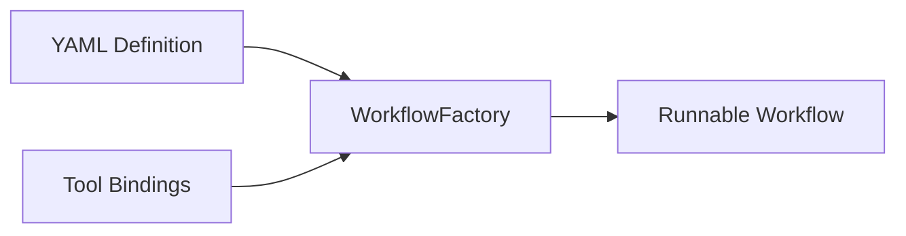

# 03-09 — Declarative Workflows (YAML)

> **Source**: [03-workflows/declarative/](https://github.com/microsoft/agent-framework/tree/main/python/samples/03-workflows/declarative)
> **Difficulty**: Intermediate–Advanced
> **Prerequisites**: [03-01 — Start Here](03-01-start-here.md), [02-07 — Declarative Agents](02-07-declarative-agents.md)

## Overview

Declarative workflows let you define entire **workflow graphs in YAML**, including agents, edges, conditions, and tools. This separates orchestration logic from Python code.



---

## Available Examples

| Folder | What It Builds |
|--------|---------------|
| `simple_workflow/` | Basic multi-step YAML workflow |
| `conditional_workflow/` | Conditional routing via YAML edge conditions |
| `customer_support/` | Full customer support triage pipeline |
| `deep_research/` | Multi-agent deep research workflow |
| `function_tools/` | Tools defined and bound in YAML |
| `human_in_loop/` | HITL pauses defined in YAML |
| `marketing/` | Marketing content pipeline |
| `student_teacher/` | Student-teacher feedback loop |

---

## YAML Workflow Schema

```yaml
kind: Workflow
name: my_workflow
description: A sample workflow

agents:
  - kind: Prompt
    name: writer
    instructions: Write marketing copy
    model:
      id: =Env.AZURE_OPENAI_MODEL
      connection:
        kind: remote
        endpoint: =Env.AZURE_AI_PROJECT_ENDPOINT

  - kind: Prompt
    name: reviewer
    instructions: Review and improve the copy

executors:
  - id: write_step
    agent: writer
  - id: review_step
    agent: reviewer

edges:
  - source: write_step
    target: review_step

start: write_step
```

---

## Key Concepts

### Environment Variables in YAML

```yaml
model:
  id: =Env.MODEL_NAME              # Resolved at runtime
  connection:
    endpoint: =Env.ENDPOINT_URL    # Resolved at runtime
```

### Tool Bindings

```python
from agent_framework.declarative import WorkflowFactory

factory = WorkflowFactory(
    bindings={"search_web": my_search_function},  # Map YAML tool names to Python
)
workflow = factory.create_workflow_from_yaml(yaml_str)
```

### Conditional Edges in YAML

```yaml
edges:
  - source: classifier
    target: spam_handler
    condition: is_spam            # References a Python binding
  - source: classifier
    target: reply_handler
    condition: is_not_spam
```

---

## 🎯 Key Takeaways

1. **`WorkflowFactory`** — Creates workflows from YAML definitions
2. **`=Env.VAR`** — Reference environment variables in YAML
3. **`bindings`** — Map YAML names to Python functions for tools and conditions
4. **Full graph support** — Sequential, conditional, loops, and parallel defined in YAML
5. **8 example apps** — From simple pipelines to deep research and customer support

## What's Next

→ [03-10 — Observability & Visualization](03-10-observability-and-viz.md) for monitoring workflows
→ [04-01 — Azure Functions](04-01-azure-functions.md) for hosting
