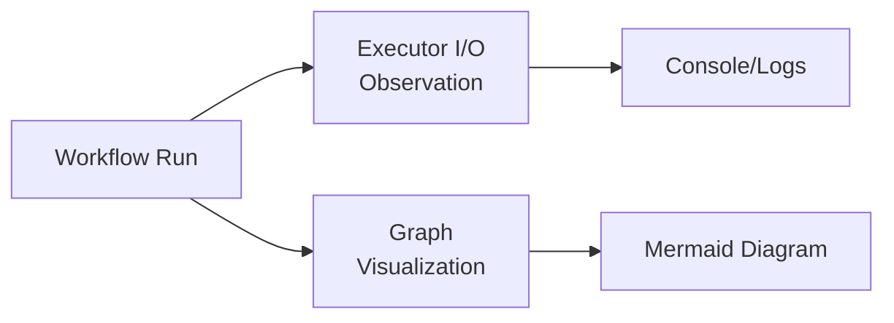

# 03-10 — Workflow Observability & Visualization

> **Source**: [03-workflows/observability/](https://github.com/microsoft/agent-framework/tree/main/python/samples/03-workflows/observability) and [03-workflows/visualization/](https://github.com/microsoft/agent-framework/tree/main/python/samples/03-workflows/visualization)
> **Difficulty**: Intermediate
> **Prerequisites**: [03-01 — Start Here](03-01-start-here.md), [02-09 — Observability](02-09-observability.md)

## Overview

Monitor workflow execution through **executor I/O observation** (debugging) and **graph visualization** (architecture diagrams).



---

## Sample 1: Executor I/O Observation

Observe inputs and outputs of every executor during a workflow run.

### Key Code

```python
from agent_framework import WorkflowBuilder

# Build workflow with observation enabled
workflow = WorkflowBuilder(start_executor=step_a).add_edge(step_a, step_b).build()

# Stream events and observe executor I/O
async for event in workflow.run("input data", stream=True):
    match event.type:
        case "executor_invoke":
            print(f"→ {event.data.executor_id} received: {event.data.input}")
        case "executor_completed":
            print(f"← {event.data.executor_id} produced: {event.data.output}")
        case "output":
            print(f"✓ Workflow output: {event.data}")
```

### Event Types

| Event Type | When It Fires | Data |
|-----------|---------------|------|
| `executor_invoke` | Executor starts processing | executor_id, input |
| `executor_completed` | Executor finishes | executor_id, output |
| `agent_response_update` | Agent streams a token | executor_id, text chunk |
| `checkpoint` | Checkpoint saved | checkpoint object |
| `output` | Workflow produces final result | output data |
| `user_input_request` | Workflow needs human input | request details |

---

## Sample 2: Concurrent Workflow Visualization

Generate a visual representation of the workflow graph.

### Key Code

```python
from agent_framework.orchestrations import ConcurrentBuilder

# Build and visualize
workflow = ConcurrentBuilder(participants=[agent_a, agent_b, agent_c]).build()

# The visualization shows the graph structure:
# dispatcher → agent_a, agent_b, agent_c → aggregator
```

---

## All Samples

| File | What It Shows |
|------|---------------|
| `executor_io_observation.py` | Log all executor inputs/outputs during a run |
| `concurrent_with_visualization.py` | Visualize concurrent workflow graph |

---

## 🎯 Key Takeaways

1. **`stream=True`** — Required to receive executor I/O events
2. **Event matching** — Use `event.type` to filter executor invocations, completions, tokens
3. **No setup needed** — Observation is built into the workflow engine
4. **Combine with OTel** — Use with `configure_otel_providers()` from [02-09](02-09-observability.md) for full tracing
5. **Visualization** — Graph structure can be rendered to see the workflow topology

## What's Next

This concludes the **Workflow Patterns** section! Continue to:

→ [04-01 — Azure Functions](04-01-azure-functions.md) for hosting workflows
→ [README](README.md) for the full guide index
