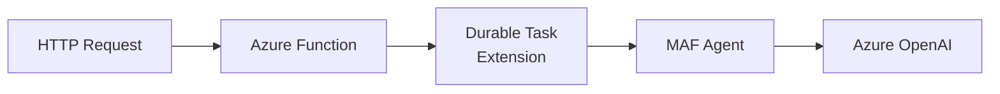

# 04-01 — Azure Functions Hosting

> **Source**: [04-hosting/azure_functions/](https://github.com/microsoft/agent-framework/tree/main/python/samples/04-hosting/azure_functions)
> **Difficulty**: Intermediate–Advanced
> **Prerequisites**: [01 — Get Started](01-get-started.md), familiarity with Azure Functions

## Overview

Host MAF agents as **serverless Azure Functions** with durable orchestration. The 12 progressive samples cover single agents, multi-agent setups, streaming, orchestration patterns, HITL, MCP servers, and workflow state management.



---

## Sample Progression

| # | Sample | Pattern |
|---|--------|---------|
| 01 | `single_agent` | Basic agent hosted in a function |
| 02 | `multi_agent` | Multiple agents with routing |
| 03 | `reliable_streaming` | Reliable streaming via durable orchestration |
| 04 | `single_agent_orchestration_chaining` | Sequential agent invocations with context |
| 05 | `multi_agent_orchestration_concurrency` | Parallel agent execution |
| 06 | `multi_agent_orchestration_conditionals` | Conditional routing (spam detection) |
| 07 | `single_agent_orchestration_hitl` | Human-in-the-loop with external events |
| 08 | `mcp_server` | MCP server hosted as Azure Function |
| 09 | `workflow_shared_state` | Workflow with shared state across executors |
| 10 | `workflow_no_shared_state` | Workflow with isolated executor state |
| 11 | `workflow_parallel` | Parallel workflow in Azure Functions |
| 12 | `workflow_hitl` | Workflow with human-in-the-loop in Functions |

---

## Environment Setup

### Prerequisites

1. **Azure Functions Core Tools 4.x**
2. **Azurite** storage emulator (for local dev)
3. **Azure OpenAI** resource with endpoint + deployment
4. **`az login`** for `AzureCliCredential`

### Quick Start

```bash
# In any sample directory:
pip install -r requirements.txt
cp local.settings.json.template local.settings.json
# Edit local.settings.json with your AZURE_OPENAI_ENDPOINT + DEPLOYMENT

# Start Azurite in a separate terminal
azurite

# Start the function
func start
```

### Configuration

```json
{
  "Values": {
    "AZURE_OPENAI_ENDPOINT": "https://your-resource.openai.azure.com",
    "AZURE_OPENAI_CHAT_DEPLOYMENT_NAME": "gpt-4o",
    "TASKHUB_NAME": "default"
  }
}
```

---

## Key Architecture

Each sample follows the same pattern:

1. **HTTP trigger** receives user request
2. **Durable orchestration** manages agent state and retries
3. **Activity functions** invoke MAF agents
4. **Response** returns to caller (or streams via SSE)

```python
# Simplified pattern
@app.function_name("chat")
@app.route(route="chat")
async def chat_endpoint(req: func.HttpRequest):
    # Start durable orchestration
    instance_id = await client.start_new("agent_orchestrator", input=req.get_json())
    return client.create_check_status_response(req, instance_id)
```

---

## 🎯 Key Takeaways

1. **Durable extension** — All Function samples use Durable Task for reliability
2. **Local dev** — CoreTools + Azurite for full local testing
3. **12 progressive samples** — From single agent → parallel workflows + HITL
4. **demo.http files** — Each sample includes HTTP test files
5. **Production-ready** — Automatic retries, state persistence, scalability

## What's Next

→ [04-02 — Durable Tasks](04-02-durable-tasks.md) for standalone durable hosting
→ [04-03 — A2A Protocol](04-03-a2a.md) for cross-framework agent communication
