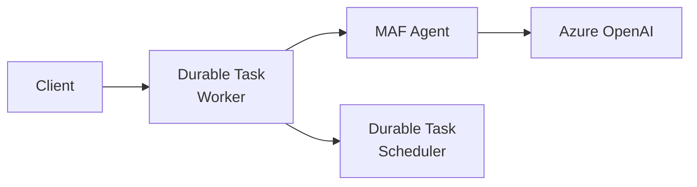
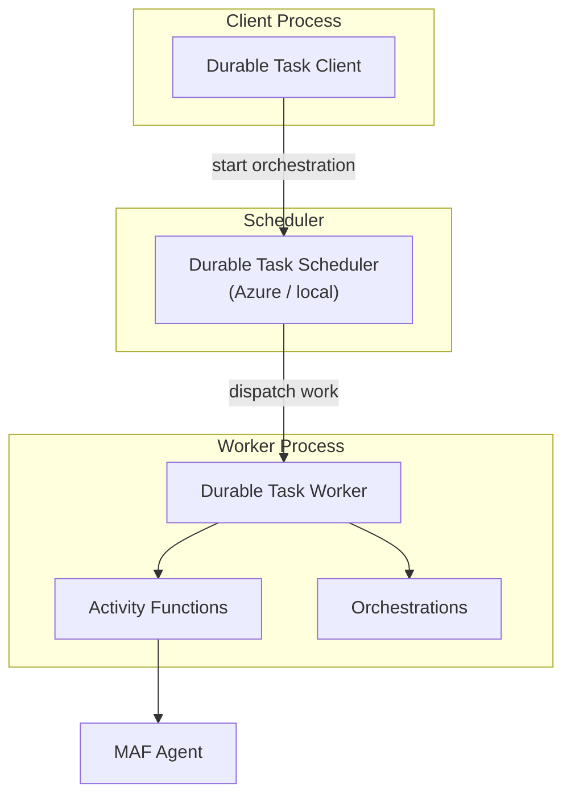

# 04-02 — Durable Tasks

> **Source**: [04-hosting/durabletask/](https://github.com/microsoft/agent-framework/tree/main/python/samples/04-hosting/durabletask)
> **Difficulty**: Intermediate–Advanced
> **Prerequisites**: [01 — Get Started](01-get-started.md), familiarity with durable task concepts

## Overview

Host MAF agents using the **Durable Task SDK** directly (without Azure Functions). This gives you the same durable orchestration — state persistence, retries, fan-out/fan-in — but running as a standalone worker process.



---

## Sample Catalog

### Basic Patterns

| # | Sample | What It Shows |
|---|--------|---------------|
| 01 | `single_agent` | Single agent with worker-client architecture |
| 02 | `multi_agent` | Domain routing (physicist vs. chemist) |
| 03 | `single_agent_streaming` | Reliable streaming via Redis Streams |

### Orchestration Patterns

| # | Sample | What It Shows |
|---|--------|---------------|
| 04 | `single_agent_orchestration_chaining` | Sequential invocations with shared context |
| 05 | `multi_agent_orchestration_concurrency` | Parallel agent execution with aggregation |
| 06 | `multi_agent_orchestration_conditionals` | Conditional branching (Pydantic structured outputs) |
| 07 | `single_agent_orchestration_hitl` | Human-in-the-loop with external events + timeouts |

---

## Architecture



### Key Concepts

| Concept | Description |
|---------|-------------|
| **Worker** | Runs orchestrations and activities (hosts the agent) |
| **Client** | Starts orchestrations and queries status |
| **Scheduler** | Manages state and dispatches work items |
| **Activity** | Single unit of work (e.g., one agent invocation) |
| **Orchestration** | Coordinates activities with retry/state logic |

---

## Running Locally

### Prerequisites

```bash
# Install Durable Task Scheduler (local emulator)
# See: https://github.com/microsoft/durabletask-dotnet

# Install dependencies
pip install -r requirements.txt

# Set environment variables
export AZURE_OPENAI_ENDPOINT="https://your-resource.openai.azure.com"
export AZURE_OPENAI_CHAT_DEPLOYMENT_NAME="gpt-4o"
```

### Start

```bash
# Terminal 1: Start the scheduler
# Terminal 2: Start the worker
python worker.py

# Terminal 3: Start the client
python client.py
```

---

## vs. Azure Functions

| Feature | Azure Functions | Durable Task SDK |
|---------|----------------|-----------------|
| Hosting | Serverless (managed) | Self-hosted worker |
| Scaling | Automatic | Manual/custom |
| Local dev | CoreTools + Azurite | Scheduler + Worker |
| Best for | Production serverless | Custom hosting, containers |

---

## 🎯 Key Takeaways

1. **Same durable semantics** as Azure Functions but self-hosted
2. **Worker-client pattern** — Separate processes for hosting and invoking
3. **Redis streaming** — Sample 03 shows reliable streaming with cursor-based resumption
4. **External events** — HITL uses durable external events with timeouts
5. **7 progressive samples** — Basic → orchestration with HITL

## What's Next

→ [04-03 — A2A Protocol](04-03-a2a.md) for cross-framework agent communication
→ [05-01 — ChatKit Integration](05-01-chatkit-integration.md) for full-stack apps
