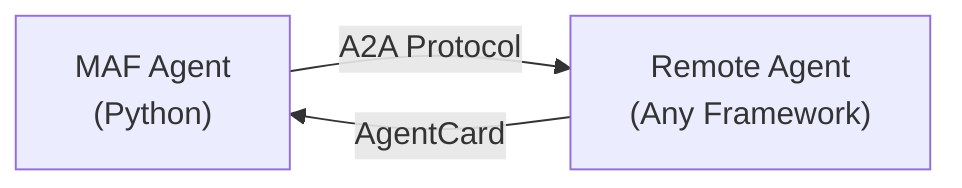

# 04-03 — Agent-to-Agent (A2A) Protocol

> **Source**: [04-hosting/a2a/](https://github.com/microsoft/agent-framework/tree/main/python/samples/04-hosting/a2a)
> **Difficulty**: Intermediate
> **Prerequisites**: [01 — Get Started](01-get-started.md)

## Overview

The **A2A (Agent2Agent) protocol** is a standardized communication protocol that enables interoperability between agents built with **different frameworks and technologies**. MAF provides `A2AAgent` to connect to any A2A-compliant remote agent.



> For the full protocol specification, see: [a2a-protocol.org](https://a2a-protocol.org/latest/)

---

## Key Code

```python
from a2a.client import A2ACardResolver
from agent_framework.a2a import A2AAgent
import httpx

# 1. Discover the remote agent's capabilities
async with httpx.AsyncClient(timeout=60.0) as http_client:
    resolver = A2ACardResolver(httpx_client=http_client, base_url=a2a_host)
    agent_card = await resolver.get_agent_card()
    print(f"Found: {agent_card.name} — {agent_card.description}")

# 2. Create an A2AAgent wrapping the remote endpoint
async with A2AAgent(
    name=agent_card.name,
    description=agent_card.description,
    agent_card=agent_card,
    url=a2a_host,
) as agent:
    # 3a. Non-streaming request/response
    response = await agent.run("What are your capabilities?")
    for msg in response.messages:
        print(msg.text)

    # 3b. Streaming (SSE-based)
    async with agent.run("Tell me about yourself", stream=True) as stream:
        async for update in stream:
            for content in update.contents:
                if content.text:
                    print(content.text)
```

---

## Key Concepts

| Concept | Description |
|---------|-------------|
| **AgentCard** | Discovery document at `/.well-known/agent.json` — describes capabilities |
| **A2ACardResolver** | Resolves and validates the agent's AgentCard |
| **A2AAgent** | MAF wrapper that turns a remote A2A endpoint into a local `Agent` |
| **Background mode** | `background=False` (default): waits for completion. `True`: poll manually |
| **SSE streaming** | Server-Sent Events for real-time incremental updates |

---

## Running the Sample

```bash
# 1. Set the remote agent URL
export A2A_AGENT_HOST="http://localhost:5001/"

# 2. Start a compatible A2A server (e.g., .NET A2A sample)
# See: agent-framework/dotnet/samples/A2AClientServer

# 3. Run the Python client
uv run python agent_with_a2a.py
```

---

## 🎯 Key Takeaways

1. **Cross-framework** — Connect MAF agents to agents built with any technology
2. **Standard protocol** — A2A is an open specification at [a2a-protocol.org](https://a2a-protocol.org)
3. **AgentCard discovery** — Agents self-describe capabilities via `/.well-known/agent.json`
4. **Drop-in Agent** — `A2AAgent` implements the standard `Agent` interface
5. **Streaming + sync** — Both request/response and SSE streaming supported

## What's Next

→ [05-01 — ChatKit Integration](05-01-chatkit-integration.md) for full-stack web apps
→ [05-02 — Evaluation](05-02-evaluation.md) for testing and quality assurance
