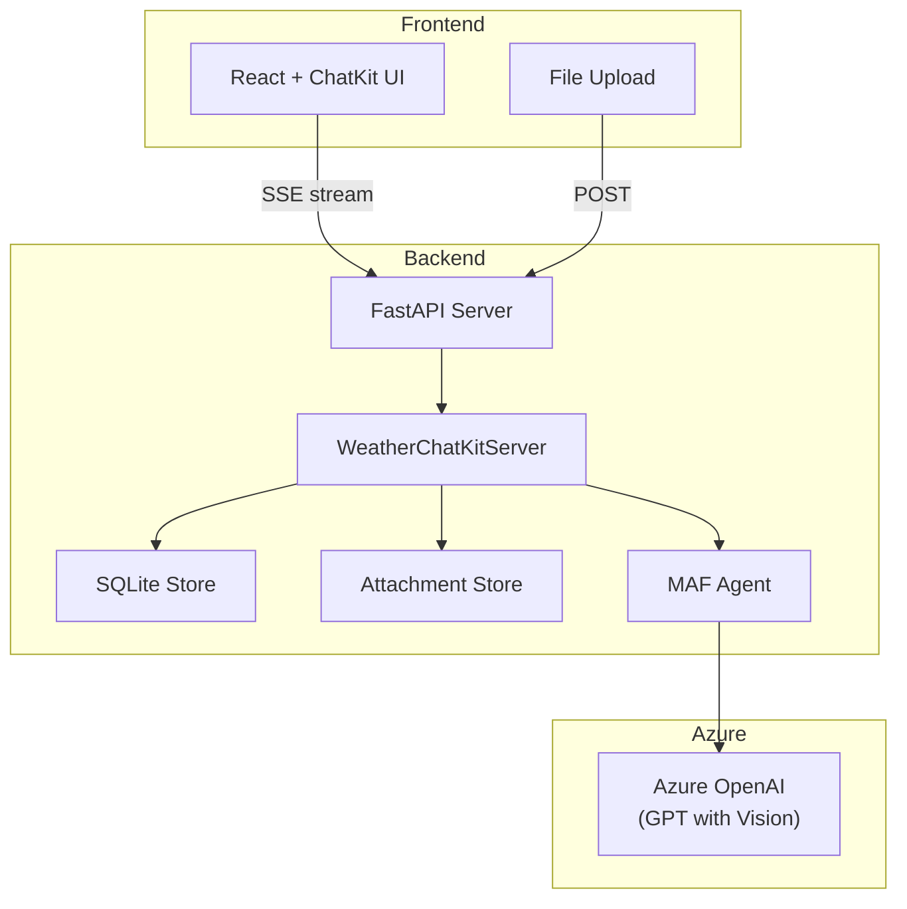

# 05-01 — ChatKit Integration

> **Source**: [05-end-to-end/chatkit-integration/](https://github.com/microsoft/agent-framework/tree/main/python/samples/05-end-to-end/chatkit-integration)
> **Difficulty**: Advanced
> **Prerequisites**: [01 — Get Started](01-get-started.md), [02-01 — Tools](02-01-tools.md)

## Overview

A **full-stack chat application** that integrates MAF agents with a React frontend powered by Microsoft's ChatKit UI library. The sample builds a weather forecast agent with image analysis, custom widgets, file uploads, and multi-turn conversations.



---

## Application Components

| File | Purpose |
|------|---------|
| `app.py` (25 KB) | Main FastAPI server with ChatKit integration |
| `store.py` | SQLite-based conversation persistence |
| `attachment_store.py` | File-based attachment storage |
| `weather_widget.py` | Custom weather + city selector widgets |
| `frontend/` | React ChatKit frontend |

---

## Key Features

### 1. ChatKit Server Protocol

```python
class WeatherChatKitServer:
    async def respond(self, thread_id, message) -> AsyncIterator[ThreadStreamEvent]:
        """Handle user messages — streams agent responses via SSE."""
        
    async def action(self, thread_id, action) -> AsyncIterator[ThreadStreamEvent]:
        """Handle UI actions (widget button clicks, form submissions)."""
```

### 2. Custom Widgets

```python
def render_weather_widget(city, forecast):
    """Returns a WidgetItem rendered in the chat."""
    return WidgetItem(
        widget_type="weather",
        data={"city": city, "forecast": forecast}
    )
```

### 3. File Upload + Image Analysis

The agent supports vision via Azure OpenAI's multimodal model, analyzing uploaded images alongside text.

---

## Running the Sample

```bash
# Backend
cd chatkit-integration
pip install -r requirements.txt
python app.py  # Starts FastAPI on localhost

# Frontend
cd frontend
npm install
npm run dev  # Starts React dev server
```

---

## 🎯 Key Takeaways

1. **Full-stack reference** — FastAPI backend + React frontend with ChatKit
2. **SSE streaming** — Real-time agent response streaming to the browser
3. **Custom widgets** — Render interactive UI components from agent tool calls
4. **File handling** — Upload, store, and pass images to vision models
5. **Persistence** — SQLite store for conversations + file-based attachment store

## What's Next

→ [05-02 — Evaluation](05-02-evaluation.md) for testing agent quality
→ [05-03 — Hosted Agents](05-03-hosted-agents.md) for cloud-hosted agent services
