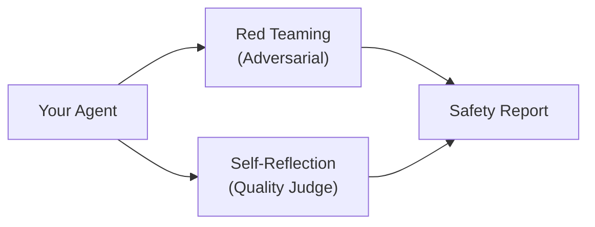

# 05-02 — Evaluation (Red Teaming & Self-Reflection)

> **Source**: [05-end-to-end/evaluation/](https://github.com/microsoft/agent-framework/tree/main/python/samples/05-end-to-end/evaluation)
> **Difficulty**: Advanced
> **Prerequisites**: [01 — Get Started](01-get-started.md)

## Overview

Evaluate agent quality and safety using **red teaming** (adversarial testing) and **self-reflection** (AI-judged quality). These patterns ensure your agents are robust, safe, and aligned.

---

## Pattern 1: Red Teaming

Adversarial testing to find safety vulnerabilities, prompt injection risks, and harmful output generation.

### What It Tests

- **Prompt injection** — Can users trick the agent into ignoring instructions?
- **Harmful content** — Does the agent generate unsafe, biased, or inappropriate output?
- **Boundary violations** — Does the agent stay within its defined scope?
- **PII leakage** — Does the agent accidentally expose sensitive data?

---

## Pattern 2: Self-Reflection

Use a second AI model as a **judge** to evaluate the quality of your agent's responses.

### What It Evaluates

- **Relevance** — Does the response address the user's question?
- **Helpfulness** — Is the response actionable and complete?
- **Accuracy** — Are facts and claims correct?
- **Tone** — Does the response match the expected communication style?

---

## Sample Structure

| Folder | What It Contains |
|--------|-----------------|
| `red_teaming/` | Adversarial test scenarios and evaluation scripts |
| `self_reflection/` | AI-as-judge evaluation framework |

---

## 🎯 Key Takeaways

1. **Red teaming** — Adversarial testing for safety and boundary enforcement
2. **Self-reflection** — AI-judged quality evaluation with structured metrics
3. **Complementary** — Use both patterns together for comprehensive evaluation
4. **Pre-production** — Run evaluations before deploying agents to users
5. **Automated** — Integrate evaluation into your CI/CD pipeline

## What's Next

→ [05-03 — Hosted Agents](05-03-hosted-agents.md) for cloud-hosted agent services
→ [05-06 — Workflow Evaluation](05-06-workflow-evaluation.md) for multi-agent evaluation
