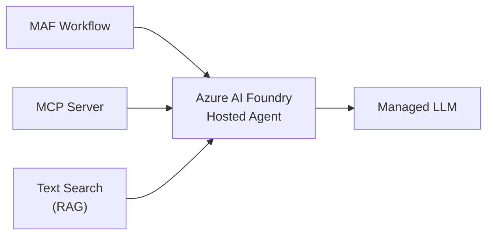

# 05-03 — Hosted Agents (Azure AI Foundry)

> **Source**: [05-end-to-end/hosted_agents/](https://github.com/microsoft/agent-framework/tree/main/python/samples/05-end-to-end/hosted_agents)
> **Difficulty**: Advanced
> **Prerequisites**: [01 — Get Started](01-get-started.md), Azure AI Foundry access

## Overview

Use **Azure AI Foundry hosted agents** — cloud-managed agent services that eliminate the need to self-host models. These samples show how to integrate hosted agents with MCP servers, RAG (Retrieval-Augmented Generation), and MAF workflows.

---

## Available Samples

| Folder | What It Shows |
|--------|---------------|
| `agent_with_hosted_mcp/` | Hosted agent using an MCP server for tool access |
| `agent_with_text_search_rag/` | RAG agent with Azure AI Search for grounded responses |
| `agents_in_workflow/` | Hosted agents used as steps within MAF workflows |

---

## Key Patterns

### Hosted Agent + MCP

Connect a cloud-hosted agent to MCP tool servers for extensible tool access without deploying custom code.

### Hosted Agent + RAG

Combine hosted agents with Azure AI Search to provide grounded, document-backed responses.

### Hosted Agents in Workflows

Use hosted agents as participants in MAF orchestrations (Sequential, Concurrent, etc.) for multi-agent coordination.

---

## 🎯 Key Takeaways

1. **Cloud-managed** — No model hosting infrastructure to manage
2. **MCP integration** — Connect hosted agents to tool servers
3. **RAG support** — Ground responses with Azure AI Search
4. **Workflow-compatible** — Hosted agents work in MAF orchestrations
5. **Azure AI Foundry** — Leverage the full Azure AI platform

## What's Next

→ [05-04 — M365 Agent](05-04-m365-agent.md) for Microsoft 365 integration
→ [05-05 — Purview Agent](05-05-purview-agent.md) for data governance
