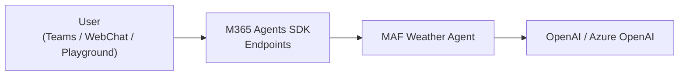

# 05-04 — M365 Agent (Microsoft 365 Agents SDK)

> **Source**: [05-end-to-end/m365-agent/](https://github.com/microsoft/agent-framework/tree/main/python/samples/05-end-to-end/m365-agent)
> **Difficulty**: Advanced
> **Prerequisites**: [01 — Get Started](01-get-started.md), M365 Agents Toolkit

## Overview

Build a MAF agent that integrates with the **Microsoft 365 ecosystem** — deployable to Teams, WebChat, and the Agents Playground. This sample creates a weather forecast agent exposed through M365 Agents SDK-compatible endpoints.



---

## Key Features

- **Multi-turn conversations** — Agent gathers required info across turns
- **M365 SDK endpoints** — Compatible with Teams, WebChat, and Agents Playground
- **Dev tunneling** — Local development with `devtunnel`
- **Flexible auth** — Anonymous mode for development or MSAL for production

---

## Project Structure

```
m365-agent/
├── .env.example          # Auth + model configuration
├── README.md
└── m365_agent_demo/
    └── app.py            # FastAPI server with M365 endpoints
```

---

## Quick Start

### 1. Configure

```bash
export PORT=3978
export USE_ANONYMOUS_MODE=True
export OPENAI_API_KEY="sk-..."
export OPENAI_CHAT_MODEL_ID="gpt-4o-mini"
```

### 2. Run Locally

```bash
uv sync
python m365_agent_demo/app.py
# Agent starts on http://localhost:3978
# Health check: GET /api/health
```

### 3. Test with Agents Playground

```bash
winget install agentsplayground
agentsplayground
```

### 4. Test with Azure Bot (WebChat)

1. Create an Azure Bot with Client Secret auth
2. Host dev tunnel: `devtunnel host -p 3978 --allow-anonymous`
3. Set messaging endpoint to tunnel URL + `/api/messages`
4. Use "Test in WebChat" in Azure Portal

---

## 🎯 Key Takeaways

1. **Teams-ready** — Deploy MAF agents to Microsoft Teams and Copilot
2. **Standard endpoints** — `/api/messages` and `/api/health` for M365 SDK
3. **Dev tunnel** — Local development with public endpoint via `devtunnel`
4. **Auth modes** — Anonymous for dev, MSAL + Azure Bot for production
5. **Multi-turn** — Agent handles conversational back-and-forth

## What's Next

→ [05-05 — Purview Agent](05-05-purview-agent.md) for data governance enforcement
→ [05-06 — Workflow Evaluation](05-06-workflow-evaluation.md) for multi-agent testing
