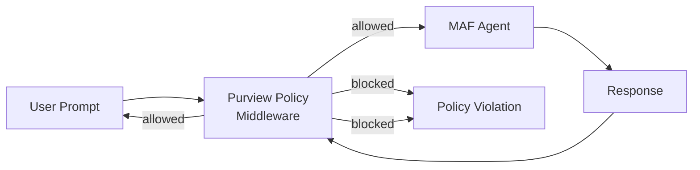

# 05-05 — Purview Agent (Policy Enforcement)

> **Source**: [05-end-to-end/purview_agent/](https://github.com/microsoft/agent-framework/tree/main/python/samples/05-end-to-end/purview_agent)
> **Difficulty**: Advanced
> **Prerequisites**: [01 — Get Started](01-get-started.md), [02-02 — Middleware](02-02-middleware.md), Microsoft Purview access

## Overview

Enforce **Microsoft Purview data governance policies** on MAF agents using middleware. This sample demonstrates prompt/response blocking, policy caching, and both agent-level and chat-client-level enforcement.



---

## Three Enforcement Approaches

### A. Agent Middleware

```python
from agent_framework.purview import PurviewPolicyMiddleware

agent = client.as_agent(
    instructions="...",
    middleware=[PurviewPolicyMiddleware()]  # Evaluates at agent level
)
```

### B. Chat Client Middleware

```python
from agent_framework.purview import PurviewChatPolicyMiddleware

client = AzureOpenAIChatClient(
    middleware=[PurviewChatPolicyMiddleware()]  # Evaluates at model call level
)
```

### C. Custom Cache Provider

Implement custom caching for policy decisions (e.g., Redis, database) for advanced scenarios.

---

## What Gets Evaluated

| Check | When |
|-------|------|
| **Prompt evaluation** | Before sending to model |
| **Response evaluation** | Before returning to user |
| **Tool call evaluation** | Before executing tool calls |

---

## Caching

Policy evaluation caching is **automatic by default**:
- **30-minute TTL** — Policies are cached to avoid repeated API calls
- **200 MB max** — Configurable cache size
- **Custom providers** — Override with Redis, CosmosDB, etc.

---

## Key Files

| File | Purpose |
|------|---------|
| `sample_purview_agent.py` (11 KB) | Three demo modes: agent middleware, client middleware, custom cache |
| `README.md` | Setup instructions and auth configuration |

---

## 🎯 Key Takeaways

1. **Purview integration** — Enforce data governance policies on AI agents
2. **Two middleware levels** — Agent-level and chat-client-level enforcement
3. **Prompt + response** — Policies evaluate both input and output
4. **Auto-caching** — Built-in caching with sensible defaults
5. **Custom cache** — Pluggable cache providers for enterprise scenarios

## What's Next

→ [05-06 — Workflow Evaluation](05-06-workflow-evaluation.md) for multi-agent testing
→ [README](README.md) for the complete guide index
