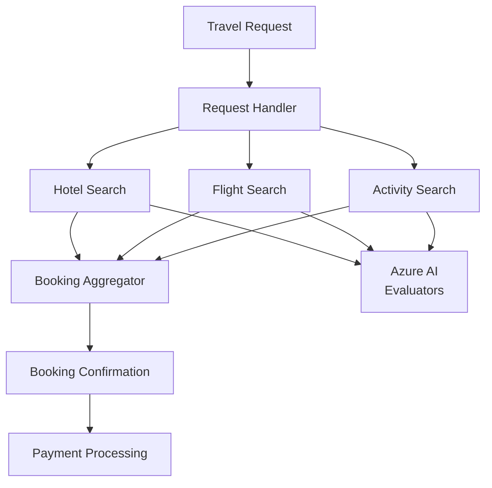

# 05-06 — Workflow Evaluation (Multi-Agent Testing)

> **Source**: [05-end-to-end/workflow_evaluation/](https://github.com/microsoft/agent-framework/tree/main/python/samples/05-end-to-end/workflow_evaluation)
> **Difficulty**: Advanced
> **Prerequisites**: [03-08 — Orchestrations](03-08-orchestrations.md), Azure AI evaluation access

## Overview

Evaluate a complete **multi-agent workflow** end-to-end using Azure AI's built-in evaluators. This sample builds a 7-agent travel planning workflow and measures quality metrics across each specialist agent.



---

## Evaluation Metrics

The sample uses **four Azure AI built-in evaluators**:

| Metric | What It Measures |
|--------|-----------------|
| **Relevance** | How well responses address the user query |
| **Groundedness** | Whether responses are grounded in available context |
| **Tool Call Accuracy** | Correct tool selection and parameter usage |
| **Tool Output Utilization** | Effective use of tool outputs in responses |

---

## Project Structure

| File | Purpose |
|------|---------|
| `create_workflow.py` (20 KB) | Builds the 7-agent travel planning workflow |
| `_tools.py` (31 KB) | Tool definitions (hotel, flight, activity search) |
| `run_evaluation.py` (7 KB) | Executes workflow and runs Azure AI evaluation |
| `.env.example` | Configuration template |

---

## How It Works

```bash
python run_evaluation.py
```

The script:

1. **Executes** the 7-agent travel planning workflow with a sample request
2. **Displays** response summary for each agent
3. **Creates** Azure AI evaluation for hotel, flight, and activity search agents
4. **Monitors** evaluation progress
5. **Outputs** the evaluation report URL with per-agent metrics

---

## 🎯 Key Takeaways

1. **End-to-end evaluation** — Test full multi-agent workflows, not just individual agents
2. **Azure AI evaluators** — Built-in metrics for relevance, groundedness, tool accuracy
3. **7-agent pipeline** — Fan-out/fan-in travel planning as a realistic test case
4. **Per-agent metrics** — Evaluate each specialist independently
5. **Report URLs** — Azure AI provides hosted evaluation reports

## What's Next

This concludes the **MAF Examples Explained** guide series! 🎉

→ [README](README.md) for the complete guide index and learning paths
