# MAF Examples Explained

> **Goal**: Deeply understand the Microsoft Agent Framework (MAF) through hands-on, annotated walkthroughs of every official Python sample.

This folder contains **detailed, step-by-step guides** that explain the code samples from the [microsoft/agent-framework](https://github.com/microsoft/agent-framework/tree/main/python/samples) repository. Each guide includes the full source code with annotations so you never need to jump to GitHub.

---

## 🗺️ Suggested Learning Path



```mermaid
graph LR
    A["01 Get Started"] --> B["03-01 Workflow Foundations"]
    B --> C["02-01 Tools"]
    C --> D["02-02 Middleware"]
    D --> E["02-03 Providers"]
    E --> F["02-04 Context Providers"]
    F --> G["03-02 Control Flow"]
    G --> H["03-03 Parallelism"]
    H --> I["03-08 Orchestrations"]
    I --> J["04 Hosting"]
    J --> K["05 End-to-End"]
```

### Start Here (Beginner)
| # | Guide | What You'll Learn |
|---|-------|-------------------|
| 1 | [01 — Get Started](01-get-started.md) | Create agents, add tools, multi-turn, memory, first workflow, hosting |
| 2 | [03-01 — Workflow Foundations](03-01-start-here.md) | Executors, edges, agents in workflows, streaming |

### Deep-Dive: Agents (Intermediate)
| # | Guide | What You'll Learn |
|---|-------|-------------------|
| 3 | [02-01 — Tools](02-01-tools.md) | Function tools: schema, kwargs, DI, approval, recovery, limits |
| 4 | [02-02 — Middleware](02-02-middleware.md) | Function-, class-, decorator-based middleware, exception handling |
| 5 | [02-03 — Providers](02-03-providers.md) | OpenAI, Azure, Anthropic, Amazon, Ollama, custom providers |
| 6 | [02-04 — Context Providers](02-04-context-providers.md) | Simple, Azure AI Search, mem0, Redis context providers |
| 7 | [02-05 — MCP](02-05-mcp.md) | Agent as MCP server, API key auth, GitHub PAT |
| 8 | [02-06 — Conversations](02-06-conversations.md) | Custom stores, Redis, suspend/resume sessions |
| 9 | [02-07 — Declarative Agents](02-07-declarative-agents.md) | YAML-based agent definitions |
| 10 | [02-08 — Multimodal](02-08-multimodal.md) | Image/audio input with various providers |
| 11 | [02-09 — Observability](02-09-observability.md) | OpenTelemetry, Foundry tracing, console output |
| 12 | [02-10 — Streaming & Extras](02-10-streaming-and-extras.md) | Response streaming, background responses, DevUI, chat clients |

### Deep-Dive: Workflows (Intermediate–Advanced)
| # | Guide | What You'll Learn |
|---|-------|-------------------|
| 13 | [03-02 — Control Flow](03-02-control-flow.md) | Sequential, conditions, switch-case, loops, cancellation |
| 14 | [03-03 — Parallelism](03-03-parallelism.md) | Fan-out/fan-in, aggregate results, map-reduce |
| 15 | [03-04 — Composition](03-04-composition.md) | Sub-workflows, request interception, kwargs propagation |
| 16 | [03-05 — State Management](03-05-state-management.md) | State with agents, workflow kwargs |
| 17 | [03-06 — Human-in-the-Loop](03-06-human-in-the-loop.md) | Interactive prompts, approval requests, declaration-only tools |
| 18 | [03-07 — Checkpoint](03-07-checkpoint.md) | Checkpoint & resume, HITL resume, sub-workflow checkpointing |
| 19 | [03-08 — Orchestrations](03-08-orchestrations.md) | Sequential, Concurrent, Handoff, GroupChat, Magentic patterns |
| 20 | [03-09 — Declarative Workflows](03-09-declarative-workflows.md) | YAML-based workflows |
| 21 | [03-10 — Observability & Viz](03-10-observability-and-viz.md) | Executor I/O observation, diagram export |

### Hosting & End-to-End (Advanced)
| # | Guide | What You'll Learn |
|---|-------|-------------------|
| 22 | [04-01 — Azure Functions](04-01-azure-functions.md) | Deploy agents to Azure Functions |
| 23 | [04-02 — Durable Tasks](04-02-durable-tasks.md) | Long-running workflows with Durable Task Framework |
| 24 | [04-03 — A2A](04-03-a2a.md) | Agent-to-Agent protocol |
| 25 | [05-01 — ChatKit](05-01-chatkit-integration.md) | ChatKit integration |
| 26 | [05-02 — Evaluation](05-02-evaluation.md) | Agent evaluation |
| 27 | [05-03 — Hosted Agents](05-03-hosted-agents.md) | Hosted agents |
| 28 | [05-04 — M365 Agent](05-04-m365-agent.md) | Microsoft 365 agent |
| 29 | [05-05 — Purview Agent](05-05-purview-agent.md) | Purview agent |
| 30 | [05-06 — Workflow Evaluation](05-06-workflow-evaluation.md) | Workflow evaluation |

---

## 🔧 Global Prerequisites

```bash
# Install MAF
pip install agent-framework --pre

# For visualization support
pip install agent-framework[viz] --pre

# For Azure Functions hosting
pip install agent-framework-azurefunctions --pre
```

### Environment Variables (most samples)

```bash
export AZURE_AI_PROJECT_ENDPOINT="https://your-project-endpoint"
export AZURE_OPENAI_RESPONSES_DEPLOYMENT_NAME="gpt-4o"
export AZURE_AI_MODEL_DEPLOYMENT_NAME="gpt-4o"
```

### Authentication

Most samples use `AzureCliCredential`. Run `az login` before executing samples.

---

## 📖 Source Repository

All original samples: [microsoft/agent-framework/python/samples](https://github.com/microsoft/agent-framework/tree/main/python/samples)
